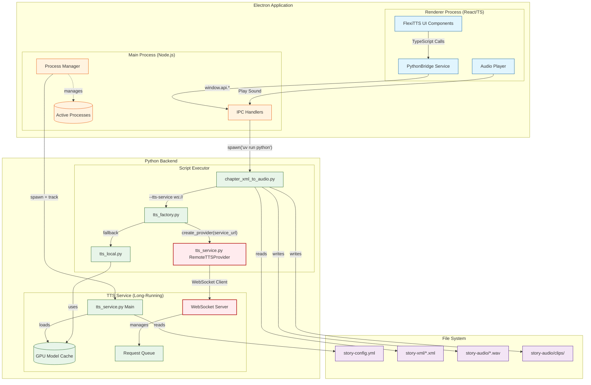

# TTS Service UI Integration - System Architecture

**Date**: 2026-02-26  
**Status**: Exploratory Architecture Study  
**Scope**: Integration of tts_service.py into FlexiTTS UI

## System Overview

The FlexiTTS application consists of three main architectural layers:

1. **UI Layer** (Electron Renderer Process)
2. **Main Process Layer** (Electron Main Process)
3. **Python Backend Layer** (TTS Scripts)

## Architecture Diagram



## Component Responsibilities

### Electron Renderer Process
| Component | Responsibility |
|-----------|----------------|
| `PythonBridgeService` | Abstracts Python script execution via IPC |
| `playAudio()` | Coordinates TTS generation and playback |
| UI Components | Chapter selection, audio controls, status display |

### Electron Main Process
| Component | Responsibility |
|-----------|----------------|
| `run-python-script` | IPC handler spawning Python processes |
| `kill-process` | Cancels running Python/audio processes |
| `play-sound-file` | Platform-specific audio playback |
| Process Tracking | `Map<string, ChildProcess>` for cleanup |

### Python Backend
| Component | Responsibility |
|-----------|----------------|
| `tts_service.py` | Long-running WebSocket TTS service |
| `chapter_xml_to_audio.py` | Per-chapter processing (short-lived) |
| `tts_factory.py` | Provider factory (local vs remote) |
| `tts_local.py` | Direct GPU TTS with caching |
| `RemoteTTSProvider` | WebSocket client for tts_service |

## Integration Points

### 1. WebSocket Connection
- **Protocol**: WebSocket (ws://localhost:PORT)
- **Client**: `RemoteTTSProvider` in `tts_service.py`
- **Server**: Async WebSocket server in `tts_service.py` main
- **Fallback**: Local TTS provider if connection fails

### 2. Process Lifecycle Management
```
App Launch
    ↓
Main Process spawns tts_service.py
    ↓
Service loads GPU model → Listening on ws://PORT
    ↓
UI detects readiness (health check?)
    ↓
chapter_xml_to_audio.py connects via --tts-service flag
    ↓
TTS requests flow through WebSocket
    ↓
App Quit → SIGTERM → GPU cleanup
```

### 3. Communication Patterns
| Direction | Mechanism | Data Format |
|-----------|-----------|-------------|
| UI → Main | Electron IPC | JSON + binary |
| Main → Python | spawn() stdio | JSON messages |
| Script → Service | WebSocket | JSON + binary |
| Service → GPU | Direct | PyTorch tensors |

## Files to Modify (Design Reference)

### UI Layer Changes
1. **`src/ui/electron/main.ts`**
   - Add tts_service.py startup/shutdown logic
   - Add health check IPC handler
   - Process management for long-running service

2. **`src/ui/src/services/pythonBridge.ts`**
   - Add `startTTSService()` method
   - Add `stopTTSService()` method
   - Modify `playAudio()` to wait for service ready

3. **`src/ui/electron/preload.ts`**
   - Expose new IPC channels for service control

### Python Backend Changes
4. **`src/scripts/chapter_xml_to_audio.py`**
   - Add `--tts-service` CLI argument support
   - Integrate with `TTSProviderFactory`

5. **`src/scripts/tts_service.py`**
   - Add health check endpoint
   - Add graceful shutdown handler

## Key Design Decisions

### Decision 1: WebSocket vs HTTP
**Choice**: WebSocket  
**Rationale**: 
- Persistent connection reduces latency for TTS requests
- Supports streaming audio responses
- Already implemented in tts_service.py

### Decision 2: Service Ownership
**Choice**: Main Process spawns service  
**Rationale**:
- Main process has process management infrastructure
- Renderer process can be sandboxed
- Easier cleanup on app quit

### Decision 3: Factory Pattern Integration
**Choice**: Use existing tts_factory.py  
**Rationale**:
- RemoteTTSProvider already supports WebSocket
- Fallback to LocalTTSProvider if service unavailable
- Clean abstraction boundary

## Open Questions

1. **Service Port**: Fixed port vs dynamic allocation?
2. **Health Checks**: heartbeat vs on-demand connection attempts?
3. **Model Preloading**: Load at startup vs on first request?
4. **Error Handling**: Restart service on crash or fail gracefully?

## References

- `src/ui/electron/main.ts` - Main process IPC handlers
- `src/ui/src/services/pythonBridge.ts` - UI bridge service
- `src/scripts/tts_service.py` - WebSocket TTS service
- `src/scripts/tts_factory.py` - Provider factory
- `src/scripts/tts_interface.py` - Abstract interface
