# FlexiTTS UI Architecture Overview

**Document Date:** February 26, 2026  
**Total Lines of Code:** 3,386  
**Architecture Pattern:** React + Custom Hooks + Service Layer  
**State Management:** React Hooks (useState, useRef, useCallback)  
**Backend Integration:** Electron IPC Bridge + Python Scripts

---

## Table of Contents

1. [Executive Summary](#executive-summary)
2. [System Architecture](#system-architecture)
3. [Component Hierarchy](#component-hierarchy)
4. [Data Flow Architecture](#data-flow-architecture)
5. [Service Layer](#service-layer)
6. [TTS Service Architecture](#tts-service-architecture)
7. [State Management](#state-management)
8. [File Structure](#file-structure)
9. [Key Design Decisions](#key-design-decisions)
10. [Testing Architecture](#testing-architecture)

---

## Executive Summary

FlexiTTS is an **Electron-based desktop application** for converting story chapters into spoken audio using Text-to-Speech (TTS) technology. The UI architecture follows modern React patterns with a clear separation of concerns:

| Layer | Purpose | LOC |
|-------|---------|-----|
| **Components** | UI rendering | ~900 |
| **Hooks** | State management & business logic | ~800 |
| **Services** | External communication | ~500 |
| **Models** | Type definitions | ~50 |
| **Utils** | Helper functions | ~30 |
| **Tests** | Test coverage | ~1,100 |

### Recent Refactoring Achievement

- **App.tsx reduced from 723 → 322 lines (-55.5%)**
- **72 tests passing (100%)**
- **Zero TypeScript errors**

---

## System Architecture

### High-Level System Diagram

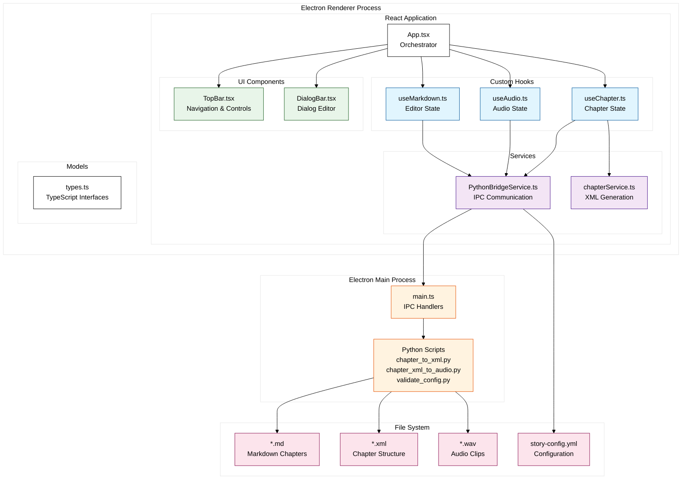

### Architecture Layers

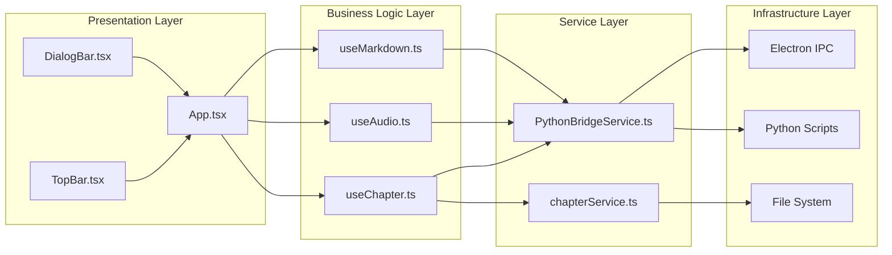

---

## Component Hierarchy

### Component Tree

```mermaid
%%{init: {
  'theme': 'base',
  'themeVariables': {
    'primaryColor': '#ffffff',
    'primaryTextColor': '#000000',
    'primaryBorderColor': '#000000',
    'lineColor': '#000000',
    'background': '#ffffff'
  }
}}%%
flowchart TD
    subgraph "Entry Point"
        ROOT[main.tsx]
    end

    subgraph "Root Component"
        APP[App.tsx]
        
        subgraph "Custom Hooks (useState/useRef)"
            USE_CHAPTER[useChapter.ts<br/>17 state items]
            USE_AUDIO[useAudio.ts<br/>2 state items]
            USE_MARKDOWN[useMarkdown.ts<br/>5 state items]
        end
    end

    subgraph "Child Components"
        TOPBAR[TopBar.tsx<br/>Props: Chapter, Config, Handlers]
        DIALOG_BAR[DialogBar.tsx<br/>Props: DialogElement, Handlers]
        CHAPTER_MENU[Context Menu<br/>Chapter Selection]
        EDITOR[Markdown Editor<br/>Side Panel]
    end

    subgraph "State Flow"
        SF1[Refs for Sync Access]
        SF2[useCallback for Handlers]
        SF3[Props Drilling to Children]
    end

    ROOT --> APP
    
    APP --> USE_CHAPTER
    APP --> USE_AUDIO
    APP --> USE_MARKDOWN
    
    APP --> TOPBAR
    APP --> DIALOG_BAR
    APP --> CHAPTER_MENU
    APP --> EDITOR
    
    USE_CHAPTER -.->|provides handlers| SF1
    USE_CHAPTER -.->|memoized| SF2
    SF2 -->|via props| TOPBAR
    SF2 -->|via props| DIALOG_BAR

    %% Styling
    classDef root fill:#e3f2fd,stroke:#1565c0
    classDef app fill:#e8f5e9,stroke:#2e7d32
    classDef hook fill:#fff3e0,stroke:#ef6c00
    classDef child fill:#f3e5f5,stroke:#6a1b9a
    classDef flow fill:#fce4ec,stroke:#c2185b
    
    class ROOT root
    class APP app
    class USE_CHAPTER,USE_AUDIO,USE_MARKDOWN hook
    class TOPBAR,DIALOG BAR,CHAPTER_MENU,EDITOR child
    class SF1,SF2,SF3 flow
```

### Component Communication Pattern

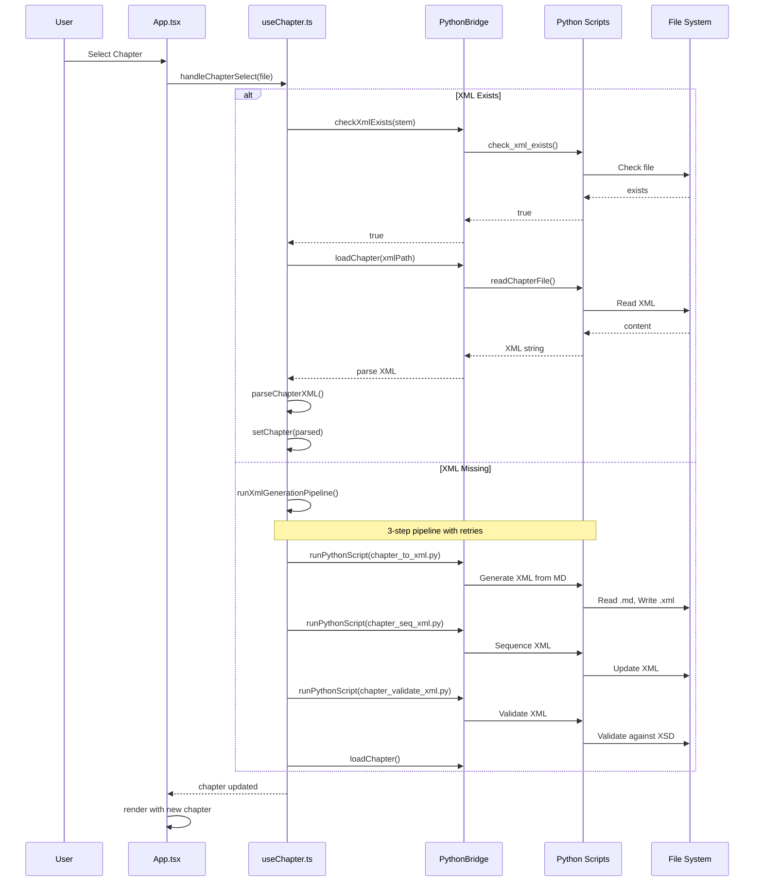

---

## Data Flow Architecture

### State Management Flow

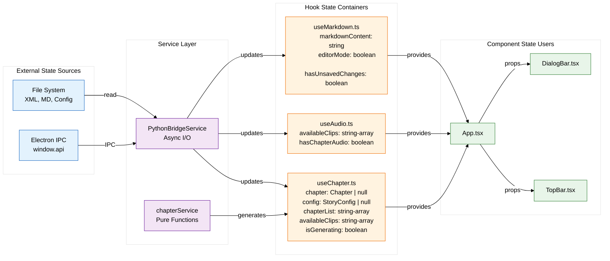

### Chapter Data Flow

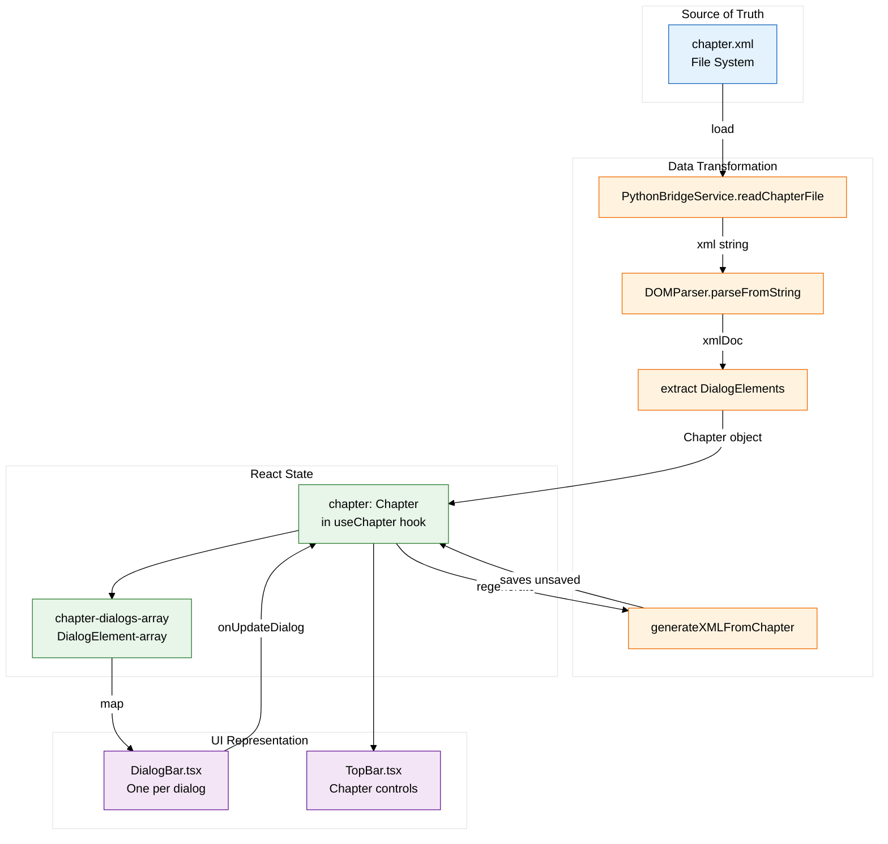

---

## Service Layer

### PythonBridgeService Architecture

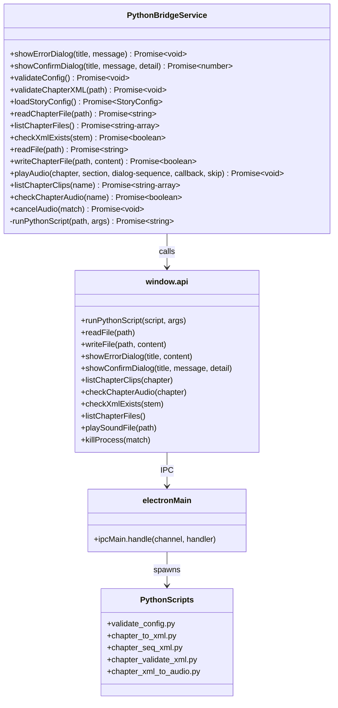

### Service Communication Flow

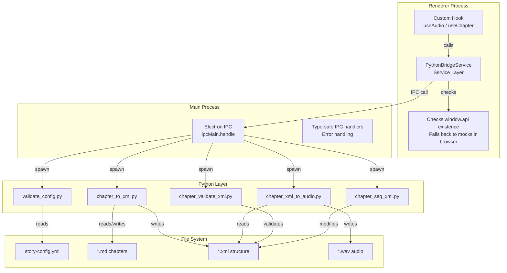

---

## TTS Service Architecture

### Overview

The TTS (Text-to-Speech) Service Architecture introduces a WebSocket-based remote TTS provider that enables distributed audio generation with GPU model caching for enhanced performance. This architecture extends the existing Factory pattern to support both local and remote TTS processing.

**Key Benefits:**
- **GPU Model Caching**: The remote service maintains loaded TTS models in GPU memory, eliminating reload overhead between requests
- **Reduced Memory Fragmentation**: Long-running service prevents repeated model loading/unloading cycles
- **Faster Repeated Operations**: Subsequent TTS requests benefit from cached model state
- **Graceful Fallback**: Automatic fallback to local TTS provider if remote service is unavailable

### TTS Service System Diagram

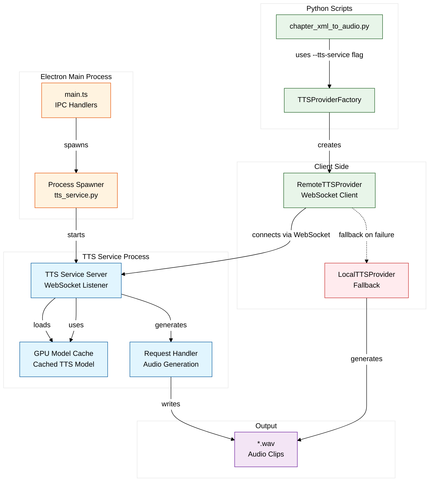

### TTS Service Startup Sequence

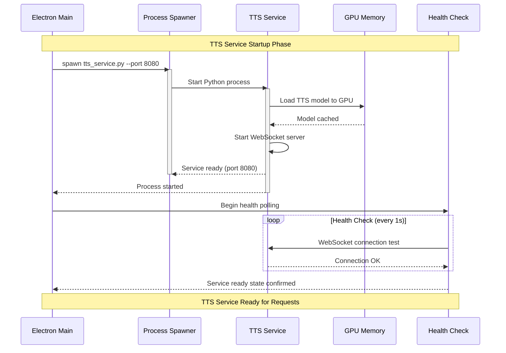

### WebSocket Communication Protocol

The TTS Service uses a JSON-based WebSocket protocol for request/response communication:

**Request Format:**
```json
{
  "text": "Hello, this is a test.",
  "speaker": "narrator",
  "emotion": "neutral",
  "language": "English",
  "instruct": "Speak clearly and naturally",
  "output_format": "wav",
  "character_config": {
    "voice": "custom-voice-id",
    "pitch": 1.0
  }
}
```

**Response Flow:**
1. **Metadata Message** (JSON): Contains sample rate, duration, format info
2. **Binary Audio Chunks**: Streamed WAV audio data
3. **Completion Message** (JSON): `{"done": true}` or `{"error": "message"}`

**Error Handling:**
- Connection failures trigger exponential backoff retry (1s, 2s, 4s, 8s delays)
- After max retries (default: 4), falls back to LocalTTSProvider if configured
- Timeout for individual generation requests: 60 seconds

### TTS Service Shutdown Sequence

```mermaid
sequenceDiagram
    participant Main as Electron Main
    participant Client as RemoteTTSProvider
    participant Service as TTS Service
    participant GPU as GPU Memory

    Note over Main,GPU: Graceful Shutdown Phase

    Main->>Client: Request shutdown
    Client->>Client: Stop accepting new requests

    Client->>Service: Send shutdown signal
    Service->>Service: Complete pending generations
    Service->>GPU: Release GPU memory
    GPU-->>Service: Memory freed
    Service->>Service: Close WebSocket connections
    Service-->>Client: Shutdown confirmed

    Client->>Client: close() cleanup
    Main->>Service: Terminate process
    deactivate Service

    Note over Main,GPU: Fallback to LocalTTSProvider
    Main->>Client: Switch to fallback mode
    Client->>Client: Use LocalTTSProvider
```

### Integration Points

**1. Command-Line Interface (`chapter_xml_to_audio.py`):**
```python
# Using --tts-service flag for remote TTS
python chapter_xml_to_audio.py chapter_001.xml --tts-service ws://localhost:8080

# Without flag (local TTS)
python chapter_xml_to_audio.py chapter_001.xml
```

**2. TTSProviderFactory Integration:**
```python
from tts_factory import create_tts_provider

# Create remote provider with fallback
provider = create_tts_provider(
    service_url="ws://localhost:8080",  # Remote service
    voices_dir=Path("voices")           # For fallback
)

# Generate audio (uses remote, falls back on failure)
audio_segments, sample_rate = provider.generate(
    text="Hello world",
    speaker="narrator",
    emotion="neutral",
    language="English",
    output_path=Path("output.wav")
)
```

**3. Factory Pattern Implementation:**
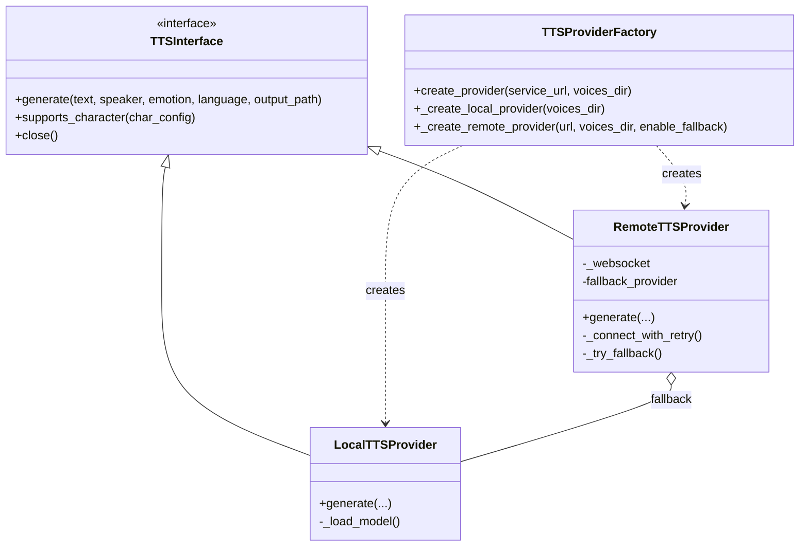

### GPU Model Caching Benefits

**Problem Without Caching:**
- Each TTS generation loads the model from disk to GPU
- Model loading: 10-30 seconds per request
- GPU memory fragmentation from repeated allocate/free cycles
- Poor user experience for chapter generation

**Solution With TTS Service:**
- Model loaded once at service startup
- Subsequent requests use cached model (sub-second response)
- GPU memory remains stable during service lifetime
- Supports batch processing of entire chapters efficiently

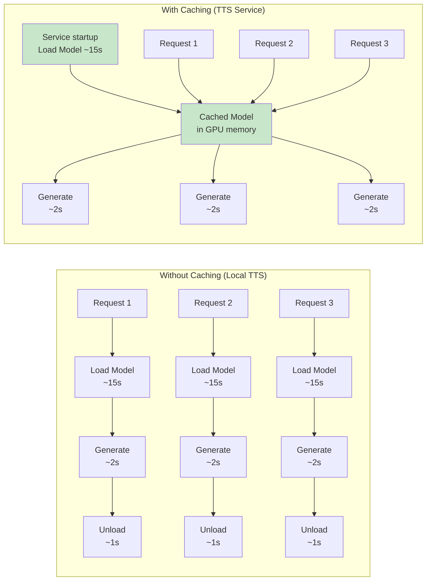

### Configuration Options

| Option | Default | Description |
|--------|---------|-------------|
| `service_url` | `None` | WebSocket URL (ws:// or wss://) for remote service |
| `max_retries` | 4 | Maximum connection retry attempts with exponential backoff |
| `timeout` | 30s | Connection timeout in seconds |
| `enable_fallback` | `True` | Enable automatic fallback to local TTS on failure |
| `voices_dir` | `./voices` | Directory for voice reference samples (used by fallback) |

### Security Considerations

- **WebSocket Protocol**: Supports both `ws://` (unencrypted) and `wss://` (TLS encrypted)
- **Local-Only by Default**: TTS service binds to localhost by default for security
- **No Authentication**: Current implementation assumes trusted local network
- **Resource Limits**: Service should implement request rate limiting for production use

---

## State Management

### useChapter Hook Structure

```mermaid
%%{init: {
  'theme': 'base',
  'themeVariables': {
    'primaryColor': '#ffffff',
    'primaryTextColor': '#000000',
    'primaryBorderColor': '#000000',
    'lineColor': '#000000',
    'background': '#ffffff'
  }
}}%%
flowchart TB
    subgraph "useChapter State"
        direction TB
        
        STATE1["config: StoryConfig | null"]
        STATE2["chapter: Chapter | null"]
        STATE3[chapterList: string-array]
        STATE4[currentChapterFile: string]
        STATE5[selectedCharacterFilter: string]
        STATE6[availableClips: string-array]
        STATE7[hasChapterAudio: boolean]
        STATE8[isGeneratingStructure: boolean]
        STATE9[generateAttempt: number]
        
        REF1[xmlContentRef: MutableRefObject]
        REF2[lastSavedXmlRef: MutableRefObject]
        REF3[hasUnsavedChangesRef: MutableRefObject]
    end

    subgraph "useChapter Actions"
        ACT1["loadChapter(filePath)"]
        ACT2["handleChapterSelect(file)"]
        ACT3["handleUpdateDialog(id, dialog)"]
        ACT4["runXmlGenerationPipeline(stem, attempt)"]
        ACT5["setLastSavedXmlValue(value)"]
        ACT6["setHasUnsavedChangesValue(value)"]
    end

    subgraph "Usage"
        APP[App.tsx]
    end

    STATE1 --> APP
    STATE2 --> APP
    STATE3 --> APP
    REF1 -.->|sync access| APP
    REF2 -.->|sync access| APP
    REF3 -.->|sync access| APP
    
    APP -->|calls| ACT1
    APP -->|calls| ACT2
    APP -->|calls| ACT3
    APP -->|calls| ACT4
    
    ACT4 -->|updates| STATE8
    ACT3 -->|updates| STATE2
    ACT1 -->|updates| STATE2
    ACT1 -.->|updates| REF1
    ACT1 -.->|updates| REF2  
    ACT1 -.->|updates| REF3

    %% Styling
    classDef state fill:#e3f2fd,stroke:#1565c0
    classDef action fill:#e8f5e9,stroke:#2e7d32
    classDef ref fill:#fff3e0,stroke:#ef6c00
    classDef usage fill:#f3e5f5,stroke:#6a1b9a
    
    class STATE1,STATE2,STATE3,STATE4,STATE5,STATE6,STATE7,STATE8,STATE9 state
    class REF1,REF2,REF3 ref
    class ACT1,ACT2,ACT3,ACT4,ACT5,ACT6 action
    class APP usage
```

### Ref Pattern for Synchronous Access

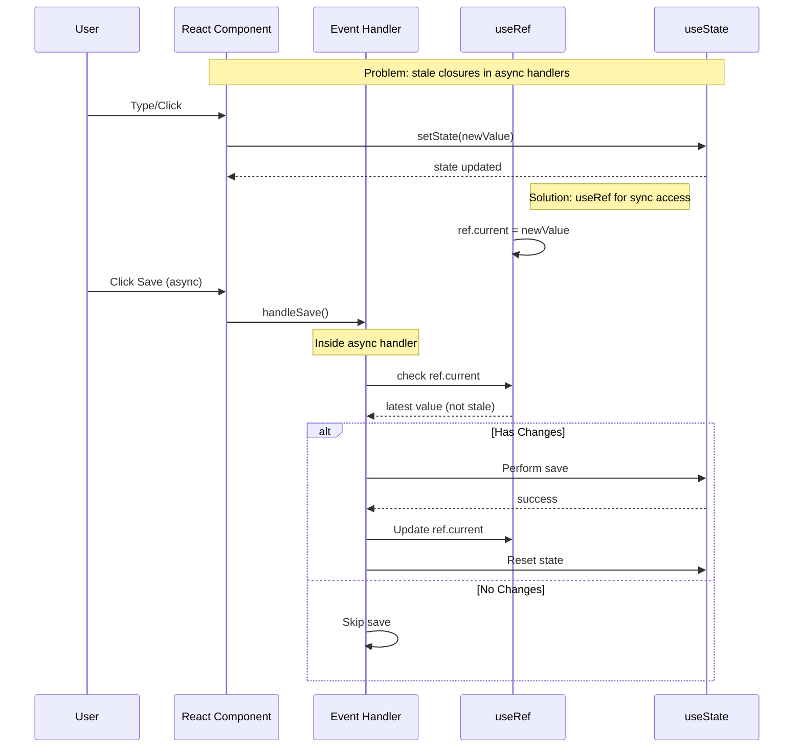

---

## File Structure

```
src/ui/src/
├── App.tsx                    # Root orchestrator component
├── App.css                    # Component styles
├── main.tsx                   # React entry point
├── index.css                  # Global styles
├──
├── components/                # UI components
│   ├── TopBar.tsx            # Navigation bar
│   └── DialogBar.tsx         # Dialog editor
│
├── hooks/                    # Custom React hooks
│   ├── index.ts              # Barrel exports
│   ├── useChapter.ts         # Chapter state (17 states)
│   ├── useAudio.ts           # Audio state (2 states)
│   └── useMarkdown.ts        # Editor state (5 states)
│
├── services/                 # External communication
│   ├── pythonBridge.ts       # Electron IPC bridge
│   └── chapterService.ts     # XML generation (pure)
│
├── models/                   # Type definitions
│   └── types.ts              # StoryConfig, Chapter, DialogElement
│
├── utils/                    # Helper utilities
│   └── colors.ts             # Character color mapping
│
└── __tests__/                # Test suite
    ├── setup.ts              # Test configuration
    ├── App.test.tsx          # Component tests
    ├── useChapter.test.ts    # Hook tests
    ├── useAudio.test.ts      # Hook tests
    ├── chapterService.test.ts # Service tests
    └── __snapshots__/        # Jest snapshots
```

### File Size Breakdown

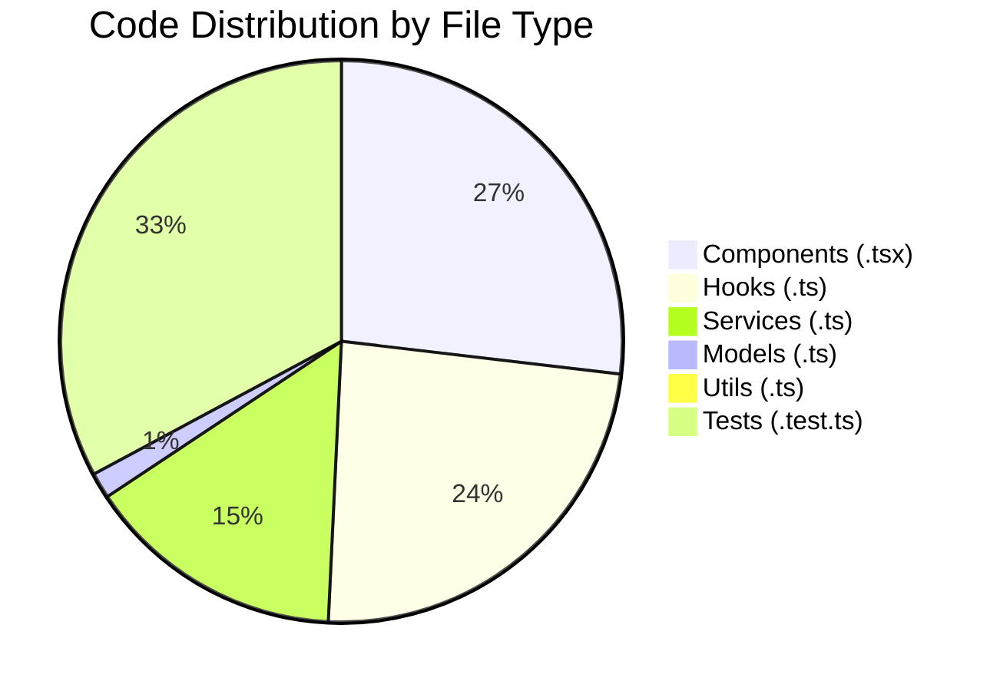

---

## Key Design Decisions

### 1. Custom Hooks Over State Management Library

**Decision:** Use React's built-in hooks (useState, useRef, useCallback) instead of Redux/Zustand.

**Rationale:**
- Application state is complex but localized
- useChapter hook encapsulates 17 related state items
- useRef pattern solves stale closure issues
- No need for global state management

**Trade-off:** Less boilerplate, but requires careful ref management.

### 2. Service Layer with Mock Fallbacks

**Decision:** PythonBridgeService checks `window.api` and provides browser-compatible mocks.

**Rationale:**
- UI can be developed/tested without Electron running
- Easier debugging in browser DevTools
- Graceful degradation for development

**Trade-off:** Some mocks are simplified (e.g., confirm dialog).

### 3. Ref Pattern for Unsaved Changes

**Decision:** Use useRef for synchronous access to change tracking state.

**Rationale:**
- Event handlers need current state synchronously
- Async handlers would capture stale closures
- Refs bypass React's render cycle

**Code Example:**
```typescript
const hasUnsavedChangesRef = useRef(false);
hasUnsavedChangesRef.current = xmlContent !== lastSavedXml;
// Handler can read latest value without re-render
```

### 4. Pipeline Pattern for XML Generation

**Decision:** Chain 3 Python scripts with retry logic.

**Pipeline:**
1. `chapter_to_xml.py` - Markdown → XML
2. `chapter_seq_xml.py` - Sequence XML IDs
3. `chapter_validate_xml.py` - XSD validation

**Rationale:**
- Each script does one thing well
- Retry logic handles transient failures
- Clear separation of concerns

### 5. Pure Function for XML Serialization

**Decision:** `generateXMLFromChapter` is a pure utility function.

**Rationale:**
- Deterministic output for input
- Easy to test with snapshot matching
- Reusable across components

---

## Testing Architecture

### Test Pyramid

```mermaid
%%{init: {
  'theme': 'base',
  'themeVariables': {
    'primaryColor': '#ffffff',
    'primaryTextColor': '#000000',
    'primaryBorderColor': '#000000',
    'lineColor': '#000000',
    'background': '#ffffff'
  }
}}%%
flowchart TB
    subgraph "Test Coverage (72 Tests Total)"
        E2E["E2E Tests
        0 tests
        (Not implemented)"]
        
        INT["Integration Tests
        App.test.tsx
        11 tests"]
        
        UNIT["Unit Tests
        useChapter: 18
        useAudio: 21
        chapterService: 22
        61 tests"]
    end

    subgraph "Test Tools"
        VITEST[vitest]
        RTL[@testing-library/react]
        MOCK[vi.mock]
    end

    E2E -->|calls| INT
    INT -->|uses| UNIT
    
    VITEST -->|runs| E2E
    VITEST -->|runs| INT
    VITEST -->|runs| UNIT
    
    RTL -->|renders| INT
    MOCK -->|stubs| UNIT

    %% Styling
    classDef e2e fill:#ffcdd2,stroke:#c62828
    classDef int fill:#fff9c4,stroke:#f9a825
    classDef unit fill:#c8e6c9,stroke:#2e7d32
    classDef tools fill:#e1f5fe,stroke:#0277bd
    
    class E2E e2e
    class INT int
    class UNIT unit
    class VITEST,RTL,MOCK tools
```

### Mock Strategy

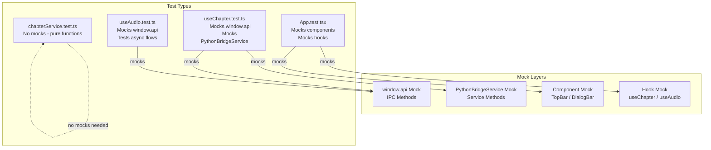

---

## Summary

### Architecture Strengths

1. **Clear Separation:** Hooks, services, and components have distinct responsibilities
2. **Testable:** 72 tests with 100% pass rate
3. **Type-Safe:** Full TypeScript coverage
4. **Maintainable:** 55% reduction in App.tsx complexity
5. **Flexible:** Mock fallbacks enable browser-based development

### Areas for Future Improvement

1. **State Persistence:** Auto-save to localStorage
2. **Error Boundaries:** Add React error boundaries
3. **Loading States:** More granular loading indicators
4. **Optimistic Updates:** Faster UI response
5. **E2E Tests:** Add Playwright/Cypress tests

---

**End of Architecture Overview**

*Generated: February 26, 2026*  
*Tool: Mermaid.js v10+ compatible diagrams*
