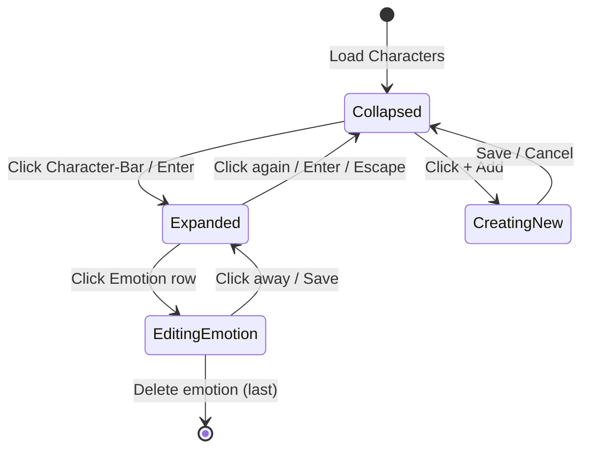
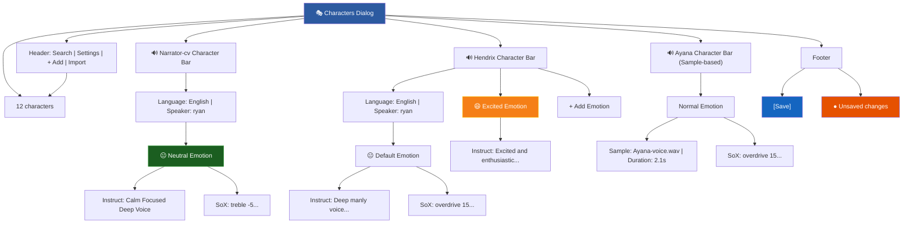

# FlexiTTS Create Character UI

## Character UI Design

- On the top bar of the UI, add a drop-down next to the Current Story drop-down (labeled Mode) where one can choose the Chapter Dialog UI or the Character UI. 
- On the top bar, make components beginning with "Chapter Name" to "Save" as components for the Chapter UI.
- Create a stub widgets container for "Character" UI where we can place Buttons to add a character

Much like the Chapter dialog screen, the Character Design screen has a bar for each character in the story, including 1 for the Narrator. The Narrator should be the first Character in the list, while other story characters follow in Alphabetical order.

When the dialog bar for a character is clicked on, it expands to show the various voice parameters for the character.
A character's voice falls into 2 main categories, [custom-voice:, speaker:] (uses the built-in qwen3-tts voice character [value of the speaker string]) and [custom-voice:, voice-sample:] (uses a voice audio reference file, voice-cloning).
A [custom-voice:, speaker] is controlled via the [instruct:] text that under the emotions: parameters associated to the character.
Use the schema_unified.xsd as a reference to derive the fields, labels and values that the UI must support. 
Add a [+] widget next to attributes where we can add another of the same key.
Add a [-] widget next to an existing key that may be deleted.
Keys with subkeys should be expandable and collapsable.

### Current Character Voice Structure

```yaml
  - name: Narrator-cv
    # This version of the narrator voice uses Qwen3-TTS voice customization.
    # It customizes one of Qwen3-TTS's 9 internal voices using sox post-processing
    # to make it deeper and rougher.
    custom-voice:
      language: English
      speaker: ryan
      instruct: "Deep manly voice. Speech is moderately fast, slightly hushed."
      description: "Ryan is a young handsome male in his early 30's. ..."
    sox-effects:
      - treble -5 5000 0.7 compand 0.3,1 6:-70,-60,-20 -4 -90 0.1 gain -3
  - name: Hendrix
    custom-voice:
      language: English
      speaker: ryan
      instruct: "Deep manly voice with a rough texture. Speech is calm and calculating, moderately fast."
    sox-effects:
      - overdrive 15 30 gain -8
  - name: Yamato
    custom-voice:
      language: English
      speaker: ryan
      instruct: "An mature man. Speech is gruff and abrupt with a hit of frustration."
    sox-effects:
      - pitch -250 equalizer 1800 +4 1.8 equalizer 3200 +3 2.2 bass +2 120 gain -n -1.5
  - name: Ayana
    voice-sample: Ayana-voice.wav
```

### New Character Voice Structure

For custom voices, the structure is as follows:
Emotions are added to the dialog dropdown.
- The idea is that the available emotions are used to control the voice's emotional tone and style dynamically during dialog playback. And these available as emotions-dropdown are available in the Chapter-Dialog UI Dialog-Bar.

```yaml
  - name: Narrator-cv
    qwen3-tts-custom-voice:
      language: English
      speaker: ryan
      instruct: "Deep manly voice. Speech is moderately fast, slightly hushed."
    sox-effects:
      - treble -5 5000 0.7 compand 0.3,1 6:-70,-60,-20 -4 -90 0.1 gain -3
    emotions:
      - name: Neutral
        instruct: "Calm Focused Deep Voice"
  - name: Hendrix
    qwen3-tts-custom-voice:
      language: English
      speaker: ryan
      sox-effects:
        - overdrive 15 30 gain -8
      emotions:
        - emotion: Default
          instruct: "Deep manly voice with a rough texture. Speech is calm and calculating, moderately fast."
        - emotion: Excited
          instruct: "Excited and enthusiastic, Fast and energetic speech"
        - emotion: Calm
          instruct: "Calm Focused Deep Voice"
        - emotion: Sad
          instruct: "Lowered slow voice, deeply sad"
          sox-effects:
            # This would override the default sox effects
            - overdrive 15 30 gain -4
        - emotion: Angry
          instruct: "Gritted teeth, aggressive tone"
        - emotion: Happy
          instruct: "Light Happy, Cordial"
    sox-effects:
      - overdrive 15 30 gain -8
  - name: Ayana
    sox-effects:
      - overdrive 15 30 gain -8
    quen3-tts-voice-design:
      - emotion: Normal
        voice-sample: Ayana-voice.wav
      - emotion: Sand
        voice-sample: Ayana-voice-sad.wav
        sox-effects:
          # This is an override of the default sox effects
          - overdrive 15 30 gain -4
      - emotion: Pain
        voice-sample: Ayana-voice-pain.wav
        dialog-effects:
          - cave

```

#### Character Voice UI

- Create a toplevel Icon button that opens the Character-Voice UI Dialog (to the left of the Character-Dialog UI)
- The Character-Voice UI dialog shows the list if Character-Bars

#### Character Bar Interaction Flow



#### Character Management Actions

- **Create**: "+" button in the dialog header opens the inline creation form or modal wizard
  - Required fields: Character name (unique), Language selection
  - Optional: Initial voice configuration
- **Delete**: Right-clicking the context menu or trash icon on Character-Bar
  - Confirmation dialog listing affected dialogs
  - Option to preview the count of dialogs using this character before deletion
- **Duplicate/Copy**: Right-clicking the menu option to clone s character with "Copy of" prefix
  - All emotion configs duplicated (can be renamed afterward)
- **Import/Export**: 
  - Export selected characters to `.yaml` or `.json`
  - Import characters from file with merge/replace dialog

#### Voice Sample Management (For Voice-Reference Characters)

- **Upload UI**: 
  - Drag-drop zone in emotion editor with visual feedback (dashed border highlight)
  - Alternative: File picker button ("Browse Files")
  - Accepted formats displayed: `.wav`, `.mp3`, `.ogg` with max file size
- **Preview**: 
  - Play button on each voice sample thumbnail
  - Inline waveform visualization
  - Stop button while playing
- **Validation**:
  - File size limit check (show error badge if exceeded)
  - Audio duration indicator (e.g., "3.2s")
  - Corrupt/invalid file error state with re-upload prompt

#### Character uses Voice references (qwen3-tts-voice-design)

- When the Character-Bar is clicked, it expands to list the emotions.
- Each emotion is based on a voice sample.
- The emotion bar has the properties...
  - emotion-name (The emotions main value)
  - voice-sample: The wave file to clone (voice reference)
  - sox-effects: The sox effects (post-processing) pipe-line

#### Character uses Custom Voice with Cloned-Voice (qwen-tts-voice-design)

- When the Character-Bar is clicked, it expands to list the emotions per the Character configuration structure.
- The Character is associated to one of the nine possible qwen2-tts built-in voices.
- Each emotion is based on a voice "instruct" prompt.

#### Emotion Editor Interface

- **Inline Editing**: Click to edit emotion name, instruct text, sox effects in-place
- **SoX Effect Builder GUI**:
  - Visual pipeline builder with draggable effect blocks
  - Dropdown for common effects with parameter sliders
  - Live preview of generated sox command string
  - Syntax validation with error highlighting
- **Reorder**: Drag handle to reorder emotions within a character
- **Bulk Operations**: Multi-select (Ctrl+Click) for bulk delete or move to character
- **Default Emotion**: Toggle to designate one emotion as default (star icon)

#### Visual Feedback & Processing States

- **Loading States**:
  - Spinner overlay during voice generation/processing
  - Progress bar for batch operations
  - "Generating..." text with estimated time remaining
- **Audio Playback Controls**:
  - Play/Pause toggle button on each sample
  - Volume slider in preview panel
  - Waveform visualization with playback position indicator
- **Dirty State Indicator**: 
  - Dot/bullet on dialog header when unsaved changes exist
  - "Save" and "Discard" buttons appear
- **Auto-save**: 
  - Visual confirmation toast "Saved" with timestamp

#### Navigation & Discovery

- **Search Bar**: Text input in dialog header to filter characters by name
- **Filter Dropdown**: Filter by language, emotion count, or voice type (custom vs. sample)
- **Collapse All**: Button to collapse all expanded Character-Bars
- **Sort Options**: Dropdown to sort by name (A-Z), date created, or usage count
- **Character Count Badge**: "12 characters" indicator in header

#### Keyboard Shortcuts

| Shortcut | Action |
|----------|--------|
| `Ctrl+N` | Create new character |
| `Delete` | Delete selected character/emotion (with confirmation) |
| `Enter` | Expand/collapse selected Character-Bar |
| `Space` | Preview audio of selected sample |
| `Ctrl+S` | Save changes |
| `Ctrl+Z` | Undo |
| `Ctrl+Shift+Z` | Redo |
| `Ctrl+F` | Focus search bar |
| `Escape` | Close dialog / deselect |

#### Accessibility

- **Focus Management**: Logical tab order through Character-Bars → Emotions → Fields
- **ARIA Labels**: All buttons, inputs, and expandable regions labeled
- **Keyboard Navigation**: Full functionality without mouse
- **High Contrast Mode**: Sufficient color contrast for all interactive elements
- **Screen Reader Announcements**: 
  - "Character added: Hendrix"
  - "3 emotions for character: Ayana"

#### Error Handling & Recovery

- **SoX Validation**: Real-time syntax checking as user types
  - Invalid effects highlighted in red with tooltip explanation
- **Network Failures**: 
  - Retry button with exponential backoff
  - Offline indicator when disconnected
- **Undo/Redo**: Full operation history (last 50 actions)
  - History panel accessible via menu
- **Conflict Resolution**: 
  - On import: "Character 'Yamato' exists. Overwrite / Keep Both / Skip?"
- **Data Recovery**:
  - Auto-save every 30 seconds
  - Recovery dialog on startup if unsaved session detected

#### Context Assignment to Dialogs

- **Quick Assign**: 
  - "Assign to Selected Dialog" button in Character-Bar header
  - Keyboard: `Ctrl+Shift+A` opens character picker from dialog view
- **Bulk Assign**:
  - Select multiple dialog lines → right-click → "Assign Character"
- **Character Switching**:
  - Dropdown in dialog bar to swap character on selected lines
  - A/B mode: Side-by-side preview of two characters saying same line

#### Suggested Dialog Layout



#### Row: Context Menu Options

Right-click on Character-Bar:
- ✏️ Rename
- 📋 Duplicate
- 🏷️ Assign to Selected Dialog
- 📤 Export
- 🗑️ Delete (with confirmation)

Right-click on Emotion Row:
- ✏️ Edit
- 📋 Duplicate
- ⭐ Set as Default
- 🗑️ Delete

