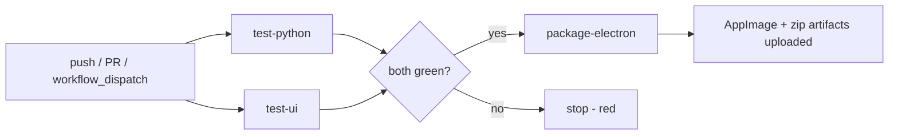

# FlexiTTS CI Plan (GitHub Actions via `act`)

**Date:** 2026-09-20
**Deliverable:** `.github/workflows/ci.yml` that runs all Script (pytest), UI (vitest), and
Integration test suites, and on success builds distributable artifacts with
**electron-builder** (per `docs/App_Delivery_Recommendations.md`).
**Constraint:** the workflow must be runnable locally with [act](https://github.com/nektos/act).

---

## 1. Current state (verified on this machine, 2026-09-20)

| Fact | Value | Implication for CI |
|---|---|---|
| Python suite | 550 tests, ~2 min, green | One pytest job covers Scripts + Integration + Perf (single `tests/` tree) |
| UI suite | 372 vitest tests in 26 files, ~5 s, jsdom | No display/xvfb needed; plain `npx vitest run` |
| Python runtime | `requires-python = ">=3.13"`; dev venv is 3.14.6 | CI must provision 3.13+ (uv handles this) |
| Dep manager | `uv` + `uv.lock` | `uv sync` reproduces the env; no pip freeze drift |
| `qwen-tts` | Local path dep: `Qwen3-TTS` directory = clone of `https://github.com/QwenLM/Qwen3-TTS` (symlink outside repo, gitignored) | CI must check it out into `Qwen3-TTS/` **before** `uv sync`, or `uv sync` fails |
| Heavy deps (torch, transformers) | Mocked in `src/scripts/tests/conftest.py` before any import | Tests pass with the full locked install; no GPU required |
| `sox` binary | Needed by `test_sox_api.py` execution tests (`shutil.which("sox")`) | `apt-get install sox` on Linux runners |
| `npm run build` (`tsc -b && vite build`) | **67 pre-existing type errors** (24 unused-var TS6133, 27 prod strictness, 16 test-file strictness) | Do **not** gate CI on `tsc -b` yet. Vite build (`npx vite build`) succeeds; electron main build (`npm run electron:build`, separate tsconfig) succeeds |
| electron-builder | `26.8.1` in devDeps, **no `electron-builder.yml` yet** | Workflow must ship a packaging config (below) matching the draft in `docs/implementation/2026-03-19-distro-packaging.md` |
| Electron main loads | `dist/index.html` + `dist-electron/electron/main.cjs` | Package `files:` must include both |
| Python sidecar (dev) | Spawned via `uv run python src/scripts/start_tts_service.py` with `projectRoot` cwd | Packaged app spawns differently; packaging scope below keeps dev behavior intact |
| act | v0.2.84 installed, Docker available | Use `catthehacker/ubuntu:act-latest` image (has Node 20+, Python via setup steps, apt) |
| Repo checkout size | ~130 MB tarball (Stories media included, 72 files) | act jobs work but the build/pack job needs ~2 GB free in the act container |

---

## 2. Workflow design



Three jobs:

1. **test-python** - `uv sync` (checkout Qwen3-TTS first), install sox, run
   `pytest tests/` (covers scripts + integration + phase13/14).
2. **test-ui** - `npm ci`, run `npx vitest run` and `npx vite build`
   (vite build validates the bundle compiles; `tsc -b` stays a local gate until
   the 67 type errors are fixed - tracked as a follow-up below).
3. **package-electron** - needs both test jobs green. `npm ci`, `vite build`,
   `electron:build`, then `npx electron-builder --linux --publish never`
   using a new `src/ui/electron-builder.yml`. Uploads AppImage + zip to the run
   artifacts. `--publish never` so pushes never touch GitHub Releases until
   signing/release keys exist; releasing is an explicit `workflow_dispatch` input.

### Why electron-builder (from App_Delivery_Recommendations.md)

- First-class AppImage (Linux single-file) + NSIS + DMG from one config
- `extraResources` is the documented path for a Python sidecar outside asar
- `electron-updater` + GitHub Releases publishing when we get there
- electron-builder 26.8.1 is already in `src/ui/package.json`

### Python sidecar scope for CI packaging

The full CUDA runtime bundle (~3-4 GB) from the packaging doc is a **separate
release-engineering effort**. CI phase 1 packages the Electron shell with the
Python **scripts** and config as `extraResources`, and documents the `uv`-based
bootstrap. This keeps CI green and fast; the heavyweight `bundle-python-cuda.sh`
step plugs into the same `extraResources` block later without workflow changes.

---

## 3. File: `.github/workflows/ci.yml`

```yaml
name: CI

on:
  push:
    branches: [main, electro-bun]
  pull_request:
  workflow_dispatch:

# act maps GITHUB_TOKEN to an unauthenticated token; upload-artifact v4
# works on act >= 0.2.40 with ACTIONS_RUNTIME_TOKEN stubbed by act.
env:
  UV_CACHE_DIR: /tmp/.uv-cache
  PIP_ROOT_USER_ACTION: ignore

jobs:
  test-python:
    name: Scripts + Integration tests (pytest)
    runs-on: ubuntu-latest
    # act: maps runs-on to the image in -P below
    steps:
      - uses: actions/checkout@v4

      # qwen-tts is a path dependency (pyproject.toml -> Qwen3-TTS).
      # It is NOT part of this repo; clone it into place before uv sync.
      - name: Checkout Qwen3-TTS (path dependency)
        run: |
          git clone --depth 1 https://github.com/QwenLM/Qwen3-TTS.git Qwen3-TTS

      - name: Install uv
        uses: astral-sh/setup-uv@v5
        with:
          python-version: "3.13"

      - name: Restore uv cache
        uses: actions/cache@v4
        with:
          path: /tmp/.uv-cache
          key: uv-${{ runner.os }}-${{ hashFiles('uv.lock') }}
          restore-keys: uv-

      - name: Install system deps (sox)
        run: |
          sudo apt-get update
          sudo apt-get install -y --no-install-recommends sox

      - name: Sync python env (locked)
        run: uv sync --locked

      - name: Run pytest (scripts + integration)
        run: |
          cd src/scripts
          uv run --project ../.. pytest tests/ -p no:cacheprovider -o addopts= \
            --junitxml=test-results/pytest-junit.xml \
            --html=test-reports/pytest-report.html --self-contained-html

      - name: Upload python test results
        if: always()
        uses: actions/upload-artifact@v4
        with:
          name: python-test-results
          path: |
            src/scripts/test-results/pytest-junit.xml
            src/scripts/test-reports/pytest-report.html
          if-no-files-found: warn

  test-ui:
    name: UI tests (vitest)
    runs-on: ubuntu-latest
    defaults:
      run:
        working-directory: src/ui
    steps:
      - uses: actions/checkout@v4

      - uses: actions/setup-node@v4
        with:
          node-version: 24
          cache: npm
          cache-dependency-path: src/ui/package-lock.json

      - name: Install UI deps
        run: npm ci

      - name: Run vitest
        run: npx vitest run --reporter=basic

      - name: Typecheck electron main/preload (must stay green)
        run: npx tsc -p tsconfig.electron.json --noEmit

      - name: Build renderer bundle (vite, no typecheck gate)
        run: npx vite build

      - name: Upload UI test report
        if: always()
        uses: actions/upload-artifact@v4
        with:
          name: ui-test-results
          path: src/ui/test-reports/
          if-no-files-found: warn

  package-electron:
    name: Package with electron-builder
    needs: [test-python, test-ui]
    runs-on: ubuntu-latest
    defaults:
      run:
        working-directory: src/ui
    steps:
      - uses: actions/checkout@v4

      - name: Checkout Qwen3-TTS (sidecar extraResource)
        run: |
          cd ../..
          git clone --depth 1 https://github.com/QwenLM/Qwen3-TTS.git Qwen3-TTS

      - uses: actions/setup-node@v4
        with:
          node-version: 24
          cache: npm
          cache-dependency-path: src/ui/package-lock.json

      - name: Install UI deps
        run: npm ci

      - name: Build renderer (vite)
        run: npx vite build

      - name: Build electron main + preload
        run: npm run electron:build

      - name: Package Linux AppImage + zip (electron-builder)
        run: npx electron-builder --linux AppImage --publish never
        env:
          # unsigned build: keep CI deterministic; signing wired later
          CSC_IDENTITY_AUTO_DISCOVERY: "false"

      - name: Upload artifacts
        uses: actions/upload-artifact@v4
        with:
          name: flexitts-linux
          path: |
            src/ui/dist-packages/*.AppImage
            src/ui/dist-packages/*.zip
          if-no-files-found: error
```

---

## 4. File: `src/ui/electron-builder.yml`

First version of the packaging config (aligned with the draft in
`docs/implementation/2026-03-19-distro-packaging.md`, adapted to current paths).
Output goes to `dist-packages/` so it never collides with vite's `dist/`
or the `dist-electron/` tsc output that `files:` includes.

```yaml
appId: com.flexitts.app
productName: FlexiTTS
directories:
  output: dist-packages
  buildResources: build-resources

files:
  - dist/**/*
  - dist-electron/electron/**/*
  - "!**/*.map"

# Python sidecar (Phase 1 scope): scripts + config shipped as real files
# outside asar. The full CUDA python env bundle lands here too once
# scripts/bundle-python-cuda.sh exists (packaging doc Phase 1).
extraResources:
  - from: ../src/scripts
    to: python-scripts
    filter:
      - "**/*.py"
      - "!**/__pycache__/**"
      - "!**/tests/**"
  - from: ../Qwen3-TTS/qwen_tts
    to: python-scripts/Qwen3-TTS/qwen_tts
    filter:
      - "**/*.py"
  - from: ../config
    to: config
    filter:
      - "**/*"

linux:
  category: AudioVideo
  maintainer: FlexiTTS Team
  target:
    - AppImage
  desktop:
    Name: FlexiTTS
    Comment: AI-Powered Text-to-Speech for Storytelling
    Categories: AudioVideo;Audio;
```

Notes:
- `--publish never` in CI: artifacts land on the run, not Releases. Flip to
  `--publish always` + `GH_TOKEN` only on tagged releases, after signing keys
  exist.
- macOS/Windows targets from the recommendations doc (NSIS, DMG) are added in
  a matrix job when those runners are validated with act (see limitations).

---

## 5. Running locally with act

act maps `runs-on` labels to Docker images. Add `.actrc` (or use CLI flags):

```bash
# .actrc
-P ubuntu-latest=catthehacker/ubuntu:act-latest
--artifact-server-path /tmp/act-artifacts
--container-architecture linux/amd64
```

Commands:

```bash
# Full pipeline exactly as CI would run it
act push --workflows .github/workflows/ci.yml

# Single job (fast iteration)
act -j test-ui
act -j test-python

# Package job (needs both test jobs to have passed in the same act run)
act -j package-electron

# Skip slow docker pulls after first run: images persist in the daemon
act -j test-ui --reuse
```

Practical notes for this repo:

- First `act` run pulls `catthehacker/ubuntu:act-latest` (~2 GB) once.
- `actions/cache` is a no-op locally without a cache server; fine, `uv sync`
  from lock is ~1-2 min cold.
- `upload-artifact` writes to the act artifact server; results appear in
  `/tmp/act-artifacts` with the config above (act `--artifact-server-path`).
- The pytest suite takes ~2 min; inside act the same suite runs ~2-4 min
  (single-core container). Budget ~10 min for the full pipeline cold.

---

## 6. Follow-ups (tracked, honest gaps)

1. **Fix the 67 `tsc -b` type errors** (24 unused-var in `electron/main.ts`,
   27 strictness in prod code, 16 in test files). Then switch CI to the real
   `npm run build` and drop the "vite only" note. These are pre-existing; do
   not let them gate this CI plan.
2. **Python sidecar bundling** (`scripts/bundle-python-cuda.sh` per packaging
   doc Phase 1) - CI stays green without it; artifacts are shell-only until
   then.
3. **electron-builder config test on act**: first run may surface missing
   `build-resources/` icon (AppIcon); add a 512px icon or disable icon checks
   for now.
4. **Windows/macOS matrix** after Linux path is proven (act runs Linux images
   only; real Windows/macOS builds need GitHub-hosted runners or a native host).
5. **Coverage gates**: wire `coverage >= threshold` into CI after coverage
   config is unified between the two suites.

---

## 7. Acceptance criteria

- [x] `.github/workflows/ci.yml` committed and `act -j test-ui` passes locally
      (372/372 vitest + electron typecheck + vite build, 30s warm)
- [x] `act -j test-python` passes locally (549 passed, 1 skipped in 48s;
      Qwen3-TTS clone step works; sox+ffmpeg + repo-anchored FlexiTTS config added)
- [x] `act` full pipeline produces a `flexitts-linux` artifact containing an
      AppImage (FlexiTTS-0.0.0.AppImage, 114MB; extracted squashfs verified:
      python-scripts/, Qwen3-TTS/qwen_tts, config/, ui.desktop correct)
- [ ] GitHub-hosted run (push to `electro-bun`) shows the same three jobs green
      (pending next push; workflow triggers on push/pull_request)
- [x] No workflow step publishes to GitHub Releases without explicit dispatch
      (`--publish never` hardcoded; publish flip documented as follow-up)
