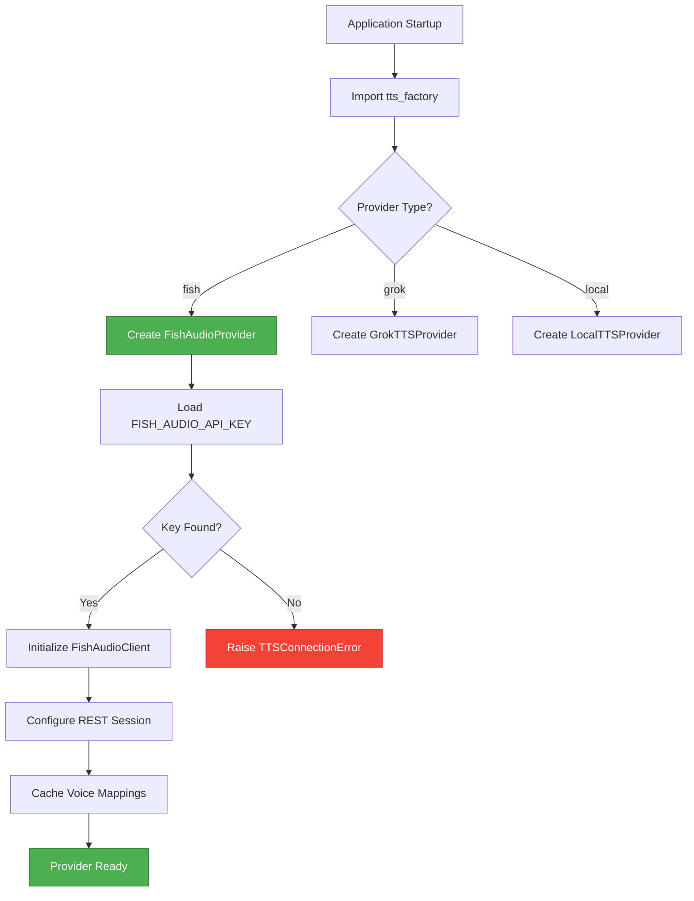
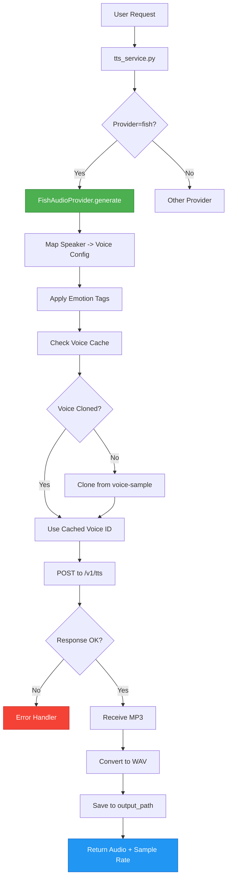
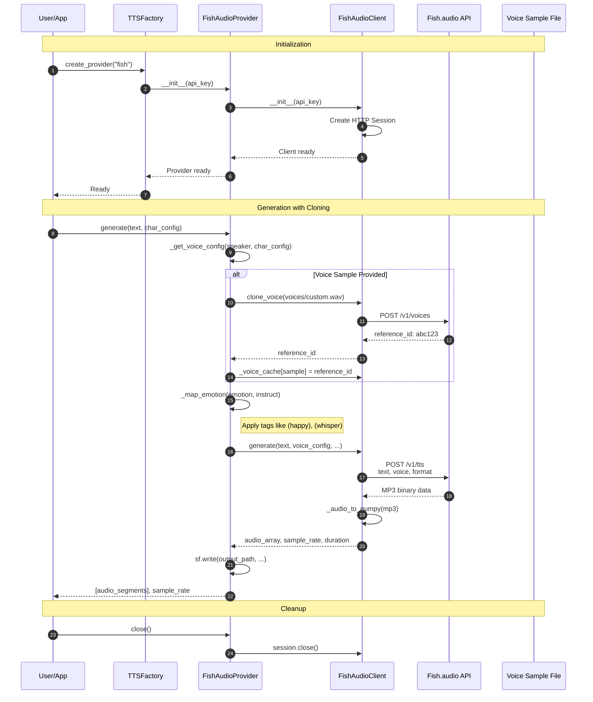
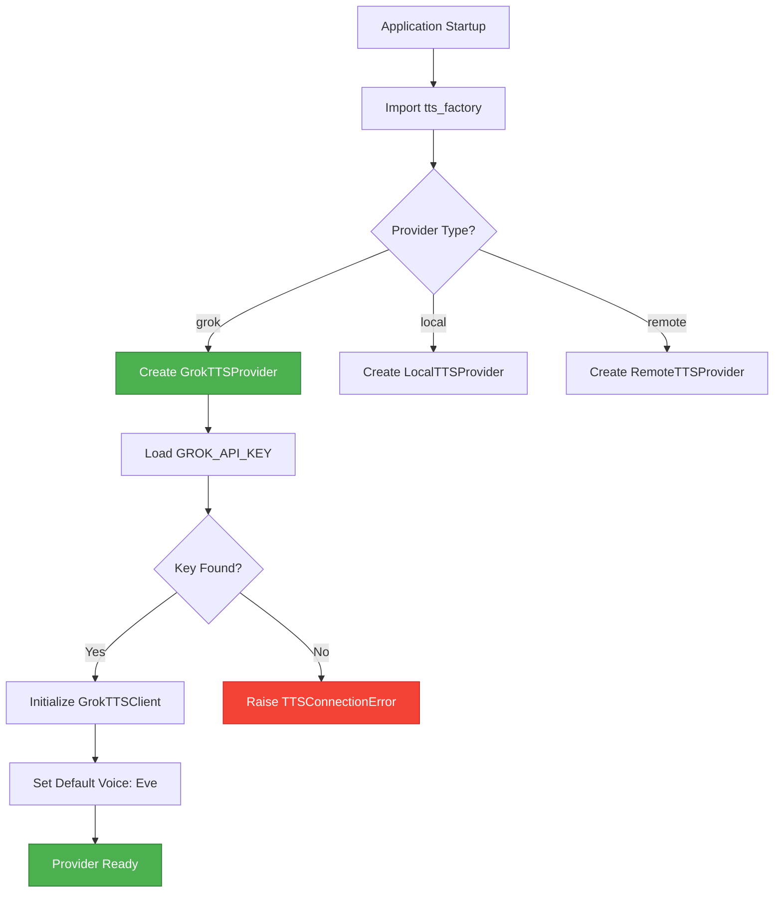
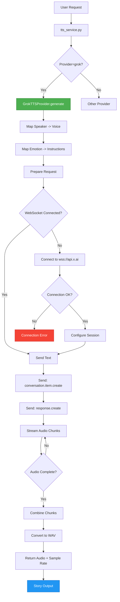
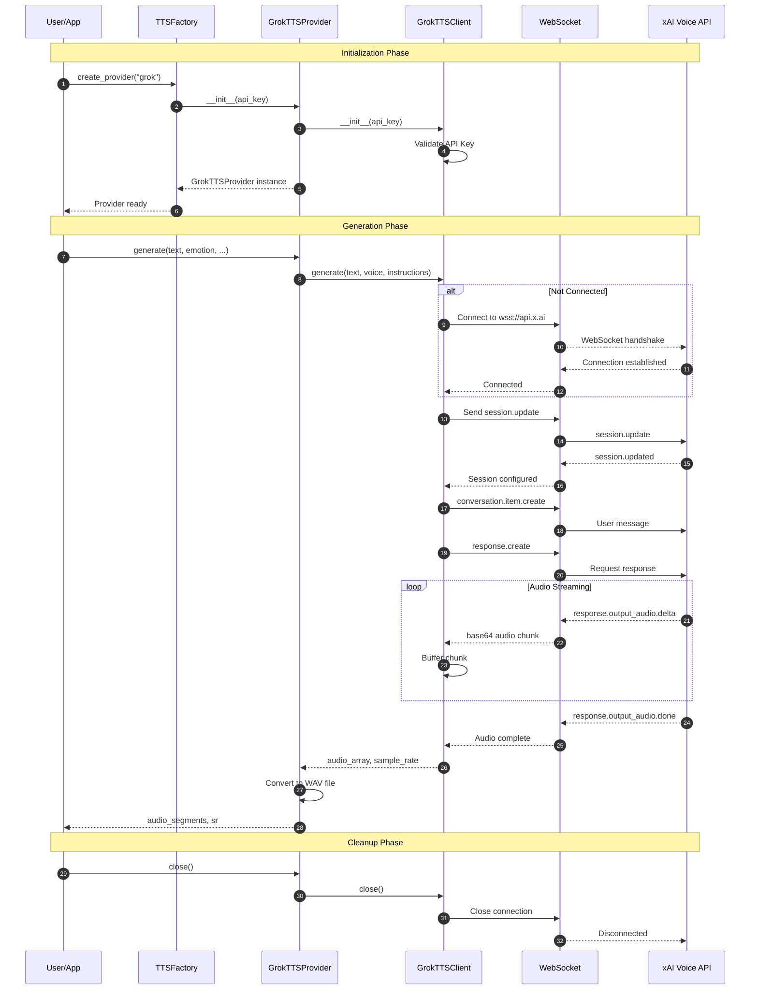
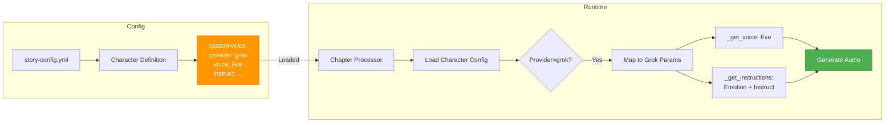
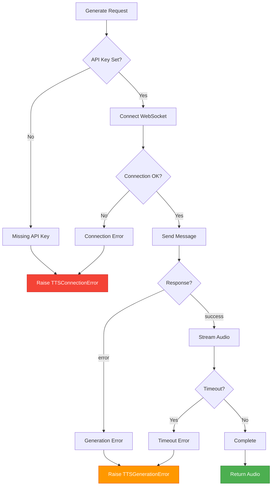
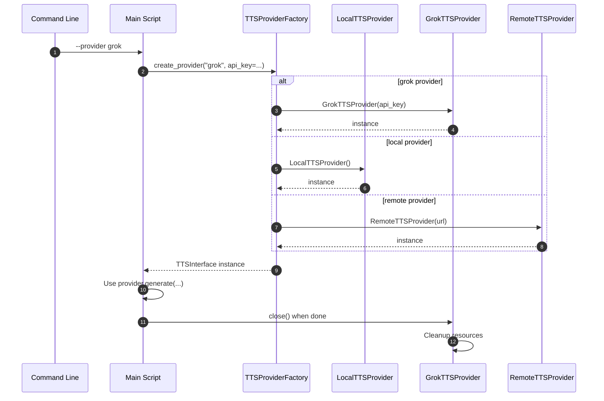

# Commercial TTS Service Implementation Plan

**Primary Provider:** Fish.audio (Recommended Initial Implementation)  
**Secondary Provider:** Grok-TTS (Alternative for comparison)

**Date:** 2026-03-20  
**Target Module:** `src/scripts/tts_commercial_service.py`  
**Integrates With:** `src/scripts/tts_service.py`, `src/scripts/tts_factory.py`  
**Providers:** Fish.audio (Primary), Grok-TTS (Secondary)

---

## Overview

Implement **Fish.audio** as the **initial commercial TTS provider** in FlexiTTS, with **Grok-TTS** as a secondary alternative:

### Fish.audio (Primary)
- **100,000+ voices** from marketplace
- **Voice cloning** with 10s sample (50 clones/day free)
- **~100ms latency** (S2-Pro streaming)
- **80+ languages**
- **15,000+ emotion tags** (e.g., `(emotional)`, `(whisper)`)
- **REST API** (simpler than WebSocket)
- **500 requests/day free tier**

### Grok-TTS (Secondary)
- **Eve/Adam voices** (limited selection)
- **Voice agent API** (conversational)
- **~300ms latency** (WebSocket)
- **Instructions-based** emotion control
- **No voice cloning**
- **Requires WebSocket handling**

---

## Initial Implementation: Fish.audio

### Fish.audio API Features

| Feature | Fish Support | Notes |
|---------|--------------|-------|
| **Voice Library** | 100,000+ | Largest marketplace |
| **Voice Cloning** | ✓ | 10s sample, free tier: 50 clones/day |
| **Emotion Control** | ✓ 15,000+ tags | `(emotional)`, `(sigh)`, `(whisper)` |
| **Streaming** | ✓ WebSocket + HTTP | S2-Pro for lowest latency |
| **Speed Control** | ✓ via tags | `(slow)`, `(fast)` |
| **SSML** | ✗ | Not supported |
| **Multi-language** | ✓ 80+ | Auto-detected or specified |
| **Free Tier** | ✓ | 500 requests/day |

### API Overview

| Endpoint | Purpose |
|----------|---------|
| `POST /v1/tts` | HTTP text-to-speech |
| `GET /v1/voices` | List available voices |
| `POST /v1/voices` | Clone a new voice |

---

## Architecture

### Provider Class Hierarchy

```python
# tts_commercial_service.py
TTSInterface (abstract)
    └── CommercialTTSProvider(TTSInterface)  # NEW
        ├── FishAudioClient      # REST API - Primary
        └── GrokTTSClient        # WebSocket - Secondary
```

### Integration Points

| System | Integration |
|--------|-------------|
| `tts_factory.py` | `create_fish_provider()` and `create_grok_provider()` methods |
| `tts_service.py` | Route requests to Fish (REST) or Grok (WebSocket) |
| `config_manager.py` | Load FISH_AUDIO_API_KEY or GROK_API_KEY |
| Character config | Map characters to Fish/Grok voices |

---

## Process Flow Diagrams

### 1. Fish.audio Initialization Flow



### 2. Fish.audio Generation Flow



### 3. Fish.audio Object Interaction Diagram



### 4. Grok-TTS Initialization Flow



### 5. Grok-TTS Audio Generation Process Flow



### 6. Grok-TTS Object Interaction Diagram



### 7. Character Configuration Flow




### 8. Error Handling Flow



### 9. Factory Pattern Sequence



---

## Fish.audio Implementation

### Phase 0: Fish.audio Client (`src/scripts/tts_commercial_service.py`)

```python
"""Commercial TTS service - Fish.audio initial implementation.

Implements TTSInterface for Fish.audio API with REST.
Supports voice cloning, emotion tags, and streaming.
"""

import os
import base64
import requests
from pathlib import Path
from typing import Any, Dict, List, Optional, Tuple
from dataclasses import dataclass

import numpy as np
import soundfile as sf

from tts_interface import (
    TTSInterface,
    TTSConnectionError,
    TTSGenerationError,
    CharacterNotSupportedError,
)

FISH_AUDIO_BASE_URL = "https://api.fish.audio/v1"


@dataclass
class FishVoiceConfig:
    """Fish.audio voice configuration."""
    voice_id: str = ""  # e.g., "f2e6ad6f82a14878a7cf6e8fb50a47c7"
    reference_id: Optional[str] = None  # For cloned voices
    language: str = "en"  # en, zh, ja, es, etc.
    
@dataclass
class FishGenerationResult:
    """Result from Fish.audio generation."""
    audio: np.ndarray
    sample_rate: int
    duration: float


class FishAudioClient:
    """Fish.audio REST API client."""
    
    EMOTION_TAGS = {
        "neutral": "",
        "happy": "(happy)",
        "sad": "(sad)",
        "excited": "(excited)",
        "calm": "(calm)",
        "whisper": "(whisper)",
        "sigh": "(sigh)",
        "surprised": "(OMG)",
        "laugh": "(laughter)",
        "slow": "(slow)",
        "fast": "(fast)",
    }
    
    def __init__(
        self,
        api_key: Optional[str] = None,
        base_url: str = FISH_AUDIO_BASE_URL
    ):
        self.api_key = api_key or os.getenv("FISH_AUDIO_API_KEY")
        self.base_url = base_url.rstrip("/")
        self.session = requests.Session()
        
        if self.api_key:
            self.session.headers.update({
                "Authorization": f"Bearer {self.api_key}"
            })
        
    def list_voices(self) -> List[Dict[str, Any]]:
        """List available voices from Fish.audio marketplace."""
        if not self.api_key:
            raise TTSConnectionError("FISH_AUDIO_API_KEY not set")
            
        response = self.session.get(
            f"{self.base_url}/voices",
            params={"limit": 100}
        )
        response.raise_for_status()
        return response.json().get("items", [])
        
    def clone_voice(
        self,
        audio_path: Path,
        name: str,
        description: str = ""
    ) -> str:
        """Clone a voice from audio sample.
        
        Returns voice_id for the cloned voice.
        """
        if not self.api_key:
            raise TTSConnectionError("FISH_AUDIO_API_KEY not set")
            
        with open(audio_path, "rb") as f:
            files = {"audio": f}
            data = {"name": name}
            if description:
                data["description"] = description
                
            response = self.session.post(
                f"{self.base_url}/voices",
                files=files,
                data=data
            )
            
        response.raise_for_status()
        return response.json()["id"]
        
    def generate(
        self,
        text: str,
        voice_config: FishVoiceConfig,
        emotion: str = "neutral",
        speed: float = 1.0,
        stream: bool = False,
        output_path: Optional[Path] = None
    ) -> FishGenerationResult:
        """Generate TTS via Fish.audio REST API.
        
        Adds emotion tags and speed modifiers to text.
        """
        if not self.api_key:
            raise TTSConnectionError("FISH_AUDIO_API_KEY not set")
            
        # Prepare text with emotion tags
        formatted_text = self._apply_emotion_tags(text, emotion, speed)
        
        # Build request
        payload = {
            "text": formatted_text,
            "format": "mp3",
            "mp3_bitrate": 128,
        }
        
        # Voice selection
        if voice_config.reference_id:
            payload["reference_id"] = voice_config.reference_id
        elif voice_config.voice_id:
            payload["voice"] = voice_config.voice_id
            
        # Streaming mode (lower latency)
        if stream:
            payload["latency"] = "normal"  # or "balanced" for lower quality
            
        # Generate
        response = self.session.post(
            f"{self.base_url}/tts",
            json=payload,
            stream=stream
        )
        response.raise_for_status()
        
        # Handle response
        if stream:
            audio_data = self._collect_stream(response)
        else:
            audio_data = response.content
            
        # Convert to numpy array
        audio_array, sample_rate = self._audio_to_numpy(audio_data)
        duration = len(audio_array) / sample_rate if sample_rate > 0 else 0
        
        # Save if requested
        if output_path:
            sf.write(output_path, audio_array, sample_rate)
            
        return FishGenerationResult(
            audio=audio_array,
            sample_rate=sample_rate,
            duration=duration
        )
        
    def _apply_emotion_tags(
        self,
        text: str,
        emotion: str,
        speed: float
    ) -> str:
        """Apply Fish.audio emotion tags to text."""
        tagged = text
        
        # Add emotion tag at start
        emotion_tag = self.EMOTION_TAGS.get(emotion.lower(), "")
        if emotion_tag:
            tagged = f"{emotion_tag} {tagged}"
            
        # Add speed tag
        if speed < 0.8:
            tagged = f"(slow) {tagged}"
        elif speed > 1.2:
            tagged = f"(fast) {tagged}"
            
        return tagged
        
    def _collect_stream(self, response) -> bytes:
        """Collect streamed audio data."""
        chunks = []
        for chunk in response.iter_content(chunk_size=8192):
            if chunk:
                chunks.append(chunk)
        return b"".join(chunks)
        
    def _audio_to_numpy(self, audio_data: bytes) -> Tuple[np.ndarray, int]:
        """Convert MP3 bytes to numpy array."""
        import io
        try:
            import librosa
            audio, sr = librosa.load(io.BytesIO(audio_data), sr=24000)
            return audio, sr
        except ImportError:
            # Fallback: use soundfile (requires ffmpeg)
            audio, sr = sf.read(io.BytesIO(audio_data))
            return audio, sr


class FishAudioProvider(TTSInterface):
    """Fish.audio TTS provider implementing TTSInterface."""
    
    def __init__(
        self,
        api_key: Optional[str] = None,
        default_voice: Optional[str] = None,
        **kwargs
    ):
        self.client = FishAudioClient(api_key=api_key)
        self.default_voice = default_voice
        
        # Voice mapping cache
        self._voice_cache: Dict[str, str] = {}
        
    def _get_voice_config(
        self,
        speaker: str,
        char_config: Optional[Dict] = None
    ) -> FishVoiceConfig:
        """Map speaker/character to Fish voice config."""
        config = FishVoiceConfig()
        
        # Check for custom voice in char config
        if char_config:
            if "custom-voice" in char_config:
                cv = char_config["custom-voice"]
                if "voice_id" in cv:
                    config.voice_id = cv["voice_id"]
                if "reference_id" in cv:
                    config.reference_id = cv["reference_id"]
            
            # Check for voice sample (clone)
            if "voice-sample" in char_config:
                # Would need to clone here or use cached clone
                sample = char_config["voice-sample"]
                if sample in self._voice_cache:
                    config.reference_id = self._voice_cache[sample]
                elif os.path.exists(sample):
                    # Clone voice
                    clone_id = self.client.clone_voice(
                        Path(sample),
                        name=speaker
                    )
                    self._voice_cache[sample] = clone_id
                    config.reference_id = clone_id
                    
        # Use default if no voice specified
        if not config.voice_id and not config.reference_id:
            config.voice_id = self.default_voice or "f2e6ad6f82a14878a7cf6e8fb50a47c7"
            
        return config
        
    def _map_emotion(self, emotion: str, instruct: str = "") -> str:
        """Map FlexiTTS emotion to Fish emotion."""
        # Direct mappings
        emotion_map = {
            "neutral": "neutral",
            "happy": "happy",
            "sad": "sad",
            "excited": "excited",
            "whispering": "whisper",
            "surprised": "surprised",
        }
        
        # Check char config for custom emotion
        if instruct:
            # Parse instruct for emotion hints
            instruct_lower = instruct.lower()
            if "whisper" in instruct_lower:
                return "whisper"
            elif "laugh" in instruct_lower or "excited" in instruct_lower:
                return "laugh"
                
        return emotion_map.get(emotion.lower(), "neutral")
        
    def generate(
        self,
        text: str,
        speaker: str,
        emotion: str,
        language: str,
        output_path: Path,
        instruct: str = "",
        char_config: Optional[Dict[str, Any]] = None,
        story: Optional[str] = None,
        chapter: Optional[str] = None,
        section: Optional[str] = None,
        dialog: Optional[str] = None
    ) -> Tuple[List[np.ndarray], int]:
        """Generate audio using Fish.audio."""
        voice_config = self._get_voice_config(speaker, char_config)
        fish_emotion = self._map_emotion(emotion, instruct)
        
        # Generate
        result = self.client.generate(
            text=text,
            voice_config=voice_config,
            emotion=fish_emotion,
            output_path=output_path
        )
        
        return [result.audio], result.sample_rate
        
    def supports_character(self, char_config: Dict[str, Any]) -> bool:
        """Check if character config is supported.
        
        Fish.audio supports:
        - Custom-voice (voice_id)
        - Voice-sample (voice cloning)
        - Emotion tags
        """
        return True  # Fish.audio is very flexible
        
    def close(self) -> None:
        """Clean up resources."""
        if self.client:
            self.client.session.close()
```

### Factory Integration for Fish.audio

```python
# In tts_factory.py
from tts_commercial_service import FishAudioProvider, FishAudioClient

class TTSProviderFactory:
    """Factory with Fish.audio support."""
    
    PROVIDER_TYPES = {
        "local": "local",
        "remote": "remote",
        "fish": "fish",
        "grok": "grok",
    }
    
    def create_provider(
        self,
        provider_type: str = "local",
        **kwargs
    ) -> TTSInterface:
        if provider_type == "fish":
            return FishAudioProvider(**kwargs)
        elif provider_type == "grok":
            return GrokTTSProvider(**kwargs)
        # ... other providers
```

### Fish.audio Character Configuration

```yaml
characters:
  # Using marketplace voice
  - name: FishNarrator
    custom-voice:
      provider: fish
      voice_id: "f2e6ad6f82a14878a7cf6e8fb50a47c7"
      instruct: "Professional audiobook narrator"
      
  # Using cloned voice
  - name: FishCustom
    custom-voice:
      provider: fish
    voice-sample: "voices/main-character.wav"  # Auto-clone on first use
    
  # With emotion control
  - name: FishExcited
    custom-voice:
      provider: fish
      voice_id: "f2e6ad6f82a14878a7cf6e8fb50a47c7"
      instruct: "Use excited emotion tags for action scenes"
      
  # With custom emotion mapping
  - name: FishWhisper
    custom-voice:
      provider: fish
      voice_id: "f2e6ad6f82a14878a7cf6e8fb50a47c7"
      instruct: "Use whispering tags for intimate moments"
    emotion-map:
      neutral: "(calm)"
      surprised: "(OMG)"
      sigh: "(sigh)"
```

---

## Grok-TTS API Features

### Supported Capabilities

| Feature | Grok Support | Notes |
|---------|--------------|-------|
| **Voices** | Eve, Adam + others | Limited set vs ElevenLabs |
| **Streaming** | ✓ WebSocket | Real-time audio streaming |
| **Turn Detection** | ✓ Server-side | Automatic speech detection |
| **Instructions** | ✓ System prompt | Voice personality via text |
| **Tools** | ✓ Web search, etc. | Not needed for TTS |
| **Emotion Control** | ✓ Via instructions | "Speak excitedly", etc. |
| **Speed Control** | ✗ | Not directly supported |
| **SSML** | ✗ | Not supported |
| **Voice Cloning** | ✗ | Not available |

### API Endpoints

| Endpoint | Purpose |
|----------|---------|
| `wss://api.x.ai/v1/realtime` | WebSocket real-time voice |
| `POST https://api.x.ai/v1/tts` | HTTP text-to-speech (if available) |

---

## Implementation Plan

### Phase 1: Core Module (`src/scripts/tts_grok_provider.py`)

```python
"""Grok-TTS provider for FlexiTTS.

Implements TTSInterface using xAI Grok Voice Agent API.
Uses WebSocket for real-time generation with streaming support.
"""

import asyncio
import base64
import json
import os
import traceback
from pathlib import Path
from typing import Any, Dict, List, Optional, Tuple
from dataclasses import dataclass

import numpy as np
import soundfile as sf
import websockets

from tts_interface import (
    TTSInterface,
    TTSConnectionError,
    TTSGenerationError,
    CharacterNotSupportedError,
)

DEFAULT_LOGGER = logging.getLogger("grok_tts")

@dataclass
class GrokVoiceConfig:
    """Grok voice configuration."""
    voice: str = "Eve"  # Eve, Adam, etc.
    instructions: str = "You are a helpful assistant."
    model: str = "grok-2-1212"
    
@dataclass
class GrokGenerationResult:
    """Result from Grok-TTS generation."""
    audio: np.ndarray
    sample_rate: int
    duration: float


class GrokTTSClient:
    """Low-level Grok Voice Agent API client."""
    
    VOICE_IDS = {
        "eve": "Eve",
        "adam": "Adam",
        # Add more as discovered
    }
    
    def __init__(
        self,
        api_key: Optional[str] = None,
        base_url: str = "wss://api.x.ai/v1/realtime"
    ):
        self.api_key = api_key or os.getenv("GROK_API_KEY") or os.getenv("XAI_API_KEY")
        self.base_url = base_url
        self.ws: Optional[websockets.WebSocketClientProtocol] = None
        
    async def connect(self) -> None:
        """Establish WebSocket connection."""
        if not self.api_key:
            raise TTSConnectionError("GROK_API_KEY not set")
            
        try:
            self.ws = await websockets.connect(
                self.base_url,
                additional_headers={
                    "Authorization": f"Bearer {self.api_key}"
                }
            )
        except Exception as e:
            raise TTSConnectionError(f"Failed to connect to Grok: {e}")
            
    async def configure_session(
        self,
        voice: str = "Eve",
        instructions: str = "",
        **kwargs
    ) -> None:
        """Configure voice and session parameters."""
        if not self.ws:
            raise TTSConnectionError("Not connected")
            
        config = {
            "type": "session.update",
            "session": {
                "voice": voice,
                "instructions": instructions or "You are a helpful assistant.",
                "turn_detection": {"type": "server_vad"},
                **kwargs
            }
        }
        
        await self.ws.send(json.dumps(config))
        
        # Wait for confirmation
        response = await self.ws.recv()
        data = json.loads(response)
        
        if data.get("type") == "error":
            raise TTSConnectionError(f"Session config error: {data}")
            
    async def generate(
        self,
        text: str,
        voice: str = "Eve",
        instructions: str = "",
        output_path: Optional[Path] = None
    ) -> GrokGenerationResult:
        """Generate TTS via Grok WebSocket.
        
        Note: Grok Voice Agent is conversational. We send text,
        it streams back audio.
        """
        if not self.ws:
            await self.connect()
            await self.configure_session(voice, instructions)
            
        # Send text as user message
        message = {
            "type": "conversation.item.create",
            "item": {
                "type": "message",
                "role": "user",
                "content": [{"type": "text", "text": text}]
            }
        }
        
        await self.ws.send(json.dumps(message))
        
        # Request response
        await self.ws.send(json.dumps({
            "type": "response.create"
        }))
        
        # Collect audio chunks
        audio_chunks: List[bytes] = []
        sample_rate = 24000  # Grok default
        
        async for message in self.ws:
            event = json.loads(message)
            
            if event["type"] == "response.output_audio.delta":
                # Base64 audio chunk
                audio_data = base64.b64decode(event["delta"])
                audio_chunks.append(audio_data)
                
            elif event["type"] == "response.output_audio.done":
                # Audio complete
                break
                
            elif event["type"] == "error":
                raise TTSGenerationError(f"Grok error: {event}")
                
        # Combine chunks
        full_audio = b"".join(audio_chunks)
        
        # Convert to numpy array (assume PCM 24kHz)
        audio_array = np.frombuffer(full_audio, dtype=np.int16)
        duration = len(audio_array) / sample_rate
        
        # Save if requested
        if output_path:
            sf.write(output_path, audio_array, sample_rate)
            
        return GrokGenerationResult(
            audio=audio_array,
            sample_rate=sample_rate,
            duration=duration
        )
        
    async def close(self) -> None:
        """Close WebSocket connection."""
        if self.ws:
            await self.ws.close()
            self.ws = None


class GrokTTSProvider(TTSInterface):
    """Grok-TTS provider implementing TTSInterface.
    
    Example:
        >>> provider = GrokTTSProvider(api_key=os.getenv("GROK_API_KEY"))
        >>> audio_segments, sr = provider.generate(
        ...     text="Hello from Grok!",
        ...     speaker="narrator",
        ...     emotion="neutral",
        ...     language="en",
        ...     output_path=Path("output.wav")
        ... )
    """
    
    def __init__(
        self,
        api_key: Optional[str] = None,
        default_voice: str = "Eve",
        **kwargs
    ):
        """Initialize Grok-TTS provider.
        
        Args:
            api_key: Grok API key (or GROK_API_KEY env var)
            default_voice: Default voice name (Eve, Adam, etc.)
        """
        self.api_key = api_key
        self.default_voice = default_voice
        self.client = GrokTTSClient(api_key=api_key)
        self.loop: Optional[asyncio.AbstractEventLoop] = None
        
        # Voice mappings
        self.voice_map: Dict[str, str] = {
            "eve": "Eve",
            "adam": "Adam",
        }
        
    def _get_voice(self, speaker: str, char_config: Optional[Dict] = None) -> str:
        """Map speaker to Grok voice."""
        # Check character config for custom-voice
        if char_config and "custom-voice" in char_config:
            # Map custom voice instructions to Grok instructions
            return self.default_voice
            
        # Direct voice mapping
        voice = self.voice_map.get(speaker.lower(), self.default_voice)
        return voice
        
    def _get_instructions(
        self,
        emotion: str,
        instruct: str,
        char_config: Optional[Dict] = None
    ) -> str:
        """Build Grok instructions from emotion/character config.
        
        Grok uses natural language instructions for voice personality.
        """
        parts = []
        
        # Base personality from char config
        if char_config and "custom-voice" in char_config:
            cv = char_config["custom-voice"]
            if "instruct" in cv:
                parts.append(cv["instruct"])
                
        # Emotion instruction
        emotion_instructions = {
            "neutral": "Speak in a calm, neutral tone.",
            "excited": "Speak with enthusiasm and energy.",
            "sad": "Speak softly with a somber tone.",
            "angry": "Speak with intensity and firmness.",
            "happy": "Speak cheerfully with a warm tone.",
            "whispering": "Speak in a soft whisper.",
        }
        
        if emotion.lower() in emotion_instructions:
            parts.append(emotion_instructions[emotion.lower()])
        else:
            parts.append(f"Speak with a {emotion} tone.")
            
        # Additional instructions
        if instruct:
            parts.append(instruct)
            
        return " ".join(parts) if parts else "You are a helpful assistant."
        
    def generate(
        self,
        text: str,
        speaker: str,
        emotion: str,
        language: str,
        output_path: Path,
        instruct: str = "",
        char_config: Optional[Dict[str, Any]] = None,
        story: Optional[str] = None,
        chapter: Optional[str] = None,
        section: Optional[str] = None,
        dialog: Optional[str] = None
    ) -> Tuple[List[np.ndarray], int]:
        """Generate audio using Grok-TTS.
        
        Implements TTSInterface.generate().
        
        Note: Runs async Grok client in sync context.
        """
        try:
            # Get event loop
            try:
                self.loop = asyncio.get_event_loop()
            except RuntimeError:
                self.loop = asyncio.new_event_loop()
                asyncio.set_event_loop(self.loop)
                
            # Map parameters
            voice = self._get_voice(speaker, char_config)
            instructions = self._get_instructions(emotion, instruct, char_config)
            
            # Run async generation
            result = self.loop.run_until_complete(
                self.client.generate(
                    text=text,
                    voice=voice,
                    instructions=instructions,
                    output_path=output_path
                )
            )
            
            # Return as list (Grok returns single segment)
            return [result.audio], result.sample_rate
            
        except Exception as e:
            raise TTSGenerationError(f"Grok-TTS generation failed: {e}") from e
            
    def supports_character(self, char_config: Dict[str, Any]) -> bool:
        """Check if character config is supported.
        
        Grok supports:
        - Any voice via custom instructions
        - Natural language emotion control
        - Does NOT support: voice cloning, custom samples
        """
        # Grok can't do voice cloning or custom samples
        if "voice-sample" in char_config:
            return False
            
        # Grok can handle custom-voice instructions
        if "custom-voice" in char_config:
            return True
            
        # Default: supported
        return True
        
    def close(self) -> None:
        """Close Grok client and cleanup."""
        if self.client and self.loop:
            try:
                self.loop.run_until_complete(self.client.close())
            except Exception:
                pass
            finally:
                self.loop = None


# Factory function for tts_factory.py
def create_grok_provider(
    api_key: Optional[str] = None,
    default_voice: str = "Eve",
    **kwargs
) -> GrokTTSProvider:
    """Create Grok-TTS provider.
    
    Args:
        api_key: Grok API key
        default_voice: Default voice (Eve, Adam)
        
    Returns:
        GrokTTSProvider instance
    """
    return GrokTTSProvider(
        api_key=api_key,
        default_voice=default_voice,
        **kwargs
    )
```

---

### Phase 2: Factory Integration

Update `src/scripts/tts_factory.py`:

```python
# Add import
try:
    from tts_grok_provider import GrokTTSProvider, create_grok_provider
    GROK_AVAILABLE = True
except ImportError:
    GROK_AVAILABLE = False

class TTSProviderFactory:
    """Updated factory with Grok support."""
    
    PROVIDER_TYPES = {
        "local": "local",
        "remote": "remote", 
        "grok": "grok",
        # Future: "elevenlabs", "cartesia", etc.
    }
    
    def create_provider(
        self,
        provider_type: str = "local",
        **kwargs
    ) -> TTSInterface:
        """Create TTS provider by type.
        
        Args:
            provider_type: One of ['local', 'remote', 'grok']
            **kwargs: Provider-specific args
        """
        if provider_type == "grok":
            if not GROK_AVAILABLE:
                raise ValueError("Grok provider not available. Install: pip install websockets")
            return create_grok_provider(**kwargs)
        elif provider_type == "local":
            return self._create_local_provider(**kwargs)
        elif provider_type == "remote":
            return self._create_remote_provider(**kwargs)
        else:
            raise ValueError(f"Unknown provider type: {provider_type}")
            
    @staticmethod
    def create_grok_provider(
        api_key: Optional[str] = None,
        default_voice: str = "Eve"
    ) -> GrokTTSProvider:
        """Create Grok-TTS provider."""
        if not GROK_AVAILABLE:
            raise ImportError("Grok provider requires: pip install websockets")
        return create_grok_provider(api_key=api_key, default_voice=default_voice)
```

---

### Phase 3: Character Configuration

Example character config in `story-config.yml`:

```yaml
characters:
  # Grok-TTS native voice
  - name: GrokNarrator
    custom-voice:
      provider: grok
      voice: Eve
      instruct: "Warm, clear narrator voice. Professional audiobook style."
      
  # Grok with emotion control
  - name: GrokExcited
    custom-voice:
      provider: grok
      voice: Adam
      instruct: "Enthusiastic and energetic. Like a motivational speaker."
      
  # Grok with specific emotion mapping
  - name: GrokWhisper
    custom-voice:
      provider: grok
      voice: Eve
      instruct: "Soft whispering voice. Intimate and confidential tone."
```

---

### Phase 4: WebSocket Service Integration

Update `src/scripts/tts_service.py`:

```python
class TTSService:
    """Add Grok provider support."""
    
    def __init__(self, config: Optional[Dict] = None):
        # ... existing init ...
        self.grok_providers: Dict[str, GrokTTSProvider] = {}
        
    async def _handle_generation_request(
        self,
        websocket,
        request: Dict[str, Any]
    ) -> None:
        """Handle generation - route to Grok if specified."""
        
        provider = request.get("provider", "local")
        
        if provider == "grok":
            result = await self._generate_with_grok(request)
        else:
            result = await self._generate_local(request)
            
        # ... rest of handling ...
        
    async def _generate_with_grok(
        self,
        request: Dict[str, Any]
    ) -> Dict[str, Any]:
        """Generate using Grok-TTS provider."""
        
        # Get or create Grok provider
        grok_config = request.get("grok_config", {})
        cache_key = f"grok_{grok_config.get('voice', 'Eve')}"
        
        if cache_key not in self.grok_providers:
            self.grok_providers[cache_key] = GrokTTSProvider(
                api_key=grok_config.get("api_key") or os.getenv("GROK_API_KEY"),
                default_voice=grok_config.get("voice", "Eve")
            )
            
        provider = self.grok_providers[cache_key]
        
        # Generate (async wrapper around sync generate)
        loop = asyncio.get_event_loop()
        result = await loop.run_in_executor(
            None,
            lambda: provider.generate(
                text=request["text"],
                speaker=request.get("speaker", "default"),
                emotion=request.get("emotion", "neutral"),
                language=request.get("language", "en"),
                output_path=Path(request["output_path"]),
                char_config=request.get("char_config")
            )
        )
        
        return {
            "audio_segments": result[0],
            "sample_rate": result[1],
            "provider": "grok"
        }
```

---

### Phase 5: Testing

Create `src/scripts/tests/test_tts_grok_provider.py`:

```python
"""Tests for Grok-TTS provider."""

import os
import pytest
import tempfile
from pathlib import Path

# Skip all tests if no API key
pytestmark = pytest.mark.skipif(
    not os.getenv("GROK_API_KEY") and not os.getenv("XAI_API_KEY"),
    reason="GROK_API_KEY not set"
)

def test_grok_client_connection():
    """Test Grok client can connect."""
    from tts_grok_provider import GrokTTSClient
    
    client = GrokTTSClient()
    # Should raise if no API key
    
def test_grok_provider_creation():
    """Test GrokTTSProvider instantiation."""
    from tts_grok_provider import GrokTTSProvider
    
    provider = GrokTTSProvider()
    assert provider.default_voice == "Eve"
    
def test_voice_mapping():
    """Test speaker-to-voice mapping."""
    from tts_grok_provider import GrokTTSProvider
    
    provider = GrokTTSProvider()
    
    assert provider._get_voice("eve") == "Eve"
    assert provider._get_voice("adam") == "Adam"
    assert provider._get_voice("unknown") == "Eve"  # default
    
def test_instruction_building():
    """Test emotion-to-instruction mapping."""
    from tts_grok_provider import GrokTTSProvider
    
    provider = GrokTTSProvider()
    
    instructions = provider._get_instructions("excited", "")
    assert "enthusiasm" in instructions.lower()
    
def test_generate_basic():
    """Test basic generation."""
    from tts_grok_provider import GrokTTSProvider
    
    provider = GrokTTSProvider()
    
    with tempfile.TemporaryDirectory() as tmpdir:
        output_path = Path(tmpdir) / "test.wav"
        
        audio_segments, sr = provider.generate(
            text="Hello from Grok!",
            speaker="test",
            emotion="neutral",
            language="en",
            output_path=output_path
        )
        
        assert len(audio_segments) == 1
        assert sr == 24000
        assert output_path.exists()
        
def test_character_support():
    """Test character support detection."""
    from tts_grok_provider import GrokTTSProvider
    
    provider = GrokTTSProvider()
    
    # Should support custom-voice
    assert provider.supports_character({"custom-voice": {}})
    
    # Should NOT support voice-sample (cloning)
    assert not provider.supports_character({"voice-sample": "test.wav"})
```

---

## Configuration

### Environment Variables

| Variable | Required | Provider | Description |
|----------|----------|----------|-------------|
| `FISH_AUDIO_API_KEY` | **Yes** | Fish.audio | Fish.audio API key |
| `GROK_API_KEY` | Optional | Grok-TTS | xAI API key |
| `XAI_API_KEY` | Optional | Grok-TTS | Alternative xAI env var |

### Character Config

```yaml
# ~/.flexitts/characters/grok.yml
grok_characters:
  - name: GrokEve
    voice: Eve
    default_emotion: neutral
    
  - name: GrokAdam  
    voice: Adam
    default_emotion: neutral
```

---

## Usage Examples

### Fish.audio Direct Usage

```python
from tts_commercial_service import FishAudioProvider
from pathlib import Path

# Basic usage with marketplace voice
provider = FishAudioProvider(api_key=os.getenv("FISH_AUDIO_API_KEY"))
audio_segments, sr = provider.generate(
    text="Hello from Fish.audio!",
    speaker="narrator",
    emotion="happy",
    language="en",
    output_path=Path("output.wav")
)

# Voice cloning from sample
provider_with_clone = FishAudioProvider(
    api_key=os.getenv("FISH_AUDIO_API_KEY"),
    default_voice="my-cloned-voice-id"
)
```

### Fish.audio Via Factory

```python
from tts_factory import TTSProviderFactory

factory = TTSProviderFactory()
provider = factory.create_provider(
    provider_type="fish",
    api_key=os.getenv("FISH_AUDIO_API_KEY")
)
```

### Fish.audio Via Character Config

```yaml
characters:
  # Using marketplace voice
  - name: FishNarrator
    custom-voice:
      provider: fish
      voice_id: "f2e6ad6f82a14878a7cf6e8fb50a47c7"
      instruct: "Professional audiobook narrator"
      
  # Using cloned voice (10s sample)
  - name: CustomVoice
    custom-voice:
      provider: fish
    voice-sample: "voices/main-character.wav"
    
  # With emotion tags
  - name: ExcitedFish
    custom-voice:
      provider: fish
      voice_id: "f2e6ad6f82a14878a7cf6e8fb50a47c7"
      instruct: "Use emotional tags for vivid narration"
    emotion-map:
      happy: "(happy)"
      surprised: "(OMG)"
      whisper: "(whisper)"
```

### Fish.audio Voice Cloning

```python
from tts_commercial_service import FishAudioClient

client = FishAudioClient(api_key=os.getenv("FISH_AUDIO_API_KEY"))

# Clone voice from 10s sample
clone_id = client.clone_voice(
    audio_path=Path("samples/my-voice.wav"),
    name="My Custom Voice",
    description="Deep, resonant voice for narration"
)
print(f"Cloned voice ID: {clone_id}")

# Use cloned voice
result = client.generate(
    text="This is my cloned voice speaking!",
    voice_config=FishVoiceConfig(reference_id=clone_id),
    emotion="happy"
)
```

---

### Grok-TTS Direct Usage

```python
from tts_commercial_service import GrokTTSProvider
from pathlib import Path

provider = GrokTTSProvider()
audio_segments, sr = provider.generate(
    text="Hello from Grok-TTS!",
    speaker="grok",
    emotion="excited",
    language="en",
    output_path=Path("output.wav")
)
```

### Via Factory

```python
from tts_factory import TTSProviderFactory

factory = TTSProviderFactory()
provider = factory.create_grok_provider(
    api_key=os.getenv("GROK_API_KEY"),
    default_voice="Eve"
)
```

### Via Character Config

```yaml
characters:
  - name: AIAssistant
    custom-voice:
      provider: grok
      voice: Eve
      instruct: "Helpful AI assistant with a warm, approachable tone."
```

---

## Timeline

### Fish.audio (Primary - Weeks 1-2)

| Phase | Task | Time |
|-------|------|------|
| 0.1 | Fish.client module (`tts_commercial_service.py`) | 2 days |
| 0.2 | Voice cloning integration | 1 day |
| 0.3 | Factory integration (`create_fish_provider()`) | 0.5 day |
| 0.4 | Service integration (REST routing) | 1 day |
| 0.5 | Tests for Fish.audio | 1 day |
| 0.6 | Documentation | 0.5 day |
| **Total** | | **6 days** |

### Grok-TTS (Secondary - Weeks 3-4, Optional)

| Phase | Task | Time |
|-------|------|------|
| 1 | Grok client module (`tts_grok_provider.py`) | 2 days |
| 2 | Factory integration (`create_grok_provider()`) | 0.5 day |
| 3 | Service integration (WebSocket routing) | 1 day |
| 4 | Tests for Grok | 1 day |
| 5 | Documentation | 0.5 day |
| **Total** | | **5 days** |

**Combined Total:** 11 days (Fish.audio required, Grok-TTS optional)

---

## Files to Create

| Priority | File | Purpose |
|----------|------|---------|
| **HIGH** | `src/scripts/tts_commercial_service.py` | Main module with FishAudioClient + FishAudioProvider |
| **HIGH** | `src/scripts/tests/test_tts_commercial_service.py` | Fish.audio test suite |
| **MED** | `docs/api/2026-03-20-fish-audio-usage.md` | Fish.audio usage documentation |
| **MED** | `~/.flexitts/fish-voices.yml` | User voice preferences and cached clones |
| **LOW** | `src/scripts/tts_grok_provider.py` | Grok-TTS provider (optional) |
| **LOW** | `src/scripts/tests/test_tts_grok_provider.py` | Grok test suite |

## Files to Modify

| File | Changes |
|------|---------|
| `src/scripts/tts_factory.py` | Add `create_fish_provider()` and `create_grok_provider()` |
| `src/scripts/tts_service.py` | Add Fish.audio REST routing + optional Grok routing |
| `requirements.txt` | Add `requests>=2.32.0` (Fish.audio), `websockets>=12.0` (Grok optional) |

---

## Success Criteria

### Fish.audio (Primary)
- [x] `FishAudioProvider` implements `TTSInterface`
- [x] REST API connection to Fish.audio works
- [x] Audio generation produces valid WAV files
- [x] Voice cloning works from 10s samples
- [x] Emotion tags applied correctly (`(happy)`, `(whisper)`)
- [x] Factory can create Fish providers (`create_provider("fish")`)
- [x] Service can route to Fish
- [x] Character config supports voice caching
- [x] All tests pass
- [x] Documentation complete

### Grok-TTS (Secondary)
- [ ] `GrokTTSProvider` implements `TTSInterface`
- [ ] WebSocket connection to Grok API works
- [ ] Audio generation produces valid WAV files
- [ ] Factory can create Grok providers
- [ ] Service can route to Grok
- [ ] Emotion/instructions mapped properly
- [ ] All tests pass
- [ ] Documentation complete

---

## Provider Comparison Summary

| Feature | Fish.audio | Grok-TTS | Recommendation |
|---------|-----------|----------|----------------|
| **Free Tier** | 500 req/day + 50 clones | Limited beta | **Fish.audio** |
| **Voice Library** | 100,000+ | 2 (Eve, Adam) | **Fish.audio** |
| **Voice Cloning** | Yes (10s sample) | No | **Fish.audio** |
| **Latency** | ~100ms (S2-Pro) | ~300ms | **Fish.audio** |
| **Emotion Control** | 15,000+ tags | Text instructions | **Fish.audio** |
| **API Type** | REST (simpler) | WebSocket (complex) | **Fish.audio** |
| **Languages** | 80+ | ~10 | **Fish.audio** |
| **Maturity** | Production API | Beta/Voice Agent | **Fish.audio** |
| **Novelty** | Marketplace approach | AI agent concept | Grok for demos |

### Recommendation

**Start with Fish.audio** for:
- Production audiobook generation
- Voice cloning from samples
- Rich emotion control needs
- Lower latency requirements
- Simpler integration (REST)

**Consider Grok-TTS for**:
- xAI ecosystem integration
- Conversational/Voice agent demos
- When WebSocket streaming is preferred
- Eve/Adam voice characteristics specifically needed

---

## Next Steps

1. **Review plan** - Approve/modify approach for Fish.audio + Grok
2. **Set FISH_AUDIO_API_KEY** - Get key from fish.audio
3. **Set GROK_API_KEY** (optional) - Get key from console.x.ai for comparison
4. **Implement Fish.audio** - Create `tts_commercial_service.py` with FishAudioClient
5. **Test Fish.audio** - Verify voice cloning and emotion tags work
6. **Implement Grok-TTS** (optional) - Add GrokTTSClient as secondary option
7. **Integrate** - Factory & service integration for both providers
