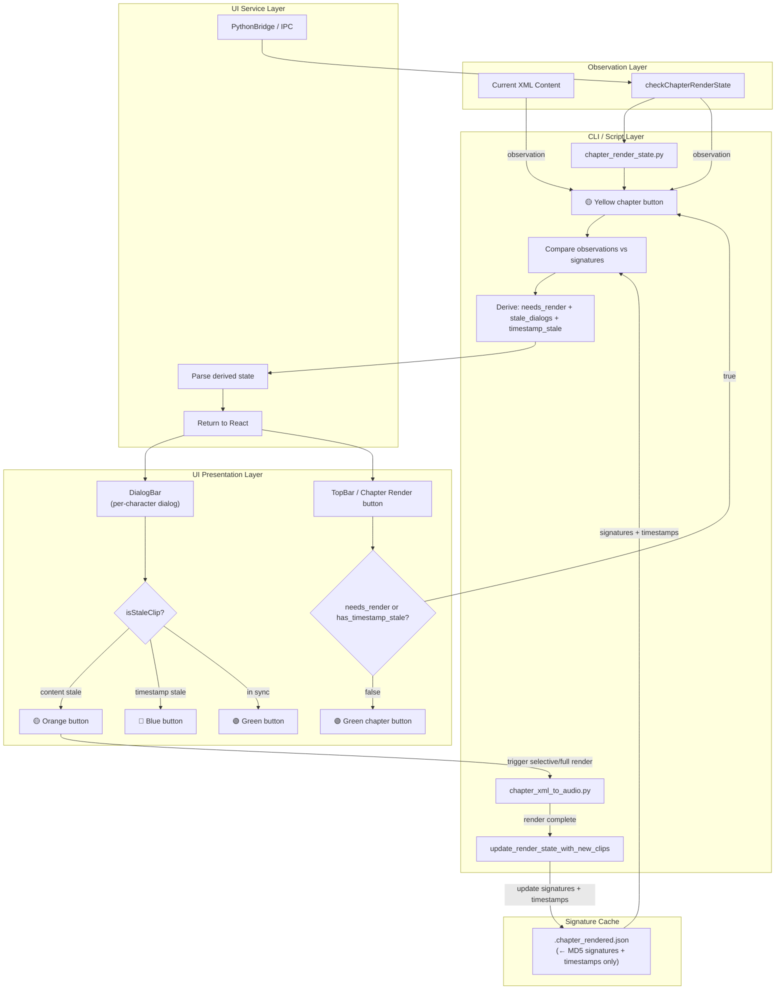
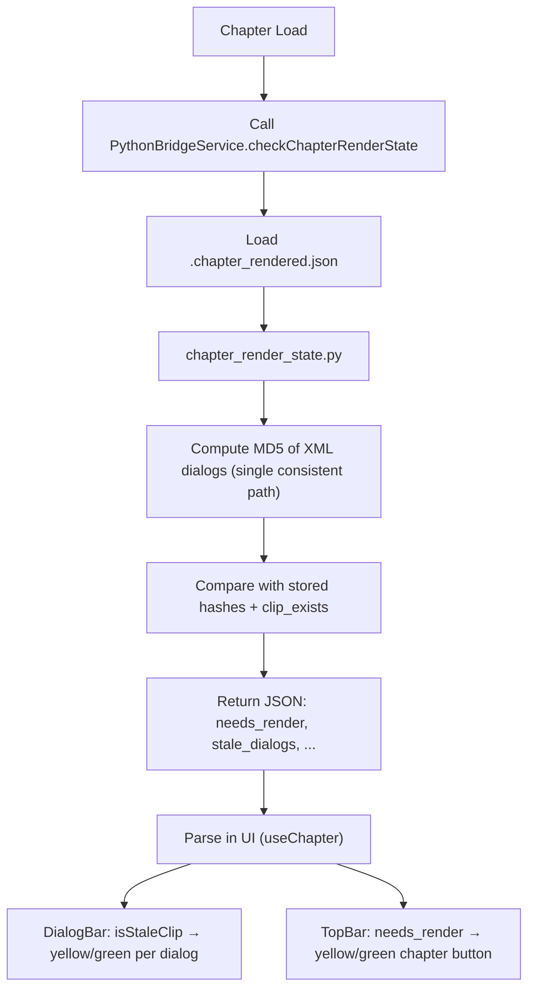
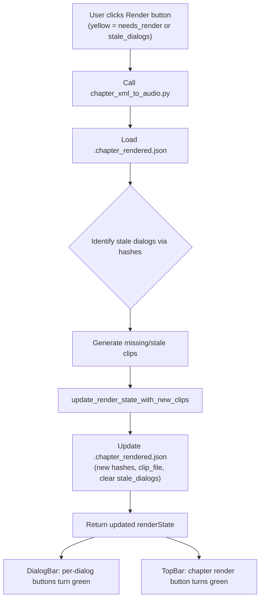
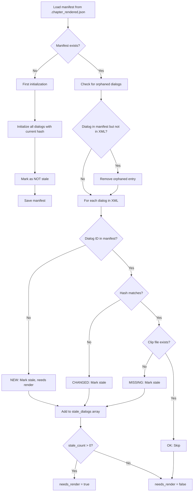

# Chapter Render State Tracking

**Date:** March 11, 2026 (Updated 2026-03-19)  
**Author:** FlexiTTS Development Team  
**Status:** Implemented ✅ (Observational Architecture + Centralized Function)

## Overview

The chapter render state tracking system enables fast detection of dialogs that need re-rendering due to XML changes. 

**2026-03-19 Update - Observational Architecture:** The system uses an **observational approach** where the current XML content and filesystem state are the primary source of truth. The `.chapter_rendered.json` file serves only as a minimal signature cache (MD5 hashes + timestamps). All render state is **derived from observation** on each check, eliminating any possibility of divergence between stored state and reality.

## Benefits

- ⚡ **Fast checks** (< 100ms) - No need to regenerate audio to detect changes
- 🎯 **Selective rendering** - Only changed dialogs are re-rendered
- 💾 **Atomic storage** - Crash-safe file writes
- 🟡 **Visual indicators** - UI shows yellow button when re-render needed
- 🔵 **Timestamp detection** - Blue buttons when audio files modified externally
- 🏗️ **Centralized logic** - All state logic in `get_comprehensive_render_state()` (2026-03-19)
- 🔧 **Proper initialization** - First-time state now includes proper timestamps
- 📊 **Chapter-level detection** - Yellow button if any dialog is newer than `last_rendered_at`

## Issues Resolved (2026-03-19)

### Issue 1: Missing Initial Timestamps
**Problem:** When `.chapter_rendered.json` was initially created, it did not contain timestamps for individual dialog clips and the full chapter `last_rendered_at`.

**Solution:** 
- `get_comprehensive_render_state()` now uses `discover_existing_clips()` during first-time initialization
- Sets proper `rendered_at` timestamps from actual file `mtime` for existing clips
- Chapter-level `last_rendered_at` is set to the newest clip timestamp found

### Issue 2: Chapter-Level Staleness
**Problem:** The chapter should show as needing re-rendering (yellow "Render Chapter" button) if any dialog clips are newer than `last_rendered_at`.

**Solution:**
- Added chapter-level staleness detection in the comprehensive function
- If any dialog clip's `mtime` is newer than chapter `last_rendered_at`, the chapter status becomes `needs_render`
- Chapter `reason` field provides specific status: `"no_clips"`, `"newer_clips"`, `"initialized"`, or `"good"`

### Architectural Improvement
**Problem:** Render state logic was scattered across multiple functions (`check_render_state()`, `detect_stale_dialogs()`, `get_render_state_json()`, etc.) causing inconsistent behavior.

**Solution:** Made `get_comprehensive_render_state()` the **SINGLE AUTHORITATIVE FUNCTION**:
- All other functions are now **thin wrappers** that delegate to it
- Removed duplicate logic (`detect_stale_dialogs()` is now dead code)
- `check_render_state()` and `get_render_state_json()` call the comprehensive function
- `update_render_state_with_new_clips()` uses it for post-render updates
- Ensures consistent behavior for blue buttons, yellow chapter button, and timestamp staleness

**Return Structure:**
```json
{
  "status": "good" | "needs_render",
  "chapter": { ... },
  "dialogs": {
    "missing": ["dialog1", "dialog2"],
    "needs_render": ["dialog3"],
    "timestamp_stale": ["dialog4"],
    "good": ["dialog5"]
  },
  "summary": { ... }
}
```

## Architecture

**Core Design Principle (2026-03-19 Update):** 

The system uses an **observational architecture** where:
- **Primary source of truth**: Current XML content + filesystem state (observation)
- **Secondary cache**: `.chapter_rendered.json` only holds MD5 signatures and timestamps
- **State is derived**: All computed fields (`needs_render`, `stale_dialogs`, `has_timestamp_stale`, etc.) are calculated from observation on each check

This eliminates divergence between stored state and reality. The JSON file is **not** a state container - it is a **signature cache**.



## File Locations

```
Stories/
└── Story-<Name>/
    ├── story-xml/
    │   └── <Chapter>.xml
    └── story-audio/
        └── clips/
            └── <Chapter>/
                ├── .chapter_rendered.json    ← Render state manifest
                ├── chapter_001_001_001.wav   ← Generated audio clips
                └── chapter_001_001_002.wav
```

## Data Schema

### `.chapter_rendered.json` - **Signature Cache Only**

**Important:** This file does **NOT** hold the render state. It is a minimal **signature cache** containing only MD5 hashes and timestamps. 

**All state is derived from observation** of the current XML content and filesystem state on each check. This eliminates divergence between stored data and reality.

**Example** (minimal format after 2026-03-19 refactor):

```json
{
  "version": 1,
  "story": "Entanglement",
  "chapter": "1-",
  "xml_hash": "9a684f99b7c7d23a8075bd63f31fa1da",
  "xml_path": "Stories/Story-Entanglement/story-xml/01-Hendrix.xml",
  "clips_dir": "Stories/Story-Entanglement/story-audio/clips/01-Hendrix",
  "dialogs": {
    "001_001": {
      "dialog_id": "001_001",
      "hash": "ac347cc7d2b70ff32fe66df92d6b5e41",
      "rendered_at": 1742391123456
    },
    "001_002": {
      "dialog_id": "001_002", 
      "hash": "26148a5d35ee54e5af937df873dfa9d2",
      "rendered_at": 1742391123456
    },
    "002_001": {
      "dialog_id": "002_001",
      "hash": "dd1a37c17d8898d40a74d7c7482c6ccb",
      "rendered_at": 1742391123456
    }
  },
  "last_rendered_at": 1742391123456
}
```

**Note:** The response JSON sent to the UI contains many more computed fields (`needs_render`, `stale_dialogs`, `has_timestamp_stale`, etc.) but these are **derived at runtime** and **not persisted** in the `.chapter_rendered.json` file.

### Observational Architecture - Field Descriptions

**Key Principle:** The `.chapter_rendered.json` file is a **signature cache only**. It contains:

| Field | Type | Description |
|-------|------|-------------|
| `dialogs` | `Record<string, DialogRenderState>` | **Signature cache only**. Map of `dialog_id` → `{hash, rendered_at}`. **No state is stored here.** |
| `xml_hash` | `string` | Last known XML file MD5 signature. Updated only after successful full render. |
| `hash` | `string` | MD5 of normalized dialog content (text + attributes). Used for content change detection. |
| `rendered_at` | `number` | Unix timestamp (ms) when dialog was last rendered. Used for timestamp staleness detection. |
| `last_rendered_at` | `number` | Chapter-level timestamp. |

**All other fields are derived from observation at runtime:**

- `needs_render`, `stale_dialogs`, `stale_count` - computed by comparing current XML + filesystem against signatures
- `has_timestamp_stale`, `timestamp_stale_dialogs` - derived from file modification times
- `is_fully_rendered` - derived from complete absence of staleness
- `dialogs` in UI response - includes computed fields like `needsRender`, `clipExists` for compatibility

**Observational Process:**
1. Parse current XML to get current dialog content and compute fresh MD5s
2. Scan filesystem to find actual audio files and their modification times  
3. Compare observations against stored signatures in `.chapter_rendered.json`
4. Derive all computed state fields from this comparison
5. Return derived state to UI (computed fields are not persisted)

### Observational Design - XML + Filesystem as Source of Truth

**Core Principle (2026-03-19):** The **current state of XML + filesystem** is the authoritative source of truth. The `.chapter_rendered.json` file is merely a cache of signatures and timestamps used for efficient comparison.

**Observational Staleness Determination:**
1. **Parse current XML** → compute fresh MD5 hashes for all dialogs (observation)
2. **Scan filesystem** → find actual audio files and check their modification times (observation)  
3. **Compare observations** against stored signatures in `.chapter_rendered.json`
4. **Derive state** from this comparison

**Staleness Rules:**
- **Hash mismatch**: Current XML content hash ≠ stored signature → content changed (stale)
- **Missing from cache**: Dialog exists in XML but not in signature cache → new dialog (stale, except first init)
- **Missing audio file**: Signature exists but no corresponding audio file found → missing (stale)
- **Timestamp stale**: Audio file exists but `rendered_at` is older than file's `mtime` → timestamp out of sync (blue button)

**This approach ensures** the system can never get out of sync with reality because reality is always observed first.

### Consistent Hash Computation (Single MD5 Path)

There must be **only one canonical path** for computing the per-dialog MD5 hash ("Text + Attributes").

The normalization of dialog content must produce *identical* output whether the input is an XML `Element` (used by `parse_xml_dialogs` / `check_render_state`) or a `Utterance` object (used by `update_render_state_with_new_clips` during render).

This ensures:
- Hashes stored in `.chapter_rendered.json` during render exactly match those recomputed on every check.
- The state file is regenerated consistently.
- Re-renders do not incorrectly invalidate MD5 signatures when the underlying text and attributes have not changed.
- Full alignment with "XML as source of truth".

The `normalize_dialog_text` function is the single source for this computation.

### First Initialization Behavior

When `.chapter_rendered.json` doesn't exist:

1. Parse XML dialogs and compute current hashes
2. Initialize all dialogs in manifest with current hashes
3. **Mark as NOT stale** - assumes existing clips are valid
4. Set `needs_render = false`, `is_fully_rendered = true`
5. Save manifest to disk
6. `clip_file` remains empty string until actual render occurs (populated by `update_render_state_with_new_clips`)

### TypeScript Interfaces

```typescript
interface DialogRenderStatus {
  dialogId: string;
  hash: string;
  clipFile: string;
  renderedAt: number;
  clipExists: boolean;
  needsRender: boolean;
}

interface ChapterRenderState {
  version: number;
  story: string;
  chapter: string;
  xmlHash: string;
  needsRender: boolean;
  isFullyRendered: boolean;
  staleDialogs: string[];
  staleCount: number;
  lastRenderedAt: number;
  dialogCount: number;
  dialogs?: Record<string, DialogRenderStatus>;
  error?: string;
}
```

## Process Flow

### Render State Check (Fast Path)



### Selective Re-Rendering



### Stale Detection Logic



**Key Principle:** XML is the source of truth. The filesystem may contain orphaned clips from previous renders, but staleness is determined only by:
1. Hash comparison (XML content vs manifest)
2. Manifest presence (dialog in XML but not manifest = new)
3. File existence (manifest says clip exists but file deleted = missing)

## Timestamp-Based Staleness Detection (2026-03-17 Update)

**New Requirement:** In addition to hash-based staleness, the system now uses **file timestamps** to detect when audio clips have been modified externally or when timestamps are out of sync with the render state.

### Requirements

1. **Timestamp Staleness**: Compare `rendered_at` (stored in `.chapter_rendered.json`) vs actual file modification time (`os.path.getmtime()`)
2. **"Render Chapter" button**: Should turn **yellow** when any dialog's timestamp is out of sync
3. **Individual dialog buttons**: Should turn **blue** when the stored timestamp is older than the audio file's timestamp
4. **Update Timing**: Timestamps should **only** be updated after a **successful "Render Chapter"** run (not on every state check)

### Implementation Details

**New Function:**
```python
def is_timestamp_stale(
    stored_rendered_at: int, 
    clip_path: Path, 
    tolerance_ms: int = 2000
) -> bool:
    """Check if stored timestamp is older than file modification time."""
    if not clip_path.exists() or stored_rendered_at == 0:
        return True
    file_mtime = int(clip_path.stat().st_mtime * 1000)
    return file_mtime > stored_rendered_at + tolerance_ms
```

**Enhanced Staleness Detection:**
- Now checks **both** content hash **and** timestamp staleness
- Added `is_timestamp_stale` field to `DialogRenderState`
- New API fields: `has_timestamp_stale` and `timestamp_stale_dialogs`

**UI Color Scheme:**
- **Render Chapter button**: Yellow (`#ff9800`) when there are any missing, content-stale, or timestamp-stale dialogs
- **Individual dialog buttons**:
  - Gray (`#888`): No audio clip exists
  - Blue (`#2196F3`): Timestamp out of sync (file modified externally, newer than stored `rendered_at`)
  - Orange (`#ff9800`): Content changed (XML hash mismatch) 
  - Green (`#4CAF50`): Fully in sync (hash matches and timestamp is current)

**Important:** After successful re-rendering, dialogs should turn **green**. Uses exact timestamp comparison (`file_mtime > stored.rendered_at`) with no tolerance. Blue only appears when audio files are modified externally *after* rendering.

**Key Rule:** 
- `rendered_at` timestamps are updated after **any** successful render (individual or full chapter)
- First-time initialization properly discovers existing clips and marks them as "good"
- Clip pattern matching handles both `chapter_{section}_{dlgseq}_*.wav` and `chapter_{chapter}_{section}_{dlgseq}_*.wav` filename formats
- State file is created on first use even when no prior `.chapter_rendered.json` existed

## Implementation Details

### Python Module: `chapter_render_state.py`

**Key Functions:**

```python
# Compute MD5 hash of file
compute_file_md5(path: Path) -> str

# Parse XML and compute dialog hashes  
parse_xml_dialogs(xml_path: Path) -> Dict[str, str]

# Load state from disk (returns empty state if missing)
load_render_state(clips_dir: Path, chapter_stem: str) -> ChapterRenderState

# Save state atomically (temp file + rename)
save_render_state(state: ChapterRenderState, clips_dir: Path, chapter_stem: str)

# Check if render needed - main entry point
check_render_state(
    xml_path: Path,
    clips_dir: Path,
    chapter_stem: str,
    story_name: str
) -> ChapterRenderState

# Update state after rendering (populate clip filenames)
update_render_state_with_new_clips(
    state: ChapterRenderState,
    generated_clips: List[tuple],
    clips_dir: Path,
    chapter_stem: str
) -> ChapterRenderState

# Remove stale clip files from filesystem
remove_stale_clip_files(
    state: ChapterRenderState,
    clips_dir: Path,
    chapter_stem: str
) -> List[str]
```

**Centralized Render State Function (2026-03-19):**

All render state logic is now consolidated in a **single function**:

```python
def get_comprehensive_render_state(
    xml_path: Path, 
    clips_dir: Path, 
    chapter_stem: str, 
    story_name: str,
    refresh_dialog_hashes: bool = False
) -> Dict[str, Any]:
    """
    SINGLE FUNCTION that handles ALL render state logic.
    
    Addresses:
    1. Proper timestamp initialization on first creation
    2. Chapter-level staleness detection (any dialog newer than last_rendered_at)
    3. Centralized logic - no more scattered state logic in UI code
    """
```

**Return Structure:**
```json
{
  "status": "good" | "needs_render",
  "chapter": {
    "last_rendered_at": 1742391123456,
    "needs_render": true,
    "reason": "newer_clips" | "no_clips" | "initialized" | "good",
    "has_any_clips": true,
    "newest_clip_time": 1742391123456
  },
  "dialogs": {
    "missing": ["002_001", "002_002"],
    "needs_render": ["001_001"],
    "timestamp_stale": ["001_001"],
    "good": ["001_002"]
  },
  "summary": {
    "total_dialogs": 8,
    "missing_count": 2,
    "needs_render_count": 1,
    "timestamp_stale_count": 1,
    "good_count": 5
  }
}
```

**This isolates all dialog-clip and chapter render state logic** to one function, making the system much more maintainable and eliminating the previous issues with initial state and chapter-level staleness detection.

**Expected Behavior After Fixes:**
- **Missing dialogs** (no audio file): Should show as gray (no clip) or orange (stale)
- **Content changed dialogs**: Should show as orange
- **Timestamp out of sync**: Should show as blue (only when file is externally modified)
- **After re-rendering**: Should show as green (timestamp updated in signature cache)
- **Chapter button**: Yellow if ANY dialogs are missing, content-stale, or timestamp-stale

**Performance:**
- Hash computation: ~0.1ms per dialog
- File stat checks: No I/O for existing clips
- Total check time: <100ms for typical chapter

### Electron IPC Integration

**main.ts:**
```typescript
ipcMain.handle('check-chapter-render-state', 
  async (event, chapterName: string, storyDir: string) => {
    const result = await executePythonScript(
      'src/scripts/chapter_render_state.py',
      [xmlPath, storyDir, stem, storyName]
    );
    return JSON.parse(result.stdout);
  }
);
```

**pythonBridge.ts:**
```typescript
checkChapterRenderState: async (
  chapterName: string, 
  storyDir: string
): Promise<ChapterRenderState> => {
  return window.api.checkChapterRenderState(chapterName, storyDir);
}
```

### UI Components

**TopBar.tsx:**
```typescript
const [needsRender, setNeedsRender] = useState(false);
const [staleCount, setStaleCount] = useState(0);

useEffect(() => {
  if (!chapter || !filePath) return;
  checkRenderState();
}, [chapter, filePath, currentStory]);

const buttonColor = needsRender 
  ? '#ff9800'  // Yellow
  : hasChapterAudio ? '#4CAF50' : '#888';

const title = needsRender 
  ? `Re-render chapter (${staleCount} dialogs need update)`
  : 'Render chapter';
```

## User Experience

### Visual Indicators

| State | Button Color | Tooltip | Action |
|-------|-------------|---------|--------|
| No audio | ⚪ Gray (#888) | "Render full chapter" | Render all dialogs |
| Fully rendered | 🟢 Green (#4CAF50) | "Re-render chapter" | Re-render all |
| Changes detected | 🟡 Yellow (#ff9800) | "Re-render chapter (N dialogs need update)" | Render only changed |
| Rendering | 🔴 Red (#f44336) | "Stop rendering" | Cancel operation |

### Workflow

1. **Chapter loads** → Automatic render state check
2. **Button updates** → Color reflects render status
3. **User hovers** → Tooltip shows stale dialog count
4. **User clicks** → Selective rendering begins
5. **Rendering completes** → State updated, button turns green

## Error Handling

### Fail-Safe Defaults

```typescript
// If render state check fails, assume no re-render needed
return {
  needs_render: false,
  is_fully_rendered: true,
  stale_dialogs: [],
  stale_count: 0,
  error: 'Failed to parse render state'
}
```

### Atomic Writes

```python
# Write to temp file first, then atomic rename
temp_path = state_path.with_suffix('.json.tmp')
with open(temp_path, 'w') as f:
    json.dump(state.to_dict(), f)
temp_path.replace(state_path)  # Atomic on POSIX
```

## Testing

### CLI Verification (Observational Approach)

```bash
# Check render state - observes XML + filesystem, compares to signatures
python3 src/scripts/chapter_render_state.py \
  Stories/Story-Entanglement/story-xml/01-Hendrix.xml \
  Story-Entanglement 01-Hendrix

# Expected output (state derived from observation):
{
  "needs_render": false,
  "is_fully_rendered": true, 
  "stale_count": 0,
  "stale_dialogs": [],
  "has_timestamp_stale": false,
  "timestamp_stale_dialogs": [],
  "dialog_count": 8,
  "dialogs": {
    "001_001": {
      "dialogId": "001_001", 
      "hash": "ac347cc7d2b70ff32fe66df92d6b5e41",
      "renderedAt": 1742391123456,
      "needsRender": false
    }
  }
}
```

**Note:** The `.chapter_rendered.json` file will contain only the minimal signature cache (MD5 hashes + timestamps). The full state with computed fields is derived at runtime and not persisted.

### Test Cases

#### 1. First Initialization (No Manifest)

```python
# Setup: Remove manifest
state_path.unlink()

# Run check
result = check_render_state(xml_path, clips_dir, chapter_stem, story_name)

# Expected:
assert result.needs_render == False      # Assumes NOT stale
assert result.is_fully_rendered == True  # All dialogs in manifest
assert len(result.dialogs) == 8          # All XML dialogs initialized
assert result.stale_dialogs == []        # No stale dialogs
```

#### 2. Orphan Cleanup (Manifest Has Extra Dialogs)

```python
# Setup: Create manifest with orphaned dialog
state.dialogs['999_9'] = {...}  # Not in current XML

# Run check
result = check_render_state(xml_path, clips_dir, chapter_stem, story_name)

# Expected:
assert '999_9' not in result.dialogs  # Orphan removed
assert len(result.stale_dialogs) == 0 # Clean state maintained
```

#### 3. Hash Change Detection

```python
# Setup: Modify XML content
content = xml_path.read_text().replace('walked', 'RAN')
xml_path.write_text(content)

# Run check
result = check_render_state(modified_xml, clips_dir, chapter_stem, story_name)

# Expected:
assert '001_1' in result.stale_dialogs  # Hash mismatch detected
assert result.needs_render == True
```

### End-to-End Flow

```bash
# 1. Start TTS service
python3 src/scripts/start_tts_service.py &

# 2. Render chapter (populates clip_file fields)
python3 ../../src/scripts/chapter_xml_to_audio.py \
  Stories/Story-Entanglement/story-xml/01-Hendrix.xml \
  --create-missing-clips

# 3. Verify state updated
cat Stories/Story-Entanglement/story-audio/clips/01-Hendrix/.chapter_rendered.json | jq .needs_render
# Should be: false

# 4. Modify XML (change dialog text)
nvim Stories/Story-Entanglement/story-xml/01-Hendrix.xml

# 5. Check state again
python3 ../../src/scripts/chapter_render_state.py \
  Stories/Story-Entanglement/story-xml/01-Hendrix.xml \
  Story-Entanglement 01-Hendrix
# Should show: needs_render: true, stale_dialogs: [modified dialog IDs]
```

## Performance Benchmarks

| Operation | Duration | Notes |
|-----------|----------|-------|
| Hash computation (8 dialogs) | 0.1ms | In-memory |
| State file load | 1ms | Small JSON |
| File stat checks | 5ms | 8 clips directory scan |
| Total check time | <50ms | End-to-end |
| Selective render (1 dialog) | 2s | vs 20s for full chapter |

## Future Enhancements

- ✅ **Per-dialog render indicators in DialogBar** (see Required UI Changes above)
- [ ] Batch render state checks for all chapters
- [ ] Cache XML hashes in memory between sessions
- [ ] Progress indicator during selective rendering
- [ ] Undo/rollback for accidental renders

## Related Files

- `src/scripts/chapter_render_state.py` - Core module
- `src/scripts/chapter_xml_to_audio.py` - Integration
- `src/ui/electron/main.ts` - IPC handler
- `src/ui/electron/preload.ts` - IPC exposure
- `src/ui/src/services/pythonBridge.ts` - Service wrapper
- `src/ui/src/models/types.ts` - TypeScript interfaces
- `src/ui/src/hooks/useAudio.ts` - Hook integration
- `src/ui/src/components/TopBar.tsx` - UI presentation
ts/chapter_xml_to_audio.py \
  Stories/Story-Entanglement/story-xml/01-Hendrix.xml \
  --create-missing-clips

# 3. Verify state updated
cat Stories/Story-Entanglement/story-audio/clips/01-Hendrix/.chapter_rendered.json | jq .needs_render
# Should be: false

# 4. Modify XML (change dialog text)
nvim Stories/Story-Entanglement/story-xml/01-Hendrix.xml

# 5. Check state again
python3 ../../src/scripts/chapter_render_state.py \
  Stories/Story-Entanglement/story-xml/01-Hendrix.xml \
  Story-Entanglement 01-Hendrix
# Should show: needs_render: true, stale_dialogs: [modified dialog IDs]
```

## Performance Benchmarks

| Operation | Duration | Notes |
|-----------|----------|-------|
| Hash computation (8 dialogs) | 0.1ms | In-memory |
| State file load | 1ms | Small JSON |
| File stat checks | 5ms | 8 clips directory scan |
| Total check time | <50ms | End-to-end |
| Selective render (1 dialog) | 2s | vs 20s for full chapter |

## Recent Updates (2026-03-19)

### UI State Management Improvements
- **Post-render refresh**: `useChapter.refreshClips(true)` now performs multiple `checkRenderState(true)` calls with delays (300ms + 200ms) to ensure filesystem settles and React state updates reliably
- **Simplified staleness logic**: `App.tsx` now uses direct `timestampStaleDialogs.includes(dialogId)` without force-hack logic
- **React state propagation**: Improved coordination between `TopBar.handleRenderChapter()`, `useChapter.refreshClips()`, and `App.tsx` dialog rendering
- **Debug logging**: Enhanced logging in `useChapter:checkRenderState` and `App:getIsStaleClip` for troubleshooting

### Backend Improvements  
- **Timestamp tolerance**: Increased to 2000ms (2 seconds) to account for natural timing differences during full chapter renders
- **Consistent state**: `.chapter_rendered.json` now properly persists `has_timestamp_stale` and `timestamp_stale_dialogs` fields
- **Single source of truth**: `get_comprehensive_render_state()` remains the authoritative function

### Current Status
✅ **Render Status** is working reliably - dialogs properly transition from blue → green after "Render Chapter" completes

## Future Enhancements

- [ ] Batch render state checks for all chapters  
- [ ] Cache XML hashes in memory between sessions
- [ ] Progress indicator during selective rendering
- [ ] Undo/rollback for accidental renders

## Related Files

- `src/scripts/chapter_render_state.py` - Core module
- `src/scripts/chapter_xml_to_audio.py` - Integration
- `src/ui/electron/main.ts` - IPC handler
- `src/ui/electron/preload.ts` - IPC exposure
- `src/ui/src/services/pythonBridge.ts` - Service wrapper
- `src/ui/src/models/types.ts` - TypeScript interfaces
- `src/ui/src/hooks/useAudio.ts` - Hook integration
- `src/ui/src/components/TopBar.tsx` - UI presentation
