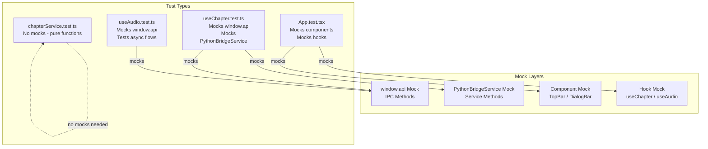

# FlexiTTS Testing Documentation

**Document Date:** February 27, 2026  
**Version:** 1.0  
**Test Framework:** Vitest with @testing-library/react  
**Test Status:** 72 tests passing (100% pass rate)

---

## Table of Contents

1. [Overview](#overview)
2. [Test File Structure](#test-file-structure)
3. [Running Tests - CLI Methods](#running-tests---cli-methods)
4. [Running Tests - IDE Methods](#running-tests---ide-methods)
5. [Test Reports Structure](#test-reports-structure)
6. [Test Pyramid](#test-pyramid)
7. [Mock Strategy](#mock-strategy)
8. [Coverage Configuration](#coverage-configuration)
9. [Best Practices](#best-practices)
10. [Future Improvements](#future-improvements)

---

## Overview

### Current Test Status

| Metric | Value |
|--------|-------|
| **Total Tests** | 72 tests |
| **Pass Rate** | 100% |
| **Test Framework** | Vitest |
| **Testing Library** | @testing-library/react |
| **Test Location** | `src/ui/src/__tests__/` |
| **Environment** | jsdom |

### Test Types

The FlexiTTS test suite includes:

- **Unit Tests** - Testing individual functions, hooks, and services in isolation
- **Integration Tests** - Testing component interactions with mocked dependencies
- **E2E Tests** - Not yet implemented (planned for future)

### Testing Stack

```
Vitest (Test Runner)
    ├── @testing-library/react (Component testing)
    ├── @testing-library/jest-dom (DOM assertions)
    ├── @testing-library/user-event (User interactions)
    ├── jsdom (Browser environment simulation)
    └── @vitest/coverage-v8 (Code coverage)
```

---

## Test File Structure

```
src/ui/src/__tests__/
├── setup.ts                 # Test configuration and global mocks
├── App.test.tsx             # Component integration tests (11 tests)
├── useChapter.test.ts       # Hook unit tests (18 tests)
├── useAudio.test.ts         # Hook unit tests (21 tests)
├── chapterService.test.ts   # Service unit tests (22 tests)
└── __snapshots__/           # Jest-compatible snapshots
    ├── App.test.tsx.snap
    ├── chapterService.test.ts.snap
    └── useChapter.test.ts.snap
```

### File Descriptions

| File | Test Count | Description |
|------|------------|-------------|
| `setup.ts` | - | Global test configuration, mocks, and utilities |
| `App.test.tsx` | 11 | Integration tests for the root App component |
| `useChapter.test.ts` | 18 | Unit tests for chapter state management hook |
| `useAudio.test.ts` | 21 | Unit tests for audio playback hook |
| `chapterService.test.ts` | 22 | Unit tests for XML generation service |

### Test Configuration (`setup.ts`)

```typescript
// Global mocks and test configuration
// - window.api Electron IPC mock
// - ResizeObserver mock
// - matchMedia mock
// - Testing library cleanup
```

---

## Running Tests - CLI Methods

### Quick Reference Commands

```bash
# Navigate to the UI directory
cd src/ui

# Run all tests (fast, no coverage)
npm test

# Run tests with coverage report
npm run test:coverage

# Generate JSON test results
npm run test:report

# Generate HTML test report with coverage link
npm run test:report:html

# Run tests in watch mode (development)
npm run test:watch
```

### Detailed Command Descriptions

#### `npm test` - Fast Test Run

```bash
npm test
# Equivalent to: vitest run
```

- **Speed:** Fast (~1-2 seconds)
- **Coverage:** Disabled (no overhead)
- **Output:** Console with pass/fail summary
- **Use Case:** Development feedback, pre-commit checks

#### `npm run test:coverage` - Coverage Report

```bash
npm run test:coverage
# Equivalent to: VITE_COVERAGE=true vitest run
```

- **Coverage:** Enabled (v8 provider)
- **Output:** Console summary + HTML report
- **Reports Location:** `test-reports/coverage/`
- **Reporters:** text (console), html (dashboard)
- **Use Case:** CI/CD pipelines, coverage gates

#### `npm run test:report` - JSON Results

```bash
npm run test:report
# Equivalent to: VITE_REPORT=true vitest run
```

- **Output Format:** JSON
- **File Location:** `test-reports/test-results.json`
- **Contents:** Detailed test results, durations, status
- **Use Case:** Programmatic processing, CI integration

#### `npm run test:report:html` - Full HTML Report

```bash
npm run test:report:html
# Runs: npm run test:report && node scripts/json-to-html-report.js
```

- **Generates:**
  - `test-reports/test-results.json` (raw data)
  - `test-reports/test-results.html` (formatted report)
  - Link to coverage report
- **Use Case:** Human-readable CI artifacts, sharing results

#### `npm run test:watch` - Watch Mode

```bash
npm run test:watch
# Equivalent to: vitest
```

- **Behavior:** Runs tests on file changes
- **Features:**
  - Interactive UI (press `a` for all, `f` for failed only)
  - Fast incremental re-runs
  - Filter by pattern
- **Use Case:** Active development, TDD workflow

### Environment Variables

| Variable | Value | Effect |
|----------|-------|--------|
| `VITE_COVERAGE` | `true` | Enables code coverage collection |
| `VITE_REPORT` | `true` | Generates JSON test results file |

---

## Running Tests - IDE Methods

### VS Code

#### Using Vitest Extension

1. **Install Extension:** Install the official `Vitest` extension by Vitest
2. **Open Testing Panel:** Click the Testing icon in the Activity Bar (beaker icon)
3. **Discover Tests:** Tests auto-populate from `__tests__` folder
4. **Run Tests:**
   - Click play icon next to individual test or suite
   - Use "Run All Tests" button in Testing panel
   - Right-click test file → "Run Test"

#### VS Code Keyboard Shortcuts

| Shortcut | Action |
|----------|--------|
| `Ctrl+Shift+P` → "Vitest: Start Watch Mode" | Start watch mode |
| `Ctrl+Shift+P` → "Vitest: Run All Tests" | Run all tests once |

#### VS Code Debug Configuration

Create `.vscode/launch.json`:

```json
{
  "version": "0.2.0",
  "configurations": [
    {
      "type": "node",
      "request": "launch",
      "name": "Debug Vitest Tests",
      "program": "${workspaceFolder}/src/ui/node_modules/.bin/vitest",
      "args": ["run", "--reporter=verbose"],
      "cwd": "${workspaceFolder}/src/ui",
      "console": "integratedTerminal"
    }
  ]
}
```

### WebStorm / IntelliJ IDEA

#### Setup

1. **Install Vitest Plugin:**
   - Go to Settings → Plugins
   - Search and install "Vitest" plugin
   - Restart IDE

2. **Configure Vitest:**
   - Go to Settings → Languages & Frameworks → Vitest
   - Set config file: `src/ui/vitest.config.ts`

3. **Run Tests:**
   - Right-click any `.test.ts` file → "Run <filename>"
   - Use Vitest tool window for test discovery
   - Green play buttons appear next to tests

#### WebStorm Run Configuration

Create a Vitest run configuration:

1. **Run → Edit Configurations**
2. **+ Add New Configuration → Vitest**
3. **Configure:**
   - **Vitest package:** `src/ui/node_modules/vitest`
   - **Working directory:** `$PROJECT_DIR$/src/ui`
   - **Config file:** `vitest.config.ts`

### Coverage in IDEs

Coverage is **disabled by default** in IDEs to keep test execution fast.

#### Enable Coverage in IDE

**Option 1: Environment Variable**

Add to your IDE's run configuration:
```
Environment variables: VITE_COVERAGE=true
```

**Option 2: Fast vs Full Test Runs**

| Mode | Coverage | Command/Config |
|------|----------|----------------|
| Fast (default) | Disabled | `npm test` or default IDE run |
| Full | Enabled | `VITE_COVERAGE=true vitest run` |

**Coverage Reports:**
- After enabling, HTML report opens in browser
- Report location: `test-reports/coverage/index.html`

---

## Test Reports Structure

### Directory Layout

```
test-reports/
├── test-results.html      # Human-readable HTML report with coverage link
├── test-results.json      # Raw JSON test data for programmatic access
└── coverage/
    ├── index.html         # Coverage dashboard overview
    ├── base.css           # Report stylesheets
    ├── prettify.css
    ├── prettify.js
    ├── sorter.js
    └── src/               # File-level coverage reports
        ├── components/    # Component coverage
        ├── hooks/          # Hook coverage  
        ├── services/       # Service coverage
        └── ...
```

### Report Files Description

#### `test-results.json`

Machine-readable test results:

```json
{
  "numTotalTestSuites": 4,
  "numPassedTestSuites": 4,
  "numFailedTestSuites": 0,
  "numPendingTestSuites": 0,
  "numTotalTests": 72,
  "numPassedTests": 72,
  "numFailedTests": 0,
  "numPendingTests": 0,
  "startTime": 1740648000000,
  "success": true,
  "testResults": [
    {
      "name": "src/__tests__/App.test.tsx",
      "status": "passed",
      "tests": [...]
    }
  ]
}
```

#### `test-results.html`

Visual test report including:
- Test suite summary (passed/failed/pending)
- Individual test results with durations
- Link to coverage dashboard
- Timestamp and environment info

#### `coverage/index.html`

Interactive coverage dashboard:
- Overall percentage metrics
- File-by-file coverage breakdown
- Line-by-line highlighting (covered vs uncovered)
- Branch coverage visualization

### Open Coverage Report

```bash
# After running test:coverage
open test-reports/coverage/index.html        # macOS
xdg-open test-reports/coverage/index.html    # Linux
start test-reports/coverage/index.html       # Windows
```

---

## Report Visual Customization

### Dark Theme Implementation

All test reports (tests, coverage, and unified dashboard) use a consistent dark theme for comfortable viewing.

**Color Palette:**
| Element | Color Code | Usage |
|---------|------------|-------|
| Background | `#1a1a2e` | Page background |
| Card BG | `#16213e` | Content cards, summaries |
| Border | `#0f3460` | Dividers, borders |
| Text | `#eaeaea` | Primary text |
| Secondary | `#a0a0a0` | Meta text, labels |
| Accent | `#3b82f6` | Links, banners |
| Pass | `#4ade80` | Passed tests, high coverage |
| Warn | `#facc15` | Medium coverage |
| Fail | `#f87171` | Failed tests, low coverage |

### CSS Injection Points

#### 1. Vitest Test Reports (`dark-theme-reporter.ts`)
**Location:** `src/ui/scripts/dark-theme-reporter.ts`

Custom Vitest reporter that auto-generates dark-themed HTML:
- Implements `Reporter` interface from `vitest`
- Generates `test-reports/test-results.html` on every test run
- CSS variables define dark theme palette
- Coverage banner links to coverage report

**Configuration:**
```typescript
// vitest.config.ts
reporter: [
  'verbose',                    // Terminal output
  './scripts/dark-theme-reporter.ts',  // Dark HTML
  'json'                        // JSON for dashboard
]
```

**Key Features:**
- Automatic HTML generation during test run
- Test hierarchy display (suite → test)
- Duration and timestamp tracking
- Error message display for failed tests
- Coverage link banner

#### 2. Vitest Coverage Reports (`inject-coverage-dark-theme.js`)
**Location:** `src/ui/scripts/inject-coverage-dark-theme.js`

Post-processor for `@vitest/coverage-v8` HTML output:

**Problems Solved:**
- Original c8 coverage uses light theme hardcoded CSS
- Cell contrast issues with dark text on dark backgrounds
- Missing navigation back to test results

**Injections:**
| Target File | Injection |
|-------------|-----------|
| `base.css` | Dark theme CSS appended after original styles |
| `index.html` | Navigation banner with back link |
| All HTMLs | `data-theme="dark"` attribute |

**Cell Contrast Fixes:**
- `td.high` / `td.pct.high` / `td.abs.high` → Green text (#4ade80)
- `td.medium` / `td.pct.medium` / `td.abs.medium` → Yellow text (#facc15)
- `td.low` / `td.pct.low` / `td.abs.low` → Red text (#f87171)
- `td.empty` / `td.abs.empty` → Grey text (#6b7280)

**Usage:**
```bash
npm run test:coverage  # Auto-injects theme after coverage run
```

#### 3. Python Test Reports (`run-tests.sh`)
**Location:** `src/scripts/run-tests.sh`

Post-processor for pytest-html output:

**Features:**
- Dark theme CSS injection into HTML head
- Coverage link banner (blue)
- Summary JSON generation from HTML parsing

**Dark Theme Styling:**
```css
body { background: #1a1a2e; color: #eaeaea; }
header { background: #16213e; border-color: #0f3460; }
.passed { background: #22c55e; }
.failed { background: #ef4444; }
.skipped { background: #f59e0b; }
```

#### 4. Unified Dashboard (`generate-dashboard.py`)
**Location:** `test-report/generate-dashboard.py`

Python script generating dark-themed dashboard aggregating both test suites:

**Features:**
- Dark card-based UI for both UI and Python tests
- Status badges with appropriate colors
- Coverage availability indicators
- Links to individual reports

### Summary of Customizations

| Report Type | Customization File | Method |
|-------------|-------------------|--------|
| Vitest Tests | `dark-theme-reporter.ts` | Custom reporter class |
| Vitest Coverage | `inject-coverage-dark-theme.js` | Post-process CSS |
| Python Tests | `run-tests.sh` (embedded Python) | Post-process HTML/JSON |
| Dashboard | `generate-dashboard.py` | Generate from JSON |

### Manual Theme Reapplication

If coverage reports lose dark theme (e.g., after fresh coverage generation):

```bash
# Re-apply dark theme to existing coverage
cd ~/workspace/FlexiTTS/src/ui
node scripts/inject-coverage-dark-theme.js

# Or regenerate everything
cd ~/workspace/FlexiTTS/src/ui
npm run test:coverage        # Vitest
open test-reports/coverage/index.html
```

---

## Test Pyramid

### Visual Test Pyramid

```mermaid
%%{init: {
  'theme': 'base',
  'themeVariables': {
    'primaryColor': '#ffffff',
    'primaryTextColor': '#000000',
    'primaryBorderColor': '#000000',
    'lineColor': '#000000',
    'background': '#ffffff'
  }
}}%%
flowchart TB
    subgraph "Test Coverage (72 Tests Total)"
        E2E["E2E Tests
        0 tests
        (Not implemented)"]
        
        INT["Integration Tests
        App.test.tsx
        11 tests"]
        
        UNIT["Unit Tests
        useChapter: 18
        useAudio: 21
        chapterService: 22
        61 tests"]
    end

    subgraph "Test Tools"
        VITEST[vitest]
        RTL[@testing-library/react]
        MOCK[vi.mock]
    end

    E2E -->|calls| INT
    INT -->|uses| UNIT
    
    VITEST -->|runs| E2E
    VITEST -->|runs| INT
    VITEST -->|runs| UNIT
    
    RTL -->|renders| INT
    MOCK -->|stubs| UNIT

    %% Styling
    classDef e2e fill:#ffcdd2,stroke:#c62828
    classDef int fill:#fff9c4,stroke:#f9a825
    classDef unit fill:#c8e6c9,stroke:#2e7d32
    classDef tools fill:#e1f5fe,stroke:#0277bd
    
    class E2E e2e
    class INT int
    class UNIT unit
    class VITEST,RTL,MOCK tools
```

### Test Distribution

| Level | File(s) | Tests | % of Total | Characteristics |
|-------|---------|-------|------------|-----------------|
| **E2E** | (none) | 0 | 0% | Full application flow testing |
| **Integration** | `App.test.tsx` | 11 | 15% | Component + Mock interactions |
| **Unit** | `useChapter.test.ts` | 18 | 25% | Hook logic testing |
| **Unit** | `useAudio.test.ts` | 21 | 29% | Async operation testing |
| **Unit** | `chapterService.test.ts` | 22 | 31% | Pure function testing |
| **Total** | - | **72** | **100%** | - |

### Test Type Breakdown

#### E2E Tests (0 tests)

**Purpose:** End-to-end user workflow testing  
**Status:** Not implemented  
**Recommended Tools:** Playwright, Cypress  

```
Future E2E Tests:
├── chapter-import.spec.ts      # Import chapter workflow
├── chapter-editing.spec.ts     # Edit dialog workflow  
├── audio-generation.spec.ts    # Generate audio workflow
└── navigation.spec.ts          # Navigate between chapters
```

#### Integration Tests (11 tests)

**Purpose:** Test component interactions with mocked dependencies  
**File:** `App.test.tsx`  
**Focus:** Component rendering, event handling, prop passing

Example integration test:
```typescript
describe('App Integration', () => {
  it('renders chapter list after loading', async () => {
    // Renders App with mocked window.api
    const { getByText } = render(<App />);
    // Asserts chapter list appears
    expect(getByText('Chapter 1')).toBeInTheDocument();
  });
});
```

#### Unit Tests (61 tests)

**Purpose:** Test isolated functions, hooks, and services  
**Technique:** Mock all dependencies

**useChapter Tests (18 tests):**
- State initialization
- Chapter loading logic
- XML generation pipeline
- Error handling
- Ref management

**useAudio Tests (21 tests):**
- Audio playback control
- Clip listing
- Async operation handling
- Cleanup on unmount

**chapterService Tests (22 tests):**
- Pure XML generation functions
- Edge cases (empty chapters, special characters)
- Snapshot testing for XML output

---

## Mock Strategy

### Mock Architecture



### Mock Types Explained

#### 1. window.api Mock (IPC Methods)

**Purpose:** Mock Electron's `window.api` for browser-based testing

```typescript
// In setup.ts or test file
vi.stubGlobal('window', {
  api: {
    runPythonScript: vi.fn(),
    readFile: vi.fn(),
    writeFile: vi.fn(),
    showErrorDialog: vi.fn(),
    showConfirmDialog: vi.fn().mockResolvedValue(0),
    listChapterFiles: vi.fn().mockResolvedValue(['chapter1.md']),
    listChapterClips: vi.fn().mockResolvedValue(['clip1.wav']),
    checkChapterAudio: vi.fn().mockResolvedValue(true),
    checkXmlExists: vi.fn().mockResolvedValue(true),
    playSoundFile: vi.fn(),
    killProcess: vi.fn()
  }
});
```

**Usage:** Hook tests that call PythonBridgeService

#### 2. PythonBridgeService Mock

**Purpose:** Mock the service layer to isolate hook tests

```typescript
// Mock entire module
vi.mock('../services/pythonBridge', () => ({
  PythonBridgeService: {
    showErrorDialog: vi.fn(),
    loadStoryConfig: vi.fn().mockResolvedValue(mockConfig),
    readChapterFile: vi.fn().mockResolvedValue('<chapter>...</chapter>'),
    // ... other methods
  }
}));
```

**Usage:** Isolating useChapter from service dependencies

#### 3. Component Mock (TopBar / DialogBar)

**Purpose:** Mock child components in integration tests

```typescript
// Mock TopBar to isolate App tests
vi.mock('../components/TopBar', () => ({
  TopBar: vi.fn((props) => (
    <div data-testid="topbar">TopBar Mock</div>
  ))
}));
```

**Usage:** App.tsx tests to focus on orchestration logic

#### 4. Hook Mock (useChapter / useAudio)

**Purpose:** Mock custom hooks to isolate component tests

```typescript
// Mock useChapter hook
vi.mock('../hooks/useChapter', () => ({
  useChapter: vi.fn().mockReturnValue({
    chapter: mockChapter,
    config: mockConfig,
    handleChapterSelect: vi.fn(),
    // ... hook return values
  })
}));
```

**Usage:** Testing components without testing hook logic

### Mock Fallback Strategy (Development)

The codebase includes built-in mocks for browser development:

```typescript
// pythonBridge.ts - runtime check
const api = (typeof window !== 'undefined' && window.api) 
  ? window.api 
  : createBrowserMockApi();

function createBrowserMockApi() {
  return {
    runPythonScript: async () => 'mock-result',
    readFile: async () => 'mock-content',
    // ... mock implementations
  };
}
```

**Benefits:**
- UI can be developed in browser without Electron
- Easier debugging with browser DevTools
- Faster iteration cycles

---

## Coverage Configuration

### Vitest Coverage Settings

From `vitest.config.ts`:

```typescript
export default defineConfig({
  ...viteConfig,
  test: {
    // ... other config
    coverage: {
      provider: 'v8',
      reporter: ['text', 'html'],
      reportsDirectory: './test-reports/coverage',
      enabled: process.env.VITE_COVERAGE === 'true',
    },
  },
});
```

### Coverage Options Explained

| Option | Value | Description |
|--------|-------|-------------|
| `provider` | `'v8'` | Uses V8's built-in coverage (fast) |
| `reporter` | `['text', 'html']` | Console output + HTML report |
| `reportsDirectory` | `'./test-reports/coverage'` | Coverage output location |
| `enabled` | `VITE_COVERAGE === 'true'` | Off by default for speed |

### Coverage Report Formats

**Text Reporter:**
```
 % Coverage report from v8
----------|---------|----------|---------|---------|-------------------
File      | % Stmts | % Branch | % Funcs | % Lines | Uncovered Line #s 
----------|---------|----------|---------|---------|-------------------
All files |   85.21 |    72.00 |    79.8 |   84.93 |                   
----------|---------|----------|---------|---------|-------------------
```

**HTML Reporter:**
- Interactive dashboard at `test-reports/coverage/index.html`
- File-by-file coverage breakdown
- Line-by-line highlighting

### Enabling Coverage

```bash
# Via environment variable
VITE_COVERAGE=true vitest run

# Via npm script
npm run test:coverage

# Via package.json script
"test:coverage-fast": "VITE_COVERAGE=true vitest run --reporter=basic",
```

---

## Best Practices

### 1. 100% Test Pass Rate

Current status: **72 tests passing, 0 failing**

**Guidelines:**
- All tests must pass before committing code
- Flaky tests should be fixed or removed
- Use `--bail` to stop on first failure: `vitest run --bail`

### 2. Mock Fallbacks for Development

The architecture supports two modes:

| Mode | Environment | Use |
|------|-------------|-----|
| Real | Electron | Production, integration testing |
| Mock | Browser | Development, unit testing |

**Benefits:**
- Browser-based development without Electron
- Deterministic test environment
- Faster test execution

### 3. Deterministic Output

Pure functions enable snapshot testing:

```typescript
// chapterService.test.ts
it('generates consistent XML', () => {
  const xml = generateXMLFromChapter(chapter);
  expect(xml).toMatchSnapshot();
});
```

**Advantages:**
- Regression detection via snapshots
- Self-documenting expected output
- Easy to update with `--update`

### 4. Testable Architecture

The refactoring achieved:

```
Before (App.tsx):      723 lines
After (App.tsx):       322 lines (-55%)
                       + hooks/    (800 lines)
                       + services/ (500 lines)
                       + components/ (900 lines)
```

**Principles:**
- Clear separation of concerns
- Hooks for state logic
- Services for external calls
- Pure utility functions

### 5. Hook Testing Patterns

**Setup Wrapper:**
```typescript
// Wrapper for testing hooks with context
function createWrapper() {
  return function Wrapper({ children }: { children: React.ReactNode }) {
    return <SomeProvider>{children}</SomeProvider>;
  };
}

// Usage
const { result } = renderHook(() => useChapter(), { wrapper: createWrapper() });
```

### 6. Async Test Patterns

**Wait for state updates:**
```typescript
await waitFor(() => {
  expect(result.current.chapter).toBeDefined();
});
```

**Mock async operations:**
```typescript
vi.mocked(window.api.loadStoryConfig).mockResolvedValue(mockConfig);
```

### 7. Snapshot Maintenance

**Update snapshots (intentional changes):**
```bash
npm test -- --update
```

**Check snapshots (CI verification):**
```bash
npm test -- --run
```

---

## Future Improvements

### E2E Tests

**Status:** Not implemented  
**Priority:** High  
**Tools:** Playwright or Cypress

**Recommended Test Scenarios:**
```
e2e/
├── chapter-workflow.spec.ts
│   ├── Import chapter from markdown
│   ├── Edit dialog elements
│   ├── Generate audio
│   └── Verify output files
├── navigation.spec.ts
│   ├── Switch between chapters
│   ├── Filter by character
│   └── Sort chapters
└── error-handling.spec.ts
    ├── Invalid chapter file
    ├── Python script failure
    └── Network timeout
```

### Error Boundary Testing

**Add React Error Boundaries:**

```typescript
// Error Boundary component + tests
import { render, screen } from '@testing-library/react';

describe('ErrorBoundary', () => {
  it('catches errors and displays fallback UI', () => {
    const ThrowError = () => { throw new Error('Test error'); };
    render(
      <ErrorBoundary>
        <ThrowError />
      </ErrorBoundary>
    );
    expect(screen.getByText('Something went wrong')).toBeInTheDocument();
  });
});
```

### Loading States Testing

**Test granular loading indicators:**

```typescript
describe('Loading States', () => {
  it('shows skeleton while loading chapter list', () => {
    // Simulate slow response
    vi.mocked(api.listChapterFiles).mockImplementation(
      () => new Promise(resolve => setTimeout(resolve, 100))
    );
    render(<App />);
    expect(screen.getByTestId('chapter-list-skeleton')).toBeInTheDocument();
  });

  it('shows progress during audio generation', () => {
    const { getByText } = render(<AudioControls />);
    fireEvent.click(getByText('Generate'));
    expect(getByText('Generating audio...')).toBeInTheDocument();
  });
});
```

### Additional Test Improvements

| Category | Improvement | Impact |
|----------|-------------|--------|
| **Performance** | Add render performance tests | Catch slow components |
| **Accessibility** | Add a11y tests (jest-axe) | WCAG compliance |
| **Network** | Mock WebSocket for TTS service | Test remote TTS |
| **State** | Add Redux DevTools tests | Debug state issues |
| **Visual** | Add visual regression tests | UI consistency |

### CI/CD Integration

**GitHub Actions example:**

```yaml
# .github/workflows/test.yml
name: Tests
on: [push, pull_request]
jobs:
  test:
    runs-on: ubuntu-latest
    steps:
      - uses: actions/checkout@v3
      - uses: actions/setup-node@v3
        with:
          node-version: '20'
      - run: cd src/ui && npm ci
      - run: npm run test:coverage
      - uses: actions/upload-artifact@v3
        with:
          name: coverage-report
          path: src/ui/test-reports/coverage/
```

---

## Appendix: Quick Reference

### Test Commands Cheat Sheet

```bash
# Fast tests
npm test

# With coverage
npm run test:coverage

# Watch mode
npm run test:watch

# Specific file
vitest run src/__tests__/App.test.tsx

# Update snapshots
npm test -- --update

# Debug mode
npm test -- --reporter=verbose
```

### File Locations Quick Reference

| Resource | Path |
|----------|------|
| Test config | `src/ui/vitest.config.ts` |
| Test setup | `src/ui/src/__tests__/setup.ts` |
| Test files | `src/ui/src/__tests__/*.test.ts(x)` |
| Snapshots | `src/ui/src/__tests__/__snapshots__/` |
| Coverage | `src/ui/test-reports/coverage/` |
| HTML report | `src/ui/test-reports/test-results.html` |
| JSON report | `src/ui/test-reports/test-results.json` |

---

**End of Testing Documentation**

*Generated: February 27, 2026*  
*Version: 1.0*  
*Maintained by: FlexiTTS Development Team*
