# FlexiTTS UI Architecture Overview

**Document Date:** March 7, 2026
**Total Lines of Code:** ~4,200
**Architecture Pattern:** React + Custom Hooks + Service Layer + Provider Pattern
**State Management:** React Hooks (useState, useRef, useCallback)
**Backend Integration:** Electron IPC Bridge + Python Scripts + WebSocket TTS Service

---

## Table of Contents

1. [Executive Summary](#executive-summary)
2. [System Architecture](#system-architecture)
3. [Component Hierarchy](#component-hierarchy)
4. [Data Flow Architecture](#data-flow-architecture)
5. [Service Layer Architecture](#service-layer-architecture)
6. [TTS Service Architecture](#tts-service-architecture)
7. [Alert System Architecture Details](#alert-system-architecture-details)
8. [Voice Cache Architecture](#voice-cache-architecture)
9. [State Management Flow](#state-management-flow)
10. [File Structure](#file-structure)
11. [Key Design Decisions](#key-design-decisions)
12. [Testing Architecture](#testing-architecture)

---

## Executive Summary

FlexiTTS is an **Electron-based desktop application** for converting story
chapters into spoken audio using Text-to-Speech (TTS) technology. The UI
architecture follows modern React patterns with a clear separation of concerns
and a sophisticated TTS provider system supporting both local and remote
GPU-cached TTS processing.

| Layer             | Purpose                           | LOC    |
|:----------------- |:--------------------------------- |:------ |
| **Components**    | UI rendering                      | ~1,100 |
| **Hooks**         | State management & business logic | ~900   |
| **Services**      | External communication            | ~600   |
| **TTS Providers** | Local/Remote TTS abstraction      | ~800   |
| **Models**        | Type definitions                  | ~100   |
| **Utils**         | Helper functions                  | ~50    |
| **Tests**         | Test coverage                     | ~1,200 |

### Recent Refactoring Achievement (March 2026)

- **TTS Service Architecture**: New WebSocket-based remote TTS with GPU model caching
- **Provider Pattern**: Abstract `TTSInterface` with `LocalTTSProvider` and `RemoteTTSProvider`
- **Voice Cache System**: Thread-safe LRU cache for voice cloning prompts
- **Alert System**: WebSocket-based real-time alerts from TTS service to UI
- **299 Python tests passing (100%)**
- **Zero TypeScript errors**

---

## System Architecture

### High-Level System Diagram

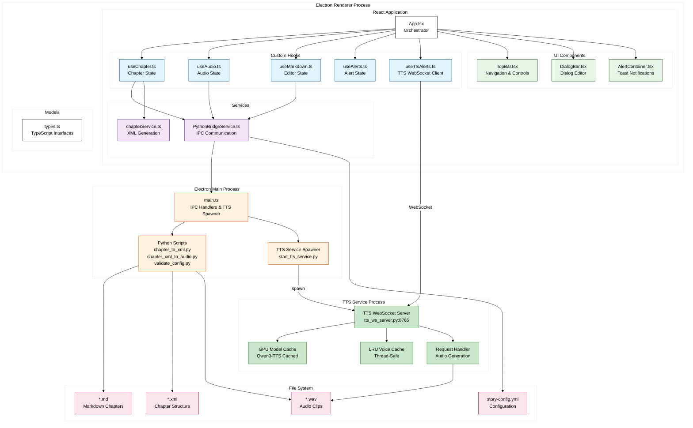

## Service Layer Architecture

### Architecture Layers

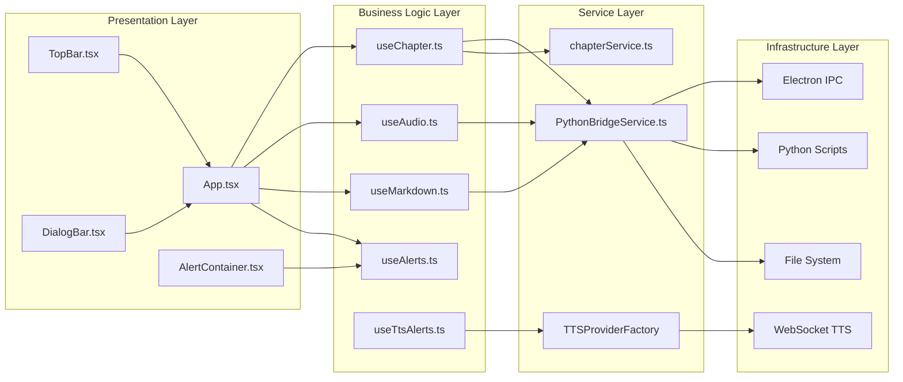

---

## TTS Service Architecture

### TTS Service Overview

The TTS (Text-to-Speech) Service Architecture introduces a **Provider Pattern**
with both local and remote TTS implementations. The remote TTS service uses
WebSocket communication with GPU model caching for enhanced performance.

**Key Architectural Patterns:**

- **Abstract Interface**: `TTSInterface` defines the contract for all TTS providers
- **Factory Pattern**: `TTSProviderFactory` creates appropriate provider instances
- **Strategy Pattern**: Switch between local and remote providers transparently
- **Fallback Pattern**: Automatic fallback from remote to local on failure
- **LRU Cache**: Thread-safe voice prompt caching for voice cloning

**Key Benefits:**

- **GPU Model Caching**: Remote service maintains loaded TTS models in GPU memory
- **Reduced Memory Fragmentation**: Long-running service prevents repeated model
  loading/unloading
- **Flexible Deployment**: Run TTS locally or remotely based on configuration
- **Graceful Degradation**: Automatic fallback to local TTS if remote fails
- **Thread-Safe Caching**: LRU voice cache with proper synchronization

### TTS Provider Class Hierarchy

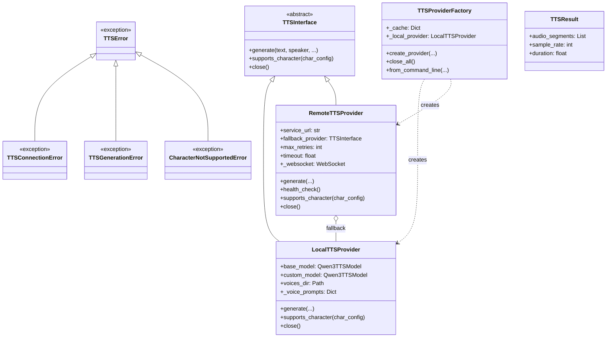

### TTS Service System Diagram

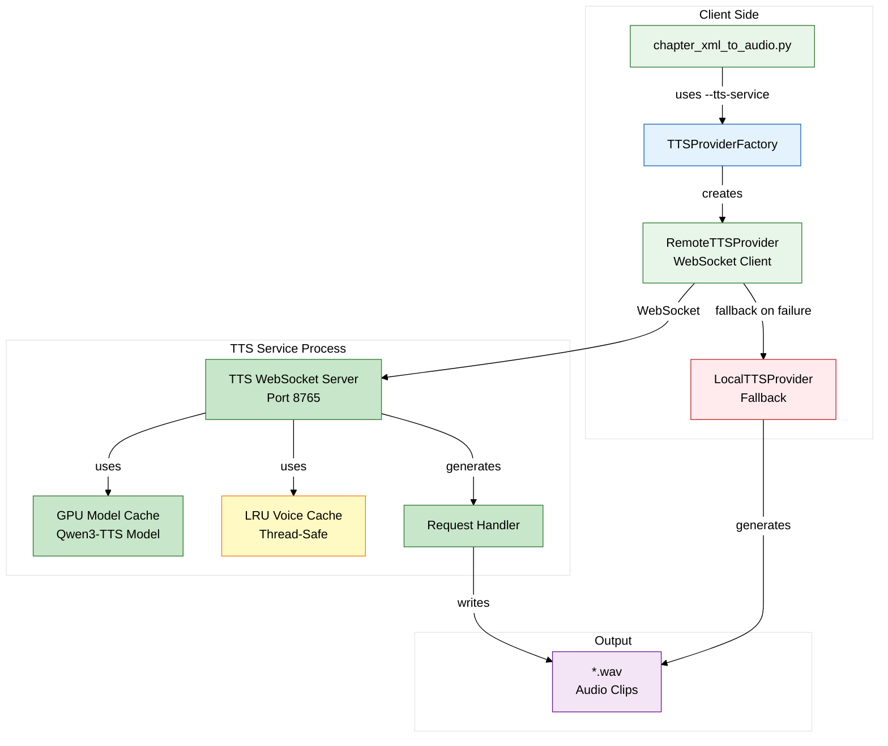

### TTS Service Startup Sequence

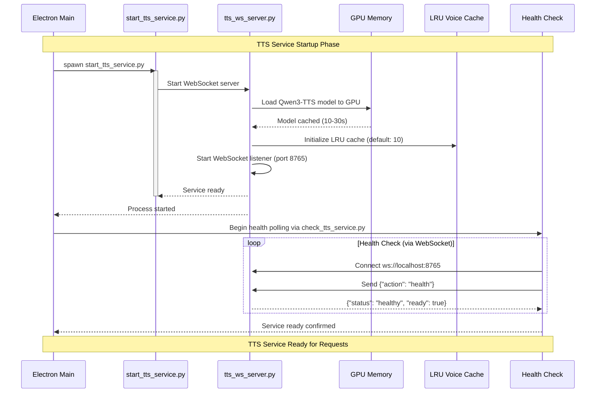

### WebSocket Communication Protocol

The TTS Service uses a JSON-based WebSocket protocol for request/response
communication with support for binary audio streaming:

**Request Format:**

```json
{
  "text": "Hello, this is a test.",
  "speaker": "narrator",
  "emotion": "neutral",
  "language": "English",
  "instruct": "Speak clearly and naturally",
  "character_config": {
    "voice-sample": "refs/voice.wav",
    "custom-voice": { "key": "..." }
  },
  "story": "Story-Entanglement",
  "chapter": "01",
  "section": "002",
  "dialog": "001"
}
```

**Response Flow:**

1. **Handshake**: Connection established with retry logic
2. **Metadata Message** (JSON): Contains sample rate, duration, format info
3. **Binary Audio Chunks**: Streamed WAV audio data
4. **Completion Message** (JSON): `{"done": true}` or `{"error": "message"}`

**Error Handling:**

- Connection failures trigger exponential backoff retry (1s, 2s, 4s, 8s)
- After max retries (default: 4), falls back to LocalTTSProvider
- Timeout for generation requests: configurable (default: 60s)

### Remote TTS Provider with Retry Logic

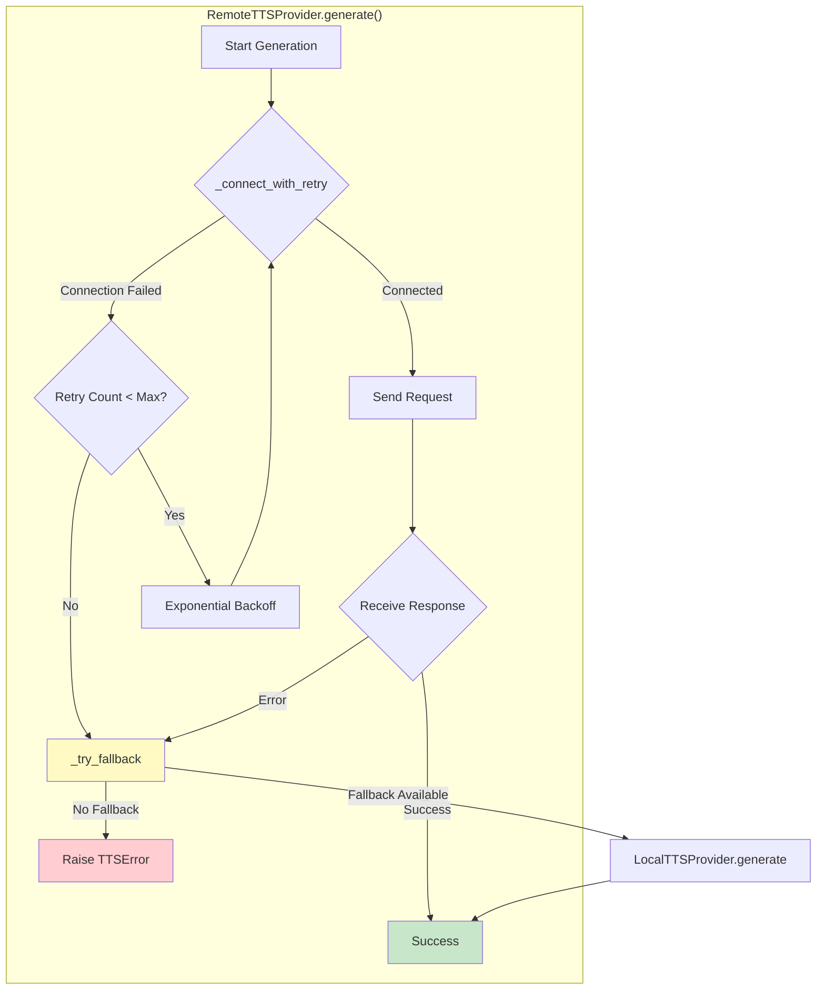

### Configuration Options

| Option                 | Default    | Description                                        |
|:---------------------- |:---------- |:-------------------------------------------------- |
| `service_url`          | `None`     | WebSocket URL (ws:// or wss://) for remote service |
| `max_retries`          | 4          | Max retry attempts with exponential backoff        |
| `timeout`              | 30s        | Connection timeout in seconds                      |
| `enable_fallback`      | `True`     | Enable fallback to local TTS on failure            |
| `voices_dir`           | `./voices` | Directory for voice reference samples              |
| `max_voice_cache_size` | 10         | Maximum voice prompts to cache (config.yml)        |
| `tts-device`           | `auto`     | Device selection: auto/cpu/cuda/cuda:N             |

---

## Alert System Architecture Details

### Alert System Overview

The Alert System provides real-time notifications from the TTS service to the UI
via WebSocket, enabling users to see TTS generation progress and errors without
polling.

**Key Components:**

- **useAlerts**: Generic alert state management hook
- **useTtsAlerts**: WebSocket client for TTS service alerts
- **AlertContainer**: Fixed-position toast notification container
- **AlertToast**: Individual toast component with animations

### Alert System Architecture

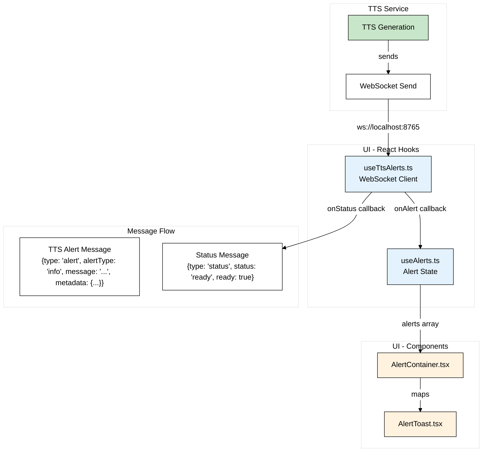

```typescript
// Alert types for visual styling
type AlertType = 'info' | 'success' | 'warning' | 'error';
type AlertSource = 'internal' | 'tts-service';

interface Alert {
  id: string;
  message: string;
  type: AlertType;
  source: AlertSource;
  timestamp: Date;
  duration?: number; // ms, default 3000
}
```

### Alert Type Visuals

| Type      | Icon | Background | Usage               |
|:--------- |:---- |:---------- |:------------------- |
| `info`    | ℹ️   | Blue       | General information |
| `success` | ✓    | Green      | Operation completed |
| `warning` | ⚠️   | Yellow     | Non-critical issues |
| `error`   | ✕    | Red        | Critical errors     |

### WebSocket Alert Protocol

**From TTS Service to UI:**

```json
{
  "type": "alert",
  "alertType": "info|success|warning|error",
  "message": "Generating audio for chapter_001_002_001...",
  "source": "tts-service",
  "metadata": {
    "chapter": "01",
    "section": "002",
    "dialog": "001",
    "character": "narrator"
  }
}
```

**Status Updates:**

```json
{
  "type": "status",
  "status": "ready",
  "ready": true,
  "cached": true
}
```

### Alert Lifecycle

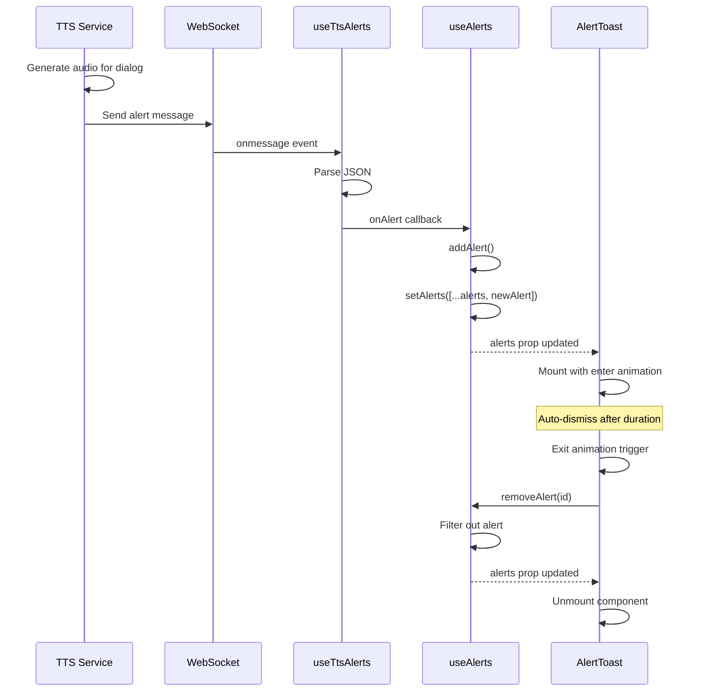

---

## Voice Cache Architecture

### Voice Cache Overview

The Voice Cache provides thread-safe LRU (Least Recently Used) caching for
voice cloning prompts, significantly improving performance when generating
audio for the same character multiple times.

**Key Features:**

- **Thread-Safe**: All operations protected by `threading.Lock`
- **Configurable Size**: Set via `max_voice_cache_size` in story-config.yml
  (default: 10)
- **LRU Eviction**: Oldest entries removed when capacity reached
- **Statistics**: Hit/miss rate tracking for performance monitoring
- **Threading-Safe**: Proper synchronization for multi-threaded TTS generation

### Voice Cache Class Diagram

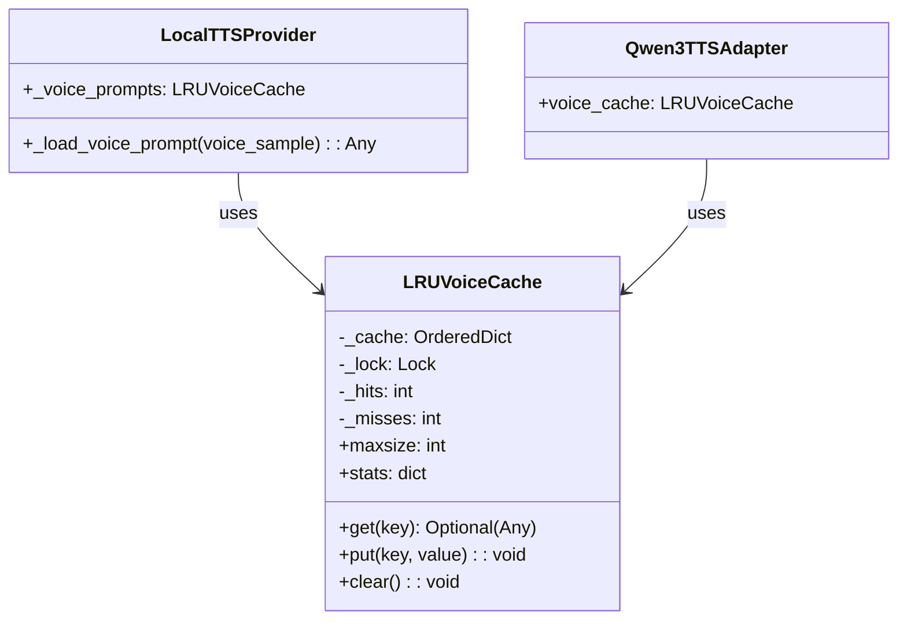

### Voice Cache Sequence

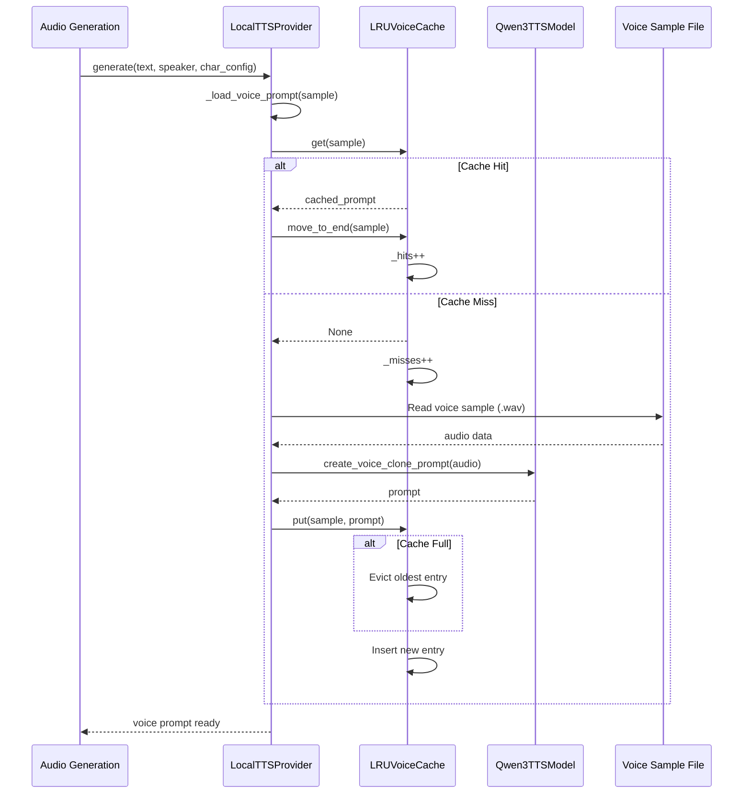

### Thread Safety

The voice cache implements proper thread safety for concurrent TTS generation:

```python
import threading
from collections import OrderedDict
from typing import Any, Optional


class LRUVoiceCache:
    def __init__(self, maxsize: int = 10):
        self.maxsize = maxsize
        self._cache: OrderedDict[str, Any] = OrderedDict()
        self._lock = threading.Lock()  # Thread-safe lock

    def get(self, key: str) -> Optional[Any]:
        with self._lock:  # Protected access
            if key in self._cache:
                self._cache.move_to_end(key)
                return self._cache[key]
            return None

    def put(self, key: str, value: Any) -> None:
        with self._lock:  # Protected access
            # Eviction and insertion logic
            pass
```

### Statistics and Monitoring

```python
{
    'size': 5,           # Current cached items
    'maxsize': 10,       # Maximum capacity
    'hits': 45,          # Cache hits
    'misses': 12,        # Cache misses
    'hit_rate': 0.789    # Hit rate (0-1)
}
```

---

## Component Hierarchy

### Component Tree

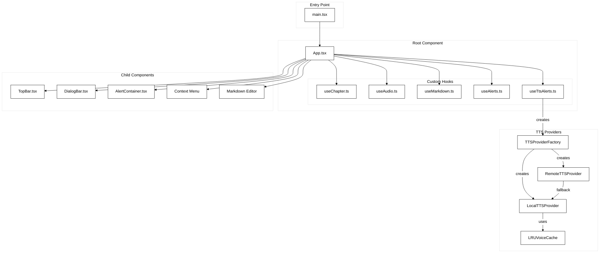

---

## Data Flow Architecture

### State Management Flow

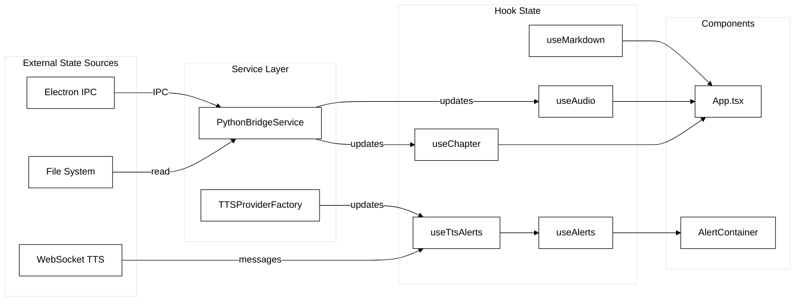

---

## File Structure

```text
src/
├── scripts/
│   ├── tts_interface.py          # Abstract TTS interface
│   ├── tts_local.py              # Local TTS provider
│   ├── tts_service.py            # Remote TTS provider
│   ├── tts_factory.py            # TTS provider factory
│   ├── tts_ws_server.py          # WebSocket TTS server
│   ├── start_tts_service.py      # TTS service startup script
│   ├── stop_tts_service.py       # TTS service shutdown script
│   ├── check_tts_service.py      # TTS health check
│   ├── chapter_xml_to_audio.py   # Chapter rendering
│   └── tts_models/
│       └── adapters/
│           └── qwen3/
│               └── voice_cache.py  # LRU voice cache
│
└── ui/
    └── src/
        ├── App.tsx
        ├── components/
        │   ├── AlertContainer.tsx    # Toast container
        │   └── AlertToast.tsx        # Individual toast
        ├── hooks/
        │   ├── useAlerts.ts          # Alert state management
        │   ├── useTtsAlerts.ts       # TTS WebSocket client
        │   └── index.ts
        └── services/
            └── pythonBridge.ts
```

---

## Key Design Decisions

### 1. TTS Provider Pattern

**Decision:** Abstract `TTSInterface` with `LocalTTSProvider` and
`RemoteTTSProvider`.

**Rationale:**

- Clean separation between local and remote TTS
- Easy to add new provider types (e.g., cloud services)
- Factory pattern for configurable instantiation
- Fallback mechanism for reliability

**Trade-off:** More abstraction layers, but enables flexible deployment.

### 2. Voice Cache with Thread Safety

**Decision:** Thread-safe LRU cache using `threading.Lock` for voice prompts.

**Rationale:**

- Significant performance improvement for repeated characters
- Thread-safe for concurrent TTS generation
- Configurable size via story-config.yml
- Hit rate monitoring for optimization

**Trade-off:** Memory usage for cached prompts, but configurable limits.

### 3. WebSocket Alert System

**Decision:** Real-time WebSocket alerts from TTS service to UI.

**Rationale:**

- No polling required for status updates
- Real-time feedback during chapter generation
- Decoupled from main TTS generation flow
- Automatic reconnection with exponential backoff

**Trade-off:** Additional WebSocket connection, but minimal overhead.

### 4. Tracking Parameters in generate()

**Decision:** Added `story`, `chapter`, `section`, `dialog` parameters to
`generate()`.

**Rationale:**

- Enables context-aware error messages
- Supports detailed progress tracking
- Facilitates alert metadata for UI
- Non-breaking (all optional parameters)

**Trade-off:** Slightly more complex method signature.

### 5. Remote TTS with Exponential Backoff

**Decision:** Retry logic with exponential backoff for remote TTS connections.

**Rationale:**

- Handles transient network issues
- Graceful degradation to local TTS
- Configurable retry counts and timeouts
- Better user experience during service startup

**Trade-off:** Slightly longer recovery time in some failure scenarios.

---

## Testing Architecture

### Test Coverage (299 Python Tests)

```mermaid
%%{init: {
  "theme": "base",
  "themeVariables": {
    "primaryColor": "#ffffff",
    "primaryTextColor": "#000000",
    "primaryBorderColor": "#000000",
    "lineColor": "#000000",
    "background": "#ffffff"
  }
}}%%
flowchart TB
    subgraph "Test Categories"
        TTS["TTS Provider Tests<br/>test_tts_local.py<br/>test_tts_service.py<br/>test_tts_factory.py<br/>test_tts_interface.py<br/>test_tts_service_startup.py<br/>test_tts_service_retry.py<br/>test_tts_service_health.py"]

        CACHE["Voice Cache Tests<br/>test_voice_cache_threading.py<br/>test_voice_cache.py"]

        WS["WebSocket Tests<br/>test_websocket_stress.py"]

        CHAPTER["Chapter Tests<br/>test_chapter_*.py<br/>test_integration_chapter_*.py"]

        CONFIG["Config Tests<br/>test_validate_config.py<br/>test_integration_validate_config.py"]
    end

    subgraph "Test Tools"
        VITEST[vitest]
        PYTEST[pytest]
        RTL[@testing-library/react]
    end

    TTS -->|python| PYTEST
    CACHE -->|python| PYTEST
    WS -->|python| PYTEST
    CHAPTER -->|python| PYTEST
    CONFIG -->|python| PYTEST
```

---

## Summary

### Architecture Strengths (March 2026)

1. **Flexible TTS Providers**: Switch between local and remote TTS transparently
2. **GPU Model Caching**: 10-30x faster repeated TTS generation
3. **Thread-Safe Voice Cache**: Optimized voice cloning performance
4. **Real-Time Alerts**: WebSocket-based user feedback without polling
5. **Graceful Fallback**: Automatic recovery from remote service failures
6. **Robust Testing**: 299 Python tests with 100% pass rate
7. **Type-Safe**: Full TypeScript coverage for UI

### Areas for Future Improvement

1. **Cloud Provider Support**: Add AWS/GCP/Azure TTS providers
2. **Voice Cache Persistence**: Save/load cache across app restarts
3. **Batch Generation**: Optimize for multiple chapters
4. **Progress Streaming**: Real-time audio streaming during generation
5. **Voice Training**: Support for custom voice training workflows

---

## Conclusion

*Generated: March 7, 2026*
*Tool: Mermaid.js v10+ compatible diagrams*
