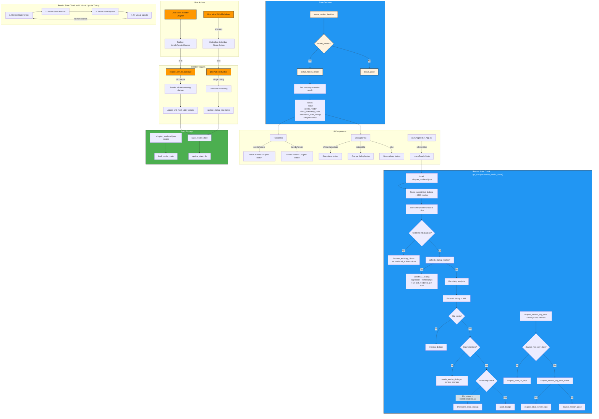

# Current Render Logic Flow (2026-03-17)

**Date:** 2026-03-17  
**Status:** ✅ Validated  
**Validation:** Markdown + Mermaid syntax validated (0 errors)  
**Purpose:** Document the complete render state detection and update flow for both "Render Chapter" and individual dialog rendering.

## Overview

The system uses an **observational architecture** where:
- **Primary source of truth**: Current XML content + filesystem state (audio clip mtimes)
- **Secondary cache**: `.chapter_rendered.json` stores MD5 hashes and timestamps only
- **State is derived**: All computed fields (`needs_render`, `has_timestamp_stale`, etc.) are calculated on each check

---

## Mermaid Diagram: Complete Render Logic Flow

**Updated:** 2026-03-19 - Reflects current UI logic with improved post-render refresh, exact timestamp comparison (no tolerance), and simplified staleness logic in App.tsx

---

## Detailed Logic Flow

### 1. **Render State Check** (`src/scripts/chapter_render_state.py:get_comprehensive_render_state()`)

**Called by:**
- `PythonBridgeService.checkChapterRenderState()`
- `TopBar.tsx` (for chapter button)
- `DialogBar.tsx` (for individual dialog buttons)
- `useChapter.ts` (via `refreshClips`)

**Logic branches:**
1. **First-time initialization**: Uses `discover_existing_clips()` to set proper `rendered_at` timestamps from actual file `mtime`
2. **Full refresh** (`refresh_dialog_hashes=true`): Updates ALL dialog signatures and sets `last_rendered_at = now`
3. **Per-dialog analysis**:
   - Missing clip → `missing_dialogs`
   - Hash mismatch → `needs_render_dialogs`
   - Timestamp check: `file_mtime > stored.rendered_at` → `timestamp_stale_dialogs`
4. **Chapter-level staleness**: `chapter_newest_clip_time > state.chapter_rendered_at`

### 2. **File Creation and Updates**

**`.chapter_rendered.json` is:**
- **Created**: First call to `get_comprehensive_render_state()` when file doesn't exist
- **Updated by**:
  - `update_xml_hash_after_render()` - after full chapter render (clears all staleness)
  - `update_dialog_timestamp()` - after individual dialog render (updates specific dialog timestamp)
  - `refresh_dialog_hashes=true` flag

**Location**: `Stories/{Story-Name}/story-audio/clips/{Chapter}/`

### 3. **UI State Mapping**

**TopBar "Render Chapter" button:**
- **Yellow**: `needs_render = true` (any missing, content changes, OR chapter staleness)
- **Green**: `status = "good"`

**DialogBar individual buttons:**
- **Blue**: `isTimestampStale = true` (from `timestamp_stale_dialogs` in renderState)
- **Orange**: Content/hash stale (`isStaleClip`)
- **Green**: Fully in sync (`!isTimestampStale && !isStaleClip`)

### 4. **Render Trigger Points**

**Full Chapter Render:**
1. User clicks "Render Chapter" in `TopBar.tsx`
2. `handleRenderChapter()` calls `chapter_xml_to_audio.py --create-missing-clips`
3. Script renders all needed dialogs + updates chapter audio file
4. Calls `updateChapterXmlHash()` then `checkChapterRenderState(true)` (full refresh)
5. Calls `onRenderComplete()` → `refreshClips(true)` in `useChapter.ts`
6. `refreshClips()` does multiple `checkRenderState(true)` calls with delays to ensure UI updates

**Individual Dialog Render:**
1. User clicks dialog button in `DialogBar.tsx`
2. Calls `PythonBridgeService.playAudio()` 
3. Calls `update_dialog_timestamp()` on completion
4. Triggers `onRefreshClips` callback
5. Updates render state in `useChapter.ts` via `checkRenderState()`

### 5. **Render State Check vs UI Visual Update Timing**

**Current Sequence (2026-03-19):**
1. **Render State Check** (`PythonBridgeService.checkChapterRenderState()`)
   - Called from: `useEffect` in TopBar, `refreshClips()` in useChapter, DialogBar after render
   - Calls `get_comprehensive_render_state()` (single authoritative function) in Python
   - Returns comprehensive JSON with `status`, `has_timestamp_stale`, `timestamp_stale_dialogs`, etc.

2. **React State Update**
   - `useChapter.tsx`: `setRenderState()` updates chapter hook state
   - `TopBar.tsx`: Updates `needsRender`, `hasTimestampStale`, `staleCount` from renderState
   - `App.tsx`: Uses `renderState` to compute `isStaleClip` and `isTimestampStale` for each dialog

3. **UI Visual Re-render**
   - React re-renders components with new state
   - **TopBar**: "Render Chapter" button changes color (yellow → green)
   - **DialogBar**: Individual dialog buttons change color (blue/orange → green)
   - Post-render: `refreshClips(true)` does multiple state checks with delays to ensure UI consistency

**Key Insight:** Post-render refresh uses multiple `checkRenderState(true)` calls with delays to ensure filesystem settles and React state updates reliably. The `finalIsTimestampStale` logic in `App.tsx` uses direct backend `timestamp_stale_dialogs` with exact timestamp comparison (no tolerance).

---

## Key Files

- **Core Logic**: `src/scripts/chapter_render_state.py`
- **UI Layer**: `src/ui/src/components/TopBar.tsx`, `src/ui/src/components/DialogBar.tsx`
- **Bridge**: `src/ui/src/services/pythonBridge.ts`
- **Hook**: `src/ui/src/hooks/useChapter.ts`
- **Previous Docs**: `docs/implementation/2026-03-11-chapter-render-state-tracking.md`

**Last Updated:** 2026-03-19
**Author:** AI Coding Assistant
**Changes:** Removed timestamp tolerance (now uses exact comparison), simplified UI staleness logic in App.tsx, improved post-render refresh in useChapter.ts with multiple state checks
