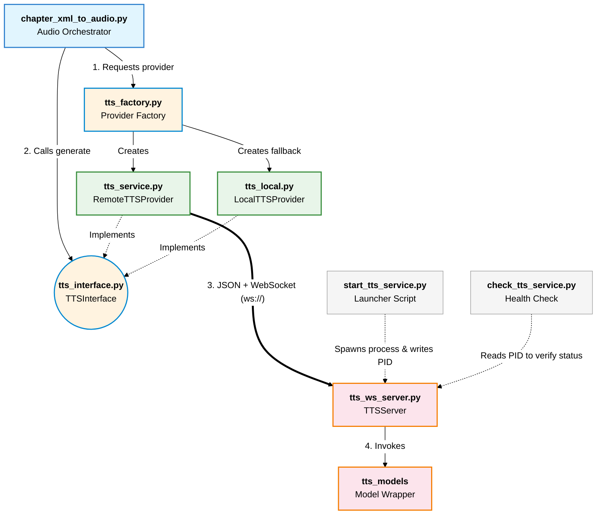

# tts_service

Here is an overview of the `tts_service.py` file, detailing its purpose, contracts, and internal data structures.

### Purpose
The `tts_service.py` module defines the `RemoteTTSProvider` class. This class serves as a client that connects to a remote TTS service via WebSockets. It allows the application to offload the heavy text-to-speech generation process to a dedicated server (like the one defined in `tts_ws_server.py`), enabling distributed processing. It also includes built-in retry logic and the ability to fall back to a local TTS model if the remote server is unreachable.

### Contracts

The `RemoteTTSProvider` adheres to two main types of contracts: a **Code Interface Contract** and a **Network Protocol Contract**.

#### 1. Code Interface Contract (`TTSInterface`)
The class inherits from `TTSInterface`, meaning it guarantees the implementation of specific methods so the rest of the application can use it interchangeably with a local TTS provider:
*   **`generate(...)`**: The core method. It accepts text, speaker details, emotion, language, and an output path. It guarantees to return a tuple containing a list of audio segments (as NumPy arrays) and the sample rate (`Tuple[List[np.ndarray], int]`).
*   **`supports_character(...)`**: Evaluates if the provider can handle a specific character configuration. For the remote provider, it generally returns `True` (assuming the server can handle it) or delegates to the fallback provider.
*   **`close()`**: Cleans up resources, specifically closing the active WebSocket connection and shutting down the fallback provider if one exists.

#### 2. Network Protocol Contract (WebSocket)
The class expects a specific communication flow when talking to the TTS server:
*   **Connection**: It expects to connect to a `ws://` or `wss://` endpoint, with exponential backoff for retries.
*   **Request**: It sends a single JSON string containing all the necessary parameters for generation.
*   **Response Stream**: It expects the server to stream back multiple messages:
    *   **Text/JSON messages**: Used for metadata, status updates, or error reporting. A message containing `{"error": "..."}` aborts the process, while `{"done": True}` signals the end of the transmission.
    *   **Binary messages**: Chunks of raw audio data (WAV format bytes).

### Data Structures

The module primarily relies on JSON for metadata and standard Python/NumPy structures for audio processing.

#### 1. Request Payload (JSON / Python Dictionary)
When `generate` is called, the parameters are packed into a dictionary and serialized to JSON. The structure looks like this:
```json
{
    "text": "Text to synthesize",
    "speaker": "character_name",
    "emotion": "neutral",
    "language": "English",
    "instruct": "Optional instructions",
    "output_format": "wav",
    "character_config": {
        "voice-sample": "path/to/sample.wav"
    }
}
```


#### 2. Audio Data Handling (`bytearray` & `np.ndarray`)
*   **Accumulation**: As binary frames arrive from the WebSocket, they are appended to a Python `bytearray`.
*   **Storage**: Once the `{"done": True}` signal is received, the entire `bytearray` is written to the disk at the specified `output_path`.
*   **In-Memory Representation**: The file is immediately read back using the `soundfile` library, which converts the WAV bytes into a **NumPy array** (`np.ndarray`). The class ensures the array is returned in the correct shape (handling mono/stereo channels appropriately) alongside the integer sample rate.

#### 3. State Management
*   `_websocket`: Stores the active connection object to reuse it for multiple requests (Connection Pooling), reducing overhead.
*   `fallback_provider`: Holds an instance of another `TTSInterface` (usually a local model) that is invoked if the WebSocket connection fails after all retry attempts.


# Architecture

Here is a Mermaid diagram illustrating the architecture and relationships between these components:





### Explanation of the Component Relationships:

1. **`chapter_xml_to_audio.py` (The Client):** Orchestrates the text-to-speech process. It doesn't instantiate providers directly; instead, it uses the Factory pattern.
2. **`tts_factory.py` & `tts_interface.py`:** The factory decides whether to supply a `RemoteTTSProvider` or a `LocalTTSProvider` based on the user's configurations. The client then interacts strictly with the `TTSInterface` abstraction, keeping it decoupled from the underlying execution method.
3. **`tts_service.py` (RemoteTTSProvider):** Acts as the WebSocket client. When its `generate()` method is called via the interface, it packages the request into JSON, sends it over the WebSocket connection, and awaits the binary audio response. It can also hold an instance of `LocalTTSProvider` as a fallback.
4. **`tts_ws_server.py` (The Server):** Listens for incoming WebSocket connections. It receives the JSON payload, loads the actual hardware-accelerated `tts_models` (like Qwen3-TTS) into GPU memory, generates the audio bytes, and streams the binary `.wav` data back to the client.
5. **Service Management Utilities:** 
   * `start_tts_service.py` is used to bootstrap `tts_ws_server.py` as a detached, headless background process and logs its PID (Process ID).
   * `check_tts_service.py` ensures the server is healthy and active by validating the existence and state of the recorded PID.